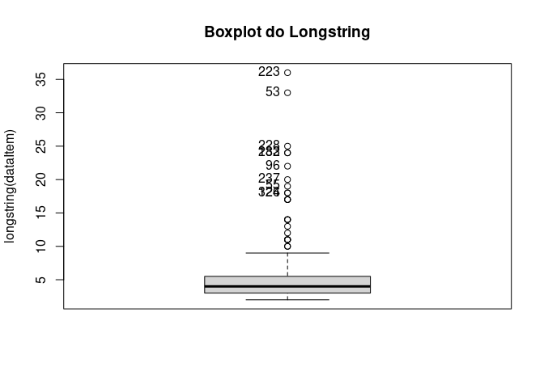

Identifing and Removing Careless
================
Geiser Chalco Challco <geiser@alumni.usp.br>

## Loading libs

``` r
library(readxl)
library(readr)
library(digest)     # biblioteca para anonimizar dados
library(dplyr)      # biblioteca para manipular data.frames
library(careless)   # biblioteca para tratamento de respostas descuidadas
library(car)        # biblioteca para graficar Boxplots com identificação de pontos
```

## Loading data

-   Raw data: [data/raw-data.csv](data/raw-data.csv)

``` r
raw_data <- read.csv("data/raw-data.csv")
data <- select(raw_data, starts_with("gender"), starts_with("age"), starts_with("Q"))
```

## Identifying careless

``` r
dataItem <- select(data, starts_with("Q"))
outliers <- Boxplot(longstring(dataItem), main = "Boxplot do Longstring") 
```

<!-- -->

``` r
careless <- cbind(resp=outliers, longstring=longstring(dataItem)[outliers], data[outliers,])
data.table::setorder(careless, -longstring)
head(careless)
```

    ##     resp longstring    gender         age Q1 Q2 Q3 Q4 Q5 Q6 Q7 Q8 Q9 Q10 Q11
    ## 223  223         36 Masculino Menos de 18  3  3  3  3  3  3  3  3  3   3   3
    ## 53    53         33 Masculino       18-24  5  5  5  5  5  5  5  5  5   5   5
    ## 228  228         25 Masculino       18-24  5  5  5  5  5  5  5  5  5   5   5
    ## 183  183         24 Masculino Menos de 18  5  5  5  5  5  5  5  5  5   5   5
    ## 232  232         24  Feminino Menos de 18  3  2  2  2  2  2  2  2  4   2   2
    ## 96    96         22 Masculino       18-24  5  5  5  5  5  2  5  2  5   5   5
    ##     Q12 Q13 Q14 Q15 Q16 Q17 Q18 Q19 Q20 Q21 Q22 Q23 Q24 Q25 Q26 Q27 Q28 Q29 Q30
    ## 223   3   3   3   3   3   3   3   3   3   3   3   3   3   3   3   3   3   3   3
    ## 53    5   5   5   5   5   5   5   5   5   5   5   5   5   5   5   5   5   5   5
    ## 228   5   5   5   5   5   5   5   5   5   5   5   5   5   5   3   5   5   5   5
    ## 183   4   5   5   5   5   5   5   5   5   5   5   5   5   5   5   5   5   5   5
    ## 232   2   2   2   2   2   2   2   2   2   2   2   2   2   2   2   2   2   2   2
    ## 96    5   5   5   5   5   5   5   5   5   5   5   5   5   5   5   5   5   5   5
    ##     Q31 Q32 Q33 Q34 Q35 Q36
    ## 223   3   3   3   3   3   3
    ## 53    5   5   5   2   5   5
    ## 228   5   5   5   5   5   5
    ## 183   5   5   5   5   5   5
    ## 232   2   2   2   3   4   2
    ## 96    3   5   5   5   5   4

-   posições 223 e 53 são considerados careless

## Saving results

-   saving careless responses in file:
    [data/careless.csv](data/careless.csv)
-   saving data without careless in file:
    [data/data-woc.csv](data/data-woc.csv)

``` r
careless <- careless[c(1,2),]
write_csv(careless, 'data/careless.csv')

data_woc <- data[-c(223,53),]
write_csv(data_woc, 'data/data-woc.csv')
```
