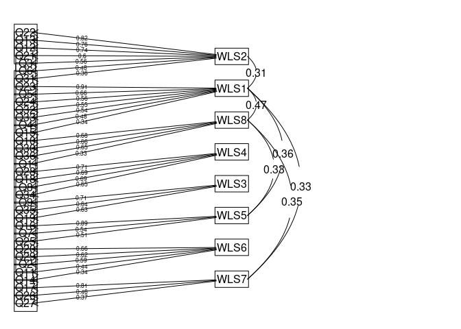
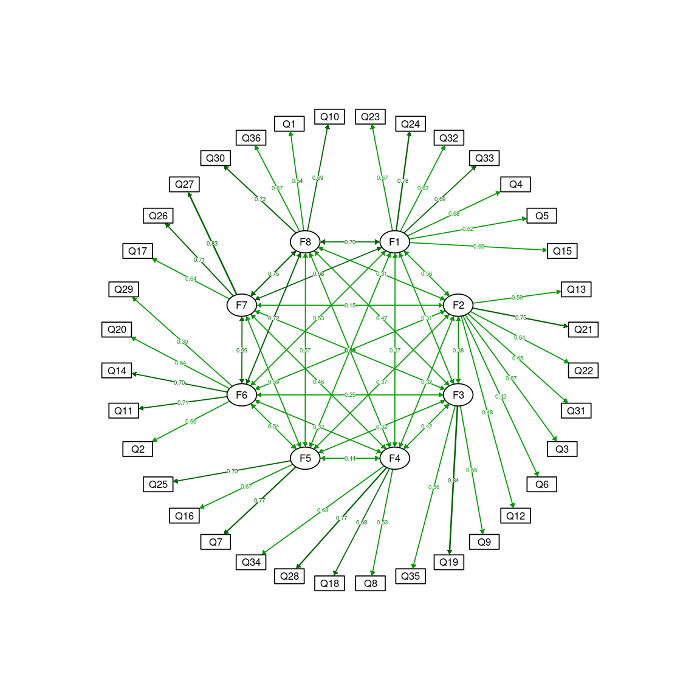
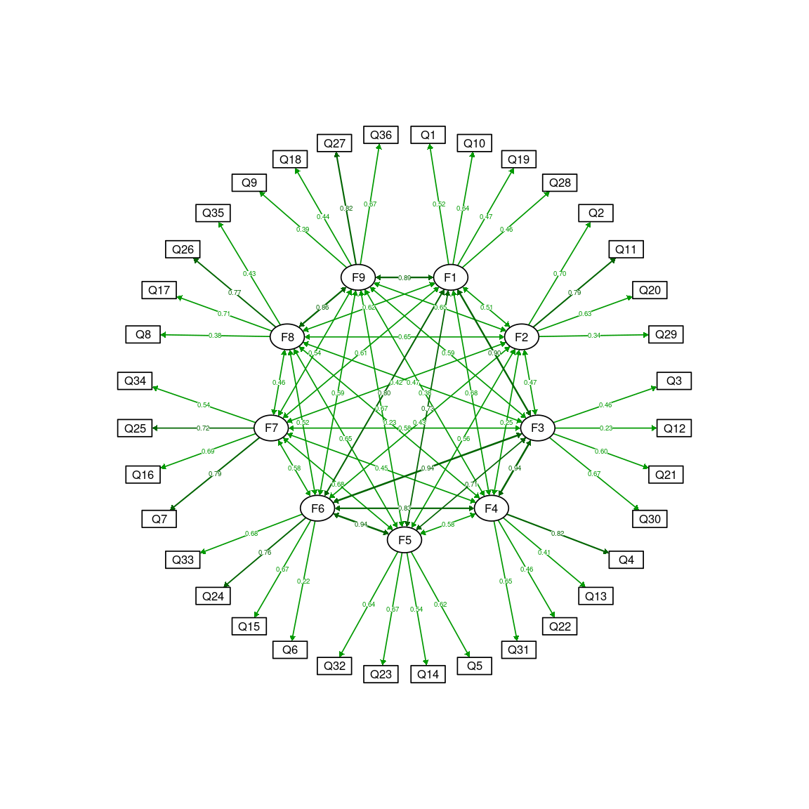

Factor Analysis
================
Geiser Chalco Challco <geiser@alumni.usp.br>

  - Data: [data/raw-data.csv](data/raw-data.csv)
  - Source code: [01-factor-analysis.Rmd](01-factor-analysis.Rmd)

## Loading libs

``` r
library(GPArotation)
library(readr)
library(dplyr)
library(psych)
library(lavaan)
library(ggraph)
library(semPlot)
library(MVN)
library(daff)
library(robustHD)
library(parameters)
```

## Loading data

  - As in the identification of [careless](00-careless.md), there was
    only 2 data, we decided to use all the raw data.

<!-- end list -->

``` r
raw_data <- read.csv("data/raw-data.csv")
dat <- select(raw_data, starts_with("gender"), starts_with("age"), starts_with("Q"))
datItem <- select(dat, starts_with("Q"))
```

## Checking assumptions

### Evaluating normality

``` r
(mvn_mod <- mvn(datItem))
```

    ## $multivariateNormality
    ##              Test        Statistic               p value Result
    ## 1 Mardia Skewness 14343.3489965268 3.06357722232731e-313     NO
    ## 2 Mardia Kurtosis 40.9912730282065                     0     NO
    ## 3             MVN             <NA>                  <NA>     NO
    ## 
    ## $univariateNormality
    ##            Test  Variable Statistic   p value Normality
    ## 1  Shapiro-Wilk    Q1        0.8148  <0.001      NO    
    ## 2  Shapiro-Wilk    Q2        0.9064  <0.001      NO    
    ## 3  Shapiro-Wilk    Q3        0.8950  <0.001      NO    
    ## 4  Shapiro-Wilk    Q4        0.8622  <0.001      NO    
    ## 5  Shapiro-Wilk    Q5        0.8854  <0.001      NO    
    ## 6  Shapiro-Wilk    Q6        0.8951  <0.001      NO    
    ## 7  Shapiro-Wilk    Q7        0.8853  <0.001      NO    
    ## 8  Shapiro-Wilk    Q8        0.9140  <0.001      NO    
    ## 9  Shapiro-Wilk    Q9        0.8893  <0.001      NO    
    ## 10 Shapiro-Wilk    Q10       0.8727  <0.001      NO    
    ## 11 Shapiro-Wilk    Q11       0.8969  <0.001      NO    
    ## 12 Shapiro-Wilk    Q12       0.9056  <0.001      NO    
    ## 13 Shapiro-Wilk    Q13       0.8974  <0.001      NO    
    ## 14 Shapiro-Wilk    Q14       0.8672  <0.001      NO    
    ## 15 Shapiro-Wilk    Q15       0.8739  <0.001      NO    
    ## 16 Shapiro-Wilk    Q16       0.8955  <0.001      NO    
    ## 17 Shapiro-Wilk    Q17       0.9028  <0.001      NO    
    ## 18 Shapiro-Wilk    Q18       0.9150  <0.001      NO    
    ## 19 Shapiro-Wilk    Q19       0.8919  <0.001      NO    
    ## 20 Shapiro-Wilk    Q20       0.8946  <0.001      NO    
    ## 21 Shapiro-Wilk    Q21       0.9005  <0.001      NO    
    ## 22 Shapiro-Wilk    Q22       0.8788  <0.001      NO    
    ## 23 Shapiro-Wilk    Q23       0.8914  <0.001      NO    
    ## 24 Shapiro-Wilk    Q24       0.8733  <0.001      NO    
    ## 25 Shapiro-Wilk    Q25       0.8880  <0.001      NO    
    ## 26 Shapiro-Wilk    Q26       0.8999  <0.001      NO    
    ## 27 Shapiro-Wilk    Q27       0.8974  <0.001      NO    
    ## 28 Shapiro-Wilk    Q28       0.9120  <0.001      NO    
    ## 29 Shapiro-Wilk    Q29       0.9093  <0.001      NO    
    ## 30 Shapiro-Wilk    Q30       0.8661  <0.001      NO    
    ## 31 Shapiro-Wilk    Q31       0.8757  <0.001      NO    
    ## 32 Shapiro-Wilk    Q32       0.8681  <0.001      NO    
    ## 33 Shapiro-Wilk    Q33       0.8490  <0.001      NO    
    ## 34 Shapiro-Wilk    Q34       0.8913  <0.001      NO    
    ## 35 Shapiro-Wilk    Q35       0.9103  <0.001      NO    
    ## 36 Shapiro-Wilk    Q36       0.8612  <0.001      NO    
    ## 
    ## $Descriptives
    ##       n     Mean   Std.Dev Median Min Max 25th 75th        Skew    Kurtosis
    ## Q1  395 3.987342 0.8323057      4   1   5    4    5 -0.95122216  1.35642152
    ## Q2  395 3.164557 1.1645175      3   1   5    2    4 -0.19643034 -0.92052005
    ## Q3  395 3.303797 0.9814838      3   1   5    3    4 -0.13653046 -0.73993160
    ## Q4  395 3.716456 0.8873663      4   1   5    3    4 -0.59091948  0.15548838
    ## Q5  395 3.551899 0.9893931      4   1   5    3    4 -0.42602080 -0.45238944
    ## Q6  395 3.139241 1.2250990      3   1   5    2    4 -0.23280275 -1.05767919
    ## Q7  395 3.513924 1.0332952      4   1   5    3    4 -0.48464135 -0.43952903
    ## Q8  395 3.070886 1.2006927      3   1   5    2    4 -0.12714403 -0.87869778
    ## Q9  395 3.508861 1.0308921      4   1   5    3    4 -0.52283293 -0.21932577
    ## Q10 395 3.794937 1.0030282      4   1   5    3    5 -0.59141801 -0.21133894
    ## Q11 395 3.412658 1.0419339      4   1   5    3    4 -0.34530530 -0.60024311
    ## Q12 395 3.075949 1.0491978      3   1   5    2    4 -0.07232489 -0.79592790
    ## Q13 395 3.167089 0.9935990      3   1   5    2    4 -0.08986936 -0.76144051
    ## Q14 395 3.597468 1.1208652      4   1   5    3    4 -0.68582788 -0.31633446
    ## Q15 395 3.637975 0.9113364      4   1   5    3    4 -0.45107974 -0.25617950
    ## Q16 395 3.331646 1.1571390      4   1   5    2    4 -0.22596582 -0.99268394
    ## Q17 395 3.278481 1.0193148      3   1   5    3    4 -0.21641506 -0.63612010
    ## Q18 395 3.043038 1.0831759      3   1   5    2    4 -0.04923769 -0.71561525
    ## Q19 395 3.556962 1.0219276      4   1   5    3    4 -0.43116767 -0.43017095
    ## Q20 395 3.534177 1.1223260      4   1   5    3    4 -0.39133528 -0.71814506
    ## Q21 395 3.364557 0.9788419      3   1   5    3    4 -0.27534501 -0.36707664
    ## Q22 395 3.243038 1.0184446      3   1   5    2    4 -0.25316505 -0.87159914
    ## Q23 395 3.508861 0.9983730      4   1   5    3    4 -0.39830712 -0.43893902
    ## Q24 395 3.681013 0.9009408      4   1   5    3    4 -0.39166307 -0.40126646
    ## Q25 395 3.384810 1.0318640      4   1   5    3    4 -0.33366401 -0.70546133
    ## Q26 395 3.324051 1.0716957      3   1   5    3    4 -0.31131622 -0.68790748
    ## Q27 395 3.440506 0.9786449      4   1   5    3    4 -0.31991305 -0.37118922
    ## Q28 395 3.235443 1.1522476      3   1   5    2    4 -0.07883622 -0.87057148
    ## Q29 395 3.045570 1.1074044      3   1   5    2    4  0.01101286 -0.88417831
    ## Q30 395 3.845570 0.9553214      4   1   5    3    5 -0.54286489 -0.38043288
    ## Q31 395 3.577215 0.9267526      4   1   5    3    4 -0.40694263 -0.41540994
    ## Q32 395 3.670886 1.0534150      4   1   5    3    4 -0.57659993 -0.49028309
    ## Q33 395 3.703797 0.8672617      4   1   5    3    4 -0.60312376  0.06024117
    ## Q34 395 3.410127 1.2356378      4   1   5    2    4 -0.37761281 -0.93292413
    ## Q35 395 3.268354 1.1416819      3   1   5    2    4 -0.25021492 -0.75300048
    ## Q36 395 3.848101 1.0530185      4   1   5    3    5 -0.64509427 -0.37984341

### Performing Kaiser, Meyer, Olkin (KMO) Measure of Sampling Adequacy

``` r
(kmo_mod <- KMO(datItem)) 
```

    ## Kaiser-Meyer-Olkin factor adequacy
    ## Call: KMO(r = datItem)
    ## Overall MSA =  0.87
    ## MSA for each item = 
    ##   Q1   Q2   Q3   Q4   Q5   Q6   Q7   Q8   Q9  Q10  Q11  Q12  Q13  Q14  Q15  Q16 
    ## 0.90 0.89 0.88 0.91 0.90 0.84 0.90 0.69 0.80 0.89 0.92 0.84 0.85 0.91 0.91 0.80 
    ##  Q17  Q18  Q19  Q20  Q21  Q22  Q23  Q24  Q25  Q26  Q27  Q28  Q29  Q30  Q31  Q32 
    ## 0.84 0.81 0.85 0.82 0.90 0.85 0.88 0.92 0.89 0.88 0.92 0.83 0.65 0.93 0.88 0.86 
    ##  Q33  Q34  Q35  Q36 
    ## 0.94 0.80 0.77 0.87

### Performing Bartlett’s test of sphericity

We don’t use *bartlett.test()* because it doesn’t perform test of
sphericity *bartlett.test()* is a function that performs test of
homogeneity of variances

``` r
(check_sphericity(datItem)) 
```

    ## # Test of Sphericity
    ## 
    ## Bartlett's test of sphericity suggests that there is sufficient significant correlation in the data for factor analysis (Chisq(630) = 6783.09, p < .001).

As there is not normality in the results, we decided to use the mean-
and variance-adjusted weighted least squares (WLSMV) estimator, based on
that WLSMV does not assume normal variables and it is a robust estimator
developed to model categorical or ordered data.

  - Brown, T. (2006). Confirmatory factor analysis for applied research.
    New York: Guildford.
  - Proitsi, P., et al. (2009). A multiple indicators multiple causes
    (MIMIC) model of behavioural and psychological symptoms in dementia
    (BPSD). Neurobiology Aging.
    <doi:10.1016/j.neurobiolaging.2009.03.005>

## Parallel Factorial Analysis

``` r
#(pfa_mod <- fa.parallel(datItem, fm = 'wls', fa = 'fa', cor='mixed'))
```

## Exploratory Factor Analysis (EFA)

Firstly, we run the EFA with the factor numbers sugested by the parallel
factorial analysis, and using the “mixed” correlation that combines
tetrachorics, polychorics, Pearsons, biserials, and polyserials methods
to estimate the correlation matrix.

``` r
#efa_mod <- fa(datItem, nfactors = pfa_mod$nfact, cor = 'mixed', fm='wls')
efa_mod <- fa(datItem, nfactors = 8, cor = 'mixed', fm = 'wls')
fa.sort(efa_mod)
```

    ## Factor Analysis using method =  wls
    ## Call: fa(r = datItem, nfactors = 8, fm = "wls", cor = "mixed")
    ## Standardized loadings (pattern matrix) based upon correlation matrix
    ##      WLS2  WLS1  WLS8  WLS4  WLS3  WLS5  WLS6  WLS7   h2   u2 com
    ## Q22  0.82 -0.08  0.06  0.05  0.05  0.04 -0.02 -0.04 0.69 0.31 1.1
    ## Q13  0.76  0.01 -0.10  0.01  0.13  0.03 -0.02 -0.01 0.63 0.37 1.1
    ## Q12  0.74 -0.05 -0.14  0.03  0.03  0.05 -0.11  0.03 0.57 0.43 1.2
    ## Q21  0.60  0.08  0.26 -0.07 -0.13  0.04  0.04  0.17 0.57 0.43 1.8
    ## Q3   0.56  0.19 -0.08  0.03  0.12  0.05  0.09  0.02 0.46 0.54 1.4
    ## Q6   0.48  0.14 -0.02  0.08  0.10 -0.04 -0.11 -0.13 0.35 0.65 1.6
    ## Q31  0.36  0.19  0.34  0.07 -0.15  0.01  0.00 -0.06 0.41 0.59 3.1
    ## Q23 -0.11  0.91 -0.09  0.03  0.07 -0.02  0.00  0.03 0.74 0.26 1.1
    ## Q5   0.16  0.66  0.02  0.12 -0.03  0.01 -0.05 -0.09 0.56 0.44 1.2
    ## Q24  0.13  0.56  0.19 -0.08  0.03  0.06  0.07  0.14 0.65 0.35 1.6
    ## Q32 -0.15  0.55  0.17 -0.07  0.10  0.24 -0.14  0.11 0.59 0.41 2.2
    ## Q33  0.16  0.54  0.14 -0.02 -0.07  0.07  0.02  0.11 0.56 0.44 1.5
    ## Q4   0.32  0.48  0.13 -0.05 -0.08 -0.01  0.18  0.07 0.57 0.43 2.4
    ## Q15  0.33  0.34  0.27  0.07 -0.10  0.04  0.03  0.02 0.52 0.48 3.3
    ## Q10  0.04  0.09  0.68  0.04  0.18 -0.01  0.05 -0.03 0.61 0.39 1.2
    ## Q30  0.06  0.08  0.66  0.01 -0.03  0.11  0.13  0.01 0.64 0.36 1.2
    ## Q36 -0.19 -0.05  0.65  0.12  0.12  0.02  0.12  0.21 0.71 0.29 1.7
    ## Q1   0.29  0.21  0.33  0.01 -0.07 -0.03  0.12 -0.02 0.38 0.62 3.1
    ## Q28  0.00  0.11  0.14  0.71  0.08 -0.05 -0.03 -0.05 0.60 0.40 1.2
    ## Q18  0.13 -0.02  0.05  0.69  0.14 -0.06 -0.09  0.12 0.61 0.39 1.3
    ## Q8   0.02 -0.07 -0.06  0.69  0.02 -0.12  0.08  0.27 0.58 0.42 1.5
    ## Q34 -0.04  0.04 -0.03  0.65 -0.09  0.49  0.04 -0.22 0.76 0.24 2.2
    ## Q9   0.12  0.06  0.08  0.10  0.71 -0.01 -0.04  0.03 0.63 0.37 1.2
    ## Q35 -0.11  0.06 -0.02  0.09  0.64 -0.02  0.14  0.20 0.56 0.44 1.4
    ## Q19  0.26  0.08  0.23  0.02  0.63  0.11 -0.10 -0.12 0.68 0.32 1.9
    ## Q16  0.06 -0.03  0.01 -0.06  0.07  0.89 -0.03  0.15 0.83 0.17 1.1
    ## Q7   0.17  0.23 -0.01  0.12 -0.06  0.54  0.12 -0.06 0.58 0.42 1.9
    ## Q25  0.05  0.14  0.07  0.10 -0.11  0.51  0.26 -0.06 0.53 0.47 2.0
    ## Q20 -0.17 -0.03  0.34 -0.09  0.01  0.12  0.66  0.01 0.76 0.24 1.8
    ## Q29  0.04 -0.12 -0.10  0.02  0.54  0.03  0.62 -0.06 0.71 0.29 2.1
    ## Q2  -0.07  0.12  0.15  0.07 -0.11 -0.02  0.59  0.17 0.60 0.40 1.6
    ## Q11  0.14  0.22  0.00  0.17 -0.12 -0.08  0.44  0.36 0.60 0.40 3.3
    ## Q14 -0.09  0.26  0.09  0.02  0.03  0.18  0.34  0.16 0.45 0.55 3.4
    ## Q17  0.04  0.06 -0.01  0.06  0.00  0.10  0.05  0.81 0.77 0.23 1.1
    ## Q26 -0.19  0.10  0.29  0.03  0.15  0.28 -0.09  0.46 0.66 0.34 3.4
    ## Q27 -0.02  0.21  0.27  0.21  0.07  0.11  0.00  0.37 0.62 0.38 3.6
    ## 
    ##                       WLS2 WLS1 WLS8 WLS4 WLS3 WLS5 WLS6 WLS7
    ## SS loadings           3.83 3.97 3.09 2.38 2.03 2.30 2.11 2.04
    ## Proportion Var        0.11 0.11 0.09 0.07 0.06 0.06 0.06 0.06
    ## Cumulative Var        0.11 0.22 0.30 0.37 0.42 0.49 0.55 0.60
    ## Proportion Explained  0.18 0.18 0.14 0.11 0.09 0.11 0.10 0.09
    ## Cumulative Proportion 0.18 0.36 0.50 0.61 0.70 0.81 0.91 1.00
    ## 
    ##  With factor correlations of 
    ##       WLS2 WLS1 WLS8 WLS4 WLS3 WLS5  WLS6  WLS7
    ## WLS2  1.00 0.31 0.10 0.18 0.13 0.12 -0.07 -0.06
    ## WLS1  0.31 1.00 0.47 0.24 0.01 0.36  0.16  0.33
    ## WLS8  0.10 0.47 1.00 0.12 0.14 0.33  0.30  0.35
    ## WLS4  0.18 0.24 0.12 1.00 0.20 0.22  0.13  0.16
    ## WLS3  0.13 0.01 0.14 0.20 1.00 0.10  0.12  0.10
    ## WLS5  0.12 0.36 0.33 0.22 0.10 1.00  0.16  0.13
    ## WLS6 -0.07 0.16 0.30 0.13 0.12 0.16  1.00  0.25
    ## WLS7 -0.06 0.33 0.35 0.16 0.10 0.13  0.25  1.00
    ## 
    ## Mean item complexity =  1.9
    ## Test of the hypothesis that 8 factors are sufficient.
    ## 
    ## The degrees of freedom for the null model are  630  and the objective function was  24.21 with Chi Square of  9227.65
    ## The degrees of freedom for the model are 370  and the objective function was  4.6 
    ## 
    ## The root mean square of the residuals (RMSR) is  0.03 
    ## The df corrected root mean square of the residuals is  0.04 
    ## 
    ## The harmonic number of observations is  395 with the empirical chi square  548.36  with prob <  4.5e-09 
    ## The total number of observations was  395  with Likelihood Chi Square =  1727.14  with prob <  9.8e-174 
    ## 
    ## Tucker Lewis Index of factoring reliability =  0.727
    ## RMSEA index =  0.096  and the 90 % confidence intervals are  0.092 0.101
    ## BIC =  -485.04
    ## Fit based upon off diagonal values = 0.99
    ## Measures of factor score adequacy             
    ##                                                   WLS2 WLS1 WLS8 WLS4 WLS3 WLS5
    ## Correlation of (regression) scores with factors   0.95 0.95 0.93 0.93 0.92 0.94
    ## Multiple R square of scores with factors          0.90 0.90 0.86 0.86 0.84 0.89
    ## Minimum correlation of possible factor scores     0.80 0.79 0.72 0.72 0.69 0.78
    ##                                                   WLS6 WLS7
    ## Correlation of (regression) scores with factors   0.92 0.92
    ## Multiple R square of scores with factors          0.84 0.84
    ## Minimum correlation of possible factor scores     0.68 0.68

``` r
fa.diagram(efa_mod, main='', sort = T, digits = 2)
```

<!-- -->

  - Detailed diagram of EFA in SVG format:
    [**efa\_mod.svg**](efa_mod.svg)

## Confirmatory Factorial Analisis (CFA)

Setting a list of models in the list variable “mdls” to be tested using
lavaan SEM syntax.

``` r
mdls <- c('unidimensional'='
FSS =~ Q1+Q2+Q3+Q4+Q5+Q6+Q7+Q8+Q9+Q10+Q11+Q12+Q13+Q14+Q15+Q16+Q17+Q18+Q19+Q20+Q21+Q22+Q23+Q24+Q25+Q26+Q27+Q28+Q29+Q30+Q31+Q32+Q33+Q34+Q35+Q36
', 
'efa model'='
F1 =~ Q23+Q24+Q32+Q33+Q4+Q5+Q15
F2 =~ Q13+Q21+Q22+Q31+Q3+Q6+Q12
F3 =~ Q9+Q19+Q35
F4 =~ Q8+Q18+Q28+Q34
F5 =~ Q7+Q16+Q25
F6 =~ Q2+Q11+Q14+Q20+Q29
F7 =~ Q17+Q26+Q27
F8 =~ Q30+Q36+Q1+Q10

F1 ~~ F2
F1 ~~ F5
F1 ~~ F7
F1 ~~ F8

F5 ~~ F8

F7 ~~ F8
',
'nine-factor model'='
F1 =~ Q1+Q10+Q19+Q28
F2 =~ Q2+Q11+Q20+Q29
F3 =~ Q3+Q12+Q21+Q30
F4 =~ Q4+Q13+Q22+Q31
F5 =~ Q5+Q14+Q23+Q32
F6 =~ Q6+Q15+Q24+Q33
F7 =~ Q7+Q16+Q25+Q34
F8 =~ Q8+Q17+Q26+Q35
F9 =~ Q9+Q18+Q27+Q36

F1 ~~ F2
F1 ~~ F3
F1 ~~ F4
F1 ~~ F5
F1 ~~ F6
F1 ~~ F7
F1 ~~ F8
F1 ~~ F9

F2 ~~ F3
F2 ~~ F4
F2 ~~ F5
F2 ~~ F6
F2 ~~ F7
F2 ~~ F8
F2 ~~ F9

F3 ~~ F4
F3 ~~ F5
F3 ~~ F6
F3 ~~ F7
F3 ~~ F8
F3 ~~ F9

F4 ~~ F5
F4 ~~ F6
F4 ~~ F7
F4 ~~ F8
F4 ~~ F9

F5 ~~ F6
F5 ~~ F7
F5 ~~ F8
F5 ~~ F9

F6 ~~ F7
F6 ~~ F8
F6 ~~ F9

F7 ~~ F8
F7 ~~ F9

F8 ~~ F9
',
'2nd order model'='
F1 =~ Q1+Q10+Q19+Q28
F2 =~ Q2+Q11+Q20+Q29
F3 =~ Q3+Q12+Q21+Q30
F4 =~ Q4+Q13+Q22+Q31
F5 =~ Q5+Q14+Q23+Q32
F6 =~ Q6+Q15+Q24+Q33
F7 =~ Q7+Q16+Q25+Q34
F8 =~ Q8+Q17+Q26+Q35
F9 =~ Q9+Q18+Q27+Q36

FSS =~ F1+F2+F3+F4+F5+F6+F7+F8+F9
',
'bi-factor model'='
g =~ Q1+Q2+Q3+Q4+Q5+Q6+Q7+Q8+Q9+Q10+Q11+Q12+Q13+Q14+Q15+Q16+Q17+Q18+Q19+Q20+Q21+Q22+Q23+Q24+Q25+Q26+Q27+Q28+Q29+Q30+Q31+Q32+Q33+Q34+Q35+Q36
F1 =~ Q1+Q10+Q19+Q28
F2 =~ Q2+Q11+Q20+Q29
F3 =~ Q3+Q12+Q21+Q30
F4 =~ Q4+Q13+Q22+Q31
F5 =~ Q5+Q14+Q23+Q32
F6 =~ Q6+Q15+Q24+Q33
F7 =~ Q7+Q16+Q25+Q34
F8 =~ Q8+Q17+Q26+Q35
F9 =~ Q9+Q18+Q27+Q36

g ~~ 0*F1
g ~~ 0*F2
g ~~ 0*F3
g ~~ 0*F4
g ~~ 0*F5
g ~~ 0*F6
g ~~ 0*F7
g ~~ 0*F8
g ~~ 0*F9

F1 ~~ 0*F2
F1 ~~ 0*F3
F1 ~~ 0*F4
F1 ~~ 0*F5
F1 ~~ 0*F6
F1 ~~ 0*F7
F1 ~~ 0*F8
F1 ~~ 0*F9

F2 ~~ 0*F3
F2 ~~ 0*F4
F2 ~~ 0*F5
F2 ~~ 0*F6
F2 ~~ 0*F7
F2 ~~ 0*F8
F2 ~~ 0*F9

F3 ~~ 0*F4
F3 ~~ 0*F5
F3 ~~ 0*F6
F3 ~~ 0*F7
F3 ~~ 0*F8
F3 ~~ 0*F9

F4 ~~ 0*F5
F4 ~~ 0*F6
F4 ~~ 0*F7
F4 ~~ 0*F8
F4 ~~ 0*F9

F5 ~~ 0*F6
F5 ~~ 0*F7
F5 ~~ 0*F8
F5 ~~ 0*F9

F6 ~~ 0*F7
F6 ~~ 0*F8
F6 ~~ 0*F9

F7 ~~ 0*F8
F7 ~~ 0*F9

F8 ~~ 0*F9
',
'uncorrelated model'='
F1 =~ Q1+Q10+Q19+Q28
F2 =~ Q2+Q11+Q20+Q29
F3 =~ Q3+Q12+Q21+Q30
F4 =~ Q4+Q13+Q22+Q31
F5 =~ Q5+Q14+Q23+Q32
F6 =~ Q6+Q15+Q24+Q33
F7 =~ Q7+Q16+Q25+Q34
F8 =~ Q8+Q17+Q26+Q35
F9 =~ Q9+Q18+Q27+Q36

F1 ~~ 0*F2
F1 ~~ 0*F3
F1 ~~ 0*F4
F1 ~~ 0*F5
F1 ~~ 0*F6
F1 ~~ 0*F7
F1 ~~ 0*F8
F1 ~~ 0*F9

F2 ~~ 0*F3
F2 ~~ 0*F4
F2 ~~ 0*F5
F2 ~~ 0*F6
F2 ~~ 0*F7
F2 ~~ 0*F8
F2 ~~ 0*F9

F3 ~~ 0*F4
F3 ~~ 0*F5
F3 ~~ 0*F6
F3 ~~ 0*F7
F3 ~~ 0*F8
F3 ~~ 0*F9

F4 ~~ 0*F5
F4 ~~ 0*F6
F4 ~~ 0*F7
F4 ~~ 0*F8
F4 ~~ 0*F9

F5 ~~ 0*F6
F5 ~~ 0*F7
F5 ~~ 0*F8
F5 ~~ 0*F9

F6 ~~ 0*F7
F6 ~~ 0*F8
F6 ~~ 0*F9

F7 ~~ 0*F8
F7 ~~ 0*F9

F8 ~~ 0*F9
')
```

Perform CFA in all the defined models and obtain the fit measurements in
the variable “*cfa\_results*”

``` r
cfa_results <- lapply(mdls, FUN = function(x) {
  cfa <- cfa(x, data=datItem, std.lv=T, estimator="WLSMV", meanstructure=T)
  fit <- round(fitMeasures(cfa), 3)
  fit <- c(
    fit
    , 'rmsea.ci' = paste0('[',fit['rmsea.ci.lower'],'; ',fit['rmsea.ci.upper'],']')
    , 'rmsea.ci.scaled' = paste0('[',fit['rmsea.ci.lower.scaled'],'; ',fit['rmsea.ci.upper.scaled'],']')
    , 'rmsea.ci.robust' = paste0('[',fit['rmsea.ci.lower.robust'],'; ',fit['rmsea.ci.upper.robust'],']')
    , 'cfi.obs' = ifelse(fit[['cfi']] < 0.85, 'unacceptable fit', NA)
    , 'cfi.obs.scaled' = ifelse(fit[['cfi.scaled']] < 0.85, 'unacceptable fit', NA)
    , 'cfi.obs.robust' = ifelse(fit[['cfi.robust']] < 0.85, 'unacceptable fit', NA)
    , 'tli.obs' = ifelse(fit[['tli']] < 0.85, 'unacceptable fit', NA)
    , 'tli.obs.scaled' = ifelse(fit[['tli.scaled']] < 0.85, 'unacceptable fit', NA)
    , 'tli.obs.robust' = ifelse(fit[['tli.robust']] < 0.85, 'unacceptable fit', NA)
    , 'rmsea.obs' = ifelse(fit[['rmsea']] > 0.10, 'poor fit', NA)
    , 'rmsea.obs.scaled' = ifelse(fit[['rmsea.scaled']] > 0.10, 'poor fit', NA)
    , 'rmsea.obs.robust' = ifelse(fit[['rmsea.robust']] > 0.10, 'poor fit', NA)
  )
  list(cfa = cfa, fit = fit)
})
```

Print the basic fit measures for all the CFA models.

``` r
do.call(rbind, lapply(cfa_results, FUN = function(x) {
  x$fit[c('chisq','df','cfi','tli','rmsea','rmsea.ci','cfi.obs','tli.obs','rmsea.obs')]
}))
```

<table>

<thead>

<tr>

<th style="text-align:left;">

</th>

<th style="text-align:left;">

chisq

</th>

<th style="text-align:left;">

df

</th>

<th style="text-align:left;">

cfi

</th>

<th style="text-align:left;">

tli

</th>

<th style="text-align:left;">

rmsea

</th>

<th style="text-align:left;">

rmsea.ci

</th>

<th style="text-align:left;">

cfi.obs

</th>

<th style="text-align:left;">

tli.obs

</th>

<th style="text-align:left;">

rmsea.obs

</th>

</tr>

</thead>

<tbody>

<tr>

<td style="text-align:left;">

unidimensional

</td>

<td style="text-align:left;">

3145.983

</td>

<td style="text-align:left;">

594

</td>

<td style="text-align:left;">

0.818

</td>

<td style="text-align:left;">

0.807

</td>

<td style="text-align:left;">

0.104

</td>

<td style="text-align:left;">

\[0.101; 0.108\]

</td>

<td style="text-align:left;">

unacceptable fit

</td>

<td style="text-align:left;">

unacceptable fit

</td>

<td style="text-align:left;">

poor fit

</td>

</tr>

<tr>

<td style="text-align:left;">

efa model

</td>

<td style="text-align:left;">

1689.582

</td>

<td style="text-align:left;">

566

</td>

<td style="text-align:left;">

0.92

</td>

<td style="text-align:left;">

0.911

</td>

<td style="text-align:left;">

0.071

</td>

<td style="text-align:left;">

\[0.067; 0.075\]

</td>

<td style="text-align:left;">

NA

</td>

<td style="text-align:left;">

NA

</td>

<td style="text-align:left;">

NA

</td>

</tr>

<tr>

<td style="text-align:left;">

nine-factor model

</td>

<td style="text-align:left;">

2363.596

</td>

<td style="text-align:left;">

558

</td>

<td style="text-align:left;">

0.871

</td>

<td style="text-align:left;">

0.855

</td>

<td style="text-align:left;">

0.091

</td>

<td style="text-align:left;">

\[0.087; 0.094\]

</td>

<td style="text-align:left;">

NA

</td>

<td style="text-align:left;">

NA

</td>

<td style="text-align:left;">

NA

</td>

</tr>

<tr>

<td style="text-align:left;">

2nd order model

</td>

<td style="text-align:left;">

2764.407

</td>

<td style="text-align:left;">

585

</td>

<td style="text-align:left;">

0.845

</td>

<td style="text-align:left;">

0.833

</td>

<td style="text-align:left;">

0.097

</td>

<td style="text-align:left;">

\[0.094; 0.101\]

</td>

<td style="text-align:left;">

unacceptable fit

</td>

<td style="text-align:left;">

unacceptable fit

</td>

<td style="text-align:left;">

NA

</td>

</tr>

<tr>

<td style="text-align:left;">

bi-factor model

</td>

<td style="text-align:left;">

2495.554

</td>

<td style="text-align:left;">

558

</td>

<td style="text-align:left;">

0.862

</td>

<td style="text-align:left;">

0.844

</td>

<td style="text-align:left;">

0.094

</td>

<td style="text-align:left;">

\[0.09; 0.098\]

</td>

<td style="text-align:left;">

NA

</td>

<td style="text-align:left;">

unacceptable fit

</td>

<td style="text-align:left;">

NA

</td>

</tr>

<tr>

<td style="text-align:left;">

uncorrelated model

</td>

<td style="text-align:left;">

12305.384

</td>

<td style="text-align:left;">

594

</td>

<td style="text-align:left;">

0.166

</td>

<td style="text-align:left;">

0.116

</td>

<td style="text-align:left;">

0.224

</td>

<td style="text-align:left;">

\[0.22; 0.227\]

</td>

<td style="text-align:left;">

unacceptable fit

</td>

<td style="text-align:left;">

unacceptable fit

</td>

<td style="text-align:left;">

poor fit

</td>

</tr>

</tbody>

</table>

Calculate fit measures for all the CFA models.

``` r
t(do.call(rbind, lapply(cfa_results, FUN = function(x) x$fit)))
```

<table>

<thead>

<tr>

<th style="text-align:left;">

</th>

<th style="text-align:left;">

unidimensional

</th>

<th style="text-align:left;">

efa model

</th>

<th style="text-align:left;">

nine-factor model

</th>

<th style="text-align:left;">

2nd order model

</th>

<th style="text-align:left;">

bi-factor model

</th>

<th style="text-align:left;">

uncorrelated model

</th>

</tr>

</thead>

<tbody>

<tr>

<td style="text-align:left;">

npar

</td>

<td style="text-align:left;">

108

</td>

<td style="text-align:left;">

136

</td>

<td style="text-align:left;">

144

</td>

<td style="text-align:left;">

117

</td>

<td style="text-align:left;">

144

</td>

<td style="text-align:left;">

108

</td>

</tr>

<tr>

<td style="text-align:left;">

fmin

</td>

<td style="text-align:left;">

3.982

</td>

<td style="text-align:left;">

2.139

</td>

<td style="text-align:left;">

2.992

</td>

<td style="text-align:left;">

3.499

</td>

<td style="text-align:left;">

3.159

</td>

<td style="text-align:left;">

15.576

</td>

</tr>

<tr>

<td style="text-align:left;">

chisq

</td>

<td style="text-align:left;">

3145.983

</td>

<td style="text-align:left;">

1689.582

</td>

<td style="text-align:left;">

2363.596

</td>

<td style="text-align:left;">

2764.407

</td>

<td style="text-align:left;">

2495.554

</td>

<td style="text-align:left;">

12305.384

</td>

</tr>

<tr>

<td style="text-align:left;">

df

</td>

<td style="text-align:left;">

594

</td>

<td style="text-align:left;">

566

</td>

<td style="text-align:left;">

558

</td>

<td style="text-align:left;">

585

</td>

<td style="text-align:left;">

558

</td>

<td style="text-align:left;">

594

</td>

</tr>

<tr>

<td style="text-align:left;">

pvalue

</td>

<td style="text-align:left;">

0

</td>

<td style="text-align:left;">

0

</td>

<td style="text-align:left;">

0

</td>

<td style="text-align:left;">

0

</td>

<td style="text-align:left;">

0

</td>

<td style="text-align:left;">

0

</td>

</tr>

<tr>

<td style="text-align:left;">

chisq.scaled

</td>

<td style="text-align:left;">

2320.374

</td>

<td style="text-align:left;">

1609.113

</td>

<td style="text-align:left;">

2097.46

</td>

<td style="text-align:left;">

2145.007

</td>

<td style="text-align:left;">

1985.657

</td>

<td style="text-align:left;">

3491.262

</td>

</tr>

<tr>

<td style="text-align:left;">

df.scaled

</td>

<td style="text-align:left;">

594

</td>

<td style="text-align:left;">

566

</td>

<td style="text-align:left;">

558

</td>

<td style="text-align:left;">

585

</td>

<td style="text-align:left;">

558

</td>

<td style="text-align:left;">

594

</td>

</tr>

<tr>

<td style="text-align:left;">

pvalue.scaled

</td>

<td style="text-align:left;">

0

</td>

<td style="text-align:left;">

0

</td>

<td style="text-align:left;">

0

</td>

<td style="text-align:left;">

0

</td>

<td style="text-align:left;">

0

</td>

<td style="text-align:left;">

0

</td>

</tr>

<tr>

<td style="text-align:left;">

chisq.scaling.factor

</td>

<td style="text-align:left;">

1.617

</td>

<td style="text-align:left;">

1.322

</td>

<td style="text-align:left;">

1.339

</td>

<td style="text-align:left;">

1.551

</td>

<td style="text-align:left;">

1.52

</td>

<td style="text-align:left;">

4.046

</td>

</tr>

<tr>

<td style="text-align:left;">

baseline.chisq

</td>

<td style="text-align:left;">

14679.513

</td>

<td style="text-align:left;">

14679.513

</td>

<td style="text-align:left;">

14679.513

</td>

<td style="text-align:left;">

14679.513

</td>

<td style="text-align:left;">

14679.513

</td>

<td style="text-align:left;">

14679.513

</td>

</tr>

<tr>

<td style="text-align:left;">

baseline.df

</td>

<td style="text-align:left;">

630

</td>

<td style="text-align:left;">

630

</td>

<td style="text-align:left;">

630

</td>

<td style="text-align:left;">

630

</td>

<td style="text-align:left;">

630

</td>

<td style="text-align:left;">

630

</td>

</tr>

<tr>

<td style="text-align:left;">

baseline.pvalue

</td>

<td style="text-align:left;">

0

</td>

<td style="text-align:left;">

0

</td>

<td style="text-align:left;">

0

</td>

<td style="text-align:left;">

0

</td>

<td style="text-align:left;">

0

</td>

<td style="text-align:left;">

0

</td>

</tr>

<tr>

<td style="text-align:left;">

baseline.chisq.scaled

</td>

<td style="text-align:left;">

3950.365

</td>

<td style="text-align:left;">

3950.365

</td>

<td style="text-align:left;">

3950.365

</td>

<td style="text-align:left;">

3950.365

</td>

<td style="text-align:left;">

3950.365

</td>

<td style="text-align:left;">

3950.365

</td>

</tr>

<tr>

<td style="text-align:left;">

baseline.df.scaled

</td>

<td style="text-align:left;">

630

</td>

<td style="text-align:left;">

630

</td>

<td style="text-align:left;">

630

</td>

<td style="text-align:left;">

630

</td>

<td style="text-align:left;">

630

</td>

<td style="text-align:left;">

630

</td>

</tr>

<tr>

<td style="text-align:left;">

baseline.pvalue.scaled

</td>

<td style="text-align:left;">

0

</td>

<td style="text-align:left;">

0

</td>

<td style="text-align:left;">

0

</td>

<td style="text-align:left;">

0

</td>

<td style="text-align:left;">

0

</td>

<td style="text-align:left;">

0

</td>

</tr>

<tr>

<td style="text-align:left;">

baseline.chisq.scaling.factor

</td>

<td style="text-align:left;">

4.231

</td>

<td style="text-align:left;">

4.231

</td>

<td style="text-align:left;">

4.231

</td>

<td style="text-align:left;">

4.231

</td>

<td style="text-align:left;">

4.231

</td>

<td style="text-align:left;">

4.231

</td>

</tr>

<tr>

<td style="text-align:left;">

cfi

</td>

<td style="text-align:left;">

0.818

</td>

<td style="text-align:left;">

0.92

</td>

<td style="text-align:left;">

0.871

</td>

<td style="text-align:left;">

0.845

</td>

<td style="text-align:left;">

0.862

</td>

<td style="text-align:left;">

0.166

</td>

</tr>

<tr>

<td style="text-align:left;">

tli

</td>

<td style="text-align:left;">

0.807

</td>

<td style="text-align:left;">

0.911

</td>

<td style="text-align:left;">

0.855

</td>

<td style="text-align:left;">

0.833

</td>

<td style="text-align:left;">

0.844

</td>

<td style="text-align:left;">

0.116

</td>

</tr>

<tr>

<td style="text-align:left;">

nnfi

</td>

<td style="text-align:left;">

0.807

</td>

<td style="text-align:left;">

0.911

</td>

<td style="text-align:left;">

0.855

</td>

<td style="text-align:left;">

0.833

</td>

<td style="text-align:left;">

0.844

</td>

<td style="text-align:left;">

0.116

</td>

</tr>

<tr>

<td style="text-align:left;">

rfi

</td>

<td style="text-align:left;">

0.773

</td>

<td style="text-align:left;">

0.872

</td>

<td style="text-align:left;">

0.818

</td>

<td style="text-align:left;">

0.797

</td>

<td style="text-align:left;">

0.808

</td>

<td style="text-align:left;">

0.111

</td>

</tr>

<tr>

<td style="text-align:left;">

nfi

</td>

<td style="text-align:left;">

0.786

</td>

<td style="text-align:left;">

0.885

</td>

<td style="text-align:left;">

0.839

</td>

<td style="text-align:left;">

0.812

</td>

<td style="text-align:left;">

0.83

</td>

<td style="text-align:left;">

0.162

</td>

</tr>

<tr>

<td style="text-align:left;">

pnfi

</td>

<td style="text-align:left;">

0.741

</td>

<td style="text-align:left;">

0.795

</td>

<td style="text-align:left;">

0.743

</td>

<td style="text-align:left;">

0.754

</td>

<td style="text-align:left;">

0.735

</td>

<td style="text-align:left;">

0.152

</td>

</tr>

<tr>

<td style="text-align:left;">

ifi

</td>

<td style="text-align:left;">

0.819

</td>

<td style="text-align:left;">

0.92

</td>

<td style="text-align:left;">

0.872

</td>

<td style="text-align:left;">

0.845

</td>

<td style="text-align:left;">

0.863

</td>

<td style="text-align:left;">

0.169

</td>

</tr>

<tr>

<td style="text-align:left;">

rni

</td>

<td style="text-align:left;">

0.818

</td>

<td style="text-align:left;">

0.92

</td>

<td style="text-align:left;">

0.871

</td>

<td style="text-align:left;">

0.845

</td>

<td style="text-align:left;">

0.862

</td>

<td style="text-align:left;">

0.166

</td>

</tr>

<tr>

<td style="text-align:left;">

cfi.scaled

</td>

<td style="text-align:left;">

0.48

</td>

<td style="text-align:left;">

0.686

</td>

<td style="text-align:left;">

0.536

</td>

<td style="text-align:left;">

0.53

</td>

<td style="text-align:left;">

0.57

</td>

<td style="text-align:left;">

0.127

</td>

</tr>

<tr>

<td style="text-align:left;">

tli.scaled

</td>

<td style="text-align:left;">

0.449

</td>

<td style="text-align:left;">

0.65

</td>

<td style="text-align:left;">

0.477

</td>

<td style="text-align:left;">

0.494

</td>

<td style="text-align:left;">

0.515

</td>

<td style="text-align:left;">

0.075

</td>

</tr>

<tr>

<td style="text-align:left;">

cfi.robust

</td>

<td style="text-align:left;">

NA

</td>

<td style="text-align:left;">

NA

</td>

<td style="text-align:left;">

NA

</td>

<td style="text-align:left;">

NA

</td>

<td style="text-align:left;">

NA

</td>

<td style="text-align:left;">

NA

</td>

</tr>

<tr>

<td style="text-align:left;">

tli.robust

</td>

<td style="text-align:left;">

NA

</td>

<td style="text-align:left;">

NA

</td>

<td style="text-align:left;">

NA

</td>

<td style="text-align:left;">

NA

</td>

<td style="text-align:left;">

NA

</td>

<td style="text-align:left;">

NA

</td>

</tr>

<tr>

<td style="text-align:left;">

nnfi.scaled

</td>

<td style="text-align:left;">

0.449

</td>

<td style="text-align:left;">

0.65

</td>

<td style="text-align:left;">

0.477

</td>

<td style="text-align:left;">

0.494

</td>

<td style="text-align:left;">

0.515

</td>

<td style="text-align:left;">

0.075

</td>

</tr>

<tr>

<td style="text-align:left;">

nnfi.robust

</td>

<td style="text-align:left;">

NA

</td>

<td style="text-align:left;">

NA

</td>

<td style="text-align:left;">

NA

</td>

<td style="text-align:left;">

NA

</td>

<td style="text-align:left;">

NA

</td>

<td style="text-align:left;">

NA

</td>

</tr>

<tr>

<td style="text-align:left;">

rfi.scaled

</td>

<td style="text-align:left;">

0.377

</td>

<td style="text-align:left;">

0.547

</td>

<td style="text-align:left;">

0.401

</td>

<td style="text-align:left;">

0.415

</td>

<td style="text-align:left;">

0.432

</td>

<td style="text-align:left;">

0.063

</td>

</tr>

<tr>

<td style="text-align:left;">

nfi.scaled

</td>

<td style="text-align:left;">

0.413

</td>

<td style="text-align:left;">

0.593

</td>

<td style="text-align:left;">

0.469

</td>

<td style="text-align:left;">

0.457

</td>

<td style="text-align:left;">

0.497

</td>

<td style="text-align:left;">

0.116

</td>

</tr>

<tr>

<td style="text-align:left;">

ifi.scaled

</td>

<td style="text-align:left;">

0.486

</td>

<td style="text-align:left;">

0.692

</td>

<td style="text-align:left;">

0.546

</td>

<td style="text-align:left;">

0.536

</td>

<td style="text-align:left;">

0.579

</td>

<td style="text-align:left;">

0.137

</td>

</tr>

<tr>

<td style="text-align:left;">

rni.scaled

</td>

<td style="text-align:left;">

0.48

</td>

<td style="text-align:left;">

0.686

</td>

<td style="text-align:left;">

0.536

</td>

<td style="text-align:left;">

0.53

</td>

<td style="text-align:left;">

0.57

</td>

<td style="text-align:left;">

0.127

</td>

</tr>

<tr>

<td style="text-align:left;">

rni.robust

</td>

<td style="text-align:left;">

NA

</td>

<td style="text-align:left;">

NA

</td>

<td style="text-align:left;">

NA

</td>

<td style="text-align:left;">

NA

</td>

<td style="text-align:left;">

NA

</td>

<td style="text-align:left;">

NA

</td>

</tr>

<tr>

<td style="text-align:left;">

rmsea

</td>

<td style="text-align:left;">

0.104

</td>

<td style="text-align:left;">

0.071

</td>

<td style="text-align:left;">

0.091

</td>

<td style="text-align:left;">

0.097

</td>

<td style="text-align:left;">

0.094

</td>

<td style="text-align:left;">

0.224

</td>

</tr>

<tr>

<td style="text-align:left;">

rmsea.ci.lower

</td>

<td style="text-align:left;">

0.101

</td>

<td style="text-align:left;">

0.067

</td>

<td style="text-align:left;">

0.087

</td>

<td style="text-align:left;">

0.094

</td>

<td style="text-align:left;">

0.09

</td>

<td style="text-align:left;">

0.22

</td>

</tr>

<tr>

<td style="text-align:left;">

rmsea.ci.upper

</td>

<td style="text-align:left;">

0.108

</td>

<td style="text-align:left;">

0.075

</td>

<td style="text-align:left;">

0.094

</td>

<td style="text-align:left;">

0.101

</td>

<td style="text-align:left;">

0.098

</td>

<td style="text-align:left;">

0.227

</td>

</tr>

<tr>

<td style="text-align:left;">

rmsea.pvalue

</td>

<td style="text-align:left;">

0

</td>

<td style="text-align:left;">

0

</td>

<td style="text-align:left;">

0

</td>

<td style="text-align:left;">

0

</td>

<td style="text-align:left;">

0

</td>

<td style="text-align:left;">

0

</td>

</tr>

<tr>

<td style="text-align:left;">

rmsea.scaled

</td>

<td style="text-align:left;">

0.086

</td>

<td style="text-align:left;">

0.068

</td>

<td style="text-align:left;">

0.084

</td>

<td style="text-align:left;">

0.082

</td>

<td style="text-align:left;">

0.081

</td>

<td style="text-align:left;">

0.111

</td>

</tr>

<tr>

<td style="text-align:left;">

rmsea.ci.lower.scaled

</td>

<td style="text-align:left;">

0.082

</td>

<td style="text-align:left;">

0.064

</td>

<td style="text-align:left;">

0.08

</td>

<td style="text-align:left;">

0.079

</td>

<td style="text-align:left;">

0.077

</td>

<td style="text-align:left;">

0.108

</td>

</tr>

<tr>

<td style="text-align:left;">

rmsea.ci.upper.scaled

</td>

<td style="text-align:left;">

0.09

</td>

<td style="text-align:left;">

0.072

</td>

<td style="text-align:left;">

0.088

</td>

<td style="text-align:left;">

0.086

</td>

<td style="text-align:left;">

0.084

</td>

<td style="text-align:left;">

0.115

</td>

</tr>

<tr>

<td style="text-align:left;">

rmsea.pvalue.scaled

</td>

<td style="text-align:left;">

0

</td>

<td style="text-align:left;">

0

</td>

<td style="text-align:left;">

0

</td>

<td style="text-align:left;">

0

</td>

<td style="text-align:left;">

0

</td>

<td style="text-align:left;">

0

</td>

</tr>

<tr>

<td style="text-align:left;">

rmsea.robust

</td>

<td style="text-align:left;">

NA

</td>

<td style="text-align:left;">

NA

</td>

<td style="text-align:left;">

NA

</td>

<td style="text-align:left;">

NA

</td>

<td style="text-align:left;">

NA

</td>

<td style="text-align:left;">

NA

</td>

</tr>

<tr>

<td style="text-align:left;">

rmsea.ci.lower.robust

</td>

<td style="text-align:left;">

NA

</td>

<td style="text-align:left;">

NA

</td>

<td style="text-align:left;">

NA

</td>

<td style="text-align:left;">

NA

</td>

<td style="text-align:left;">

NA

</td>

<td style="text-align:left;">

NA

</td>

</tr>

<tr>

<td style="text-align:left;">

rmsea.ci.upper.robust

</td>

<td style="text-align:left;">

NA

</td>

<td style="text-align:left;">

NA

</td>

<td style="text-align:left;">

NA

</td>

<td style="text-align:left;">

NA

</td>

<td style="text-align:left;">

NA

</td>

<td style="text-align:left;">

NA

</td>

</tr>

<tr>

<td style="text-align:left;">

rmsea.pvalue.robust

</td>

<td style="text-align:left;">

NA

</td>

<td style="text-align:left;">

NA

</td>

<td style="text-align:left;">

NA

</td>

<td style="text-align:left;">

NA

</td>

<td style="text-align:left;">

NA

</td>

<td style="text-align:left;">

NA

</td>

</tr>

<tr>

<td style="text-align:left;">

rmr

</td>

<td style="text-align:left;">

0.13

</td>

<td style="text-align:left;">

0.093

</td>

<td style="text-align:left;">

0.113

</td>

<td style="text-align:left;">

0.122

</td>

<td style="text-align:left;">

0.116

</td>

<td style="text-align:left;">

0.24

</td>

</tr>

<tr>

<td style="text-align:left;">

rmr\_nomean

</td>

<td style="text-align:left;">

0.134

</td>

<td style="text-align:left;">

0.096

</td>

<td style="text-align:left;">

0.116

</td>

<td style="text-align:left;">

0.125

</td>

<td style="text-align:left;">

0.119

</td>

<td style="text-align:left;">

0.247

</td>

</tr>

<tr>

<td style="text-align:left;">

srmr

</td>

<td style="text-align:left;">

0.115

</td>

<td style="text-align:left;">

0.085

</td>

<td style="text-align:left;">

0.1

</td>

<td style="text-align:left;">

0.108

</td>

<td style="text-align:left;">

0.103

</td>

<td style="text-align:left;">

0.23

</td>

</tr>

<tr>

<td style="text-align:left;">

srmr\_bentler

</td>

<td style="text-align:left;">

0.115

</td>

<td style="text-align:left;">

0.085

</td>

<td style="text-align:left;">

0.1

</td>

<td style="text-align:left;">

0.108

</td>

<td style="text-align:left;">

0.103

</td>

<td style="text-align:left;">

0.23

</td>

</tr>

<tr>

<td style="text-align:left;">

srmr\_bentler\_nomean

</td>

<td style="text-align:left;">

0.119

</td>

<td style="text-align:left;">

0.087

</td>

<td style="text-align:left;">

0.102

</td>

<td style="text-align:left;">

0.111

</td>

<td style="text-align:left;">

0.105

</td>

<td style="text-align:left;">

0.236

</td>

</tr>

<tr>

<td style="text-align:left;">

crmr

</td>

<td style="text-align:left;">

0.119

</td>

<td style="text-align:left;">

0.087

</td>

<td style="text-align:left;">

0.102

</td>

<td style="text-align:left;">

0.111

</td>

<td style="text-align:left;">

0.105

</td>

<td style="text-align:left;">

0.236

</td>

</tr>

<tr>

<td style="text-align:left;">

crmr\_nomean

</td>

<td style="text-align:left;">

0.122

</td>

<td style="text-align:left;">

0.089

</td>

<td style="text-align:left;">

0.105

</td>

<td style="text-align:left;">

0.114

</td>

<td style="text-align:left;">

0.108

</td>

<td style="text-align:left;">

0.243

</td>

</tr>

<tr>

<td style="text-align:left;">

srmr\_mplus

</td>

<td style="text-align:left;">

0.115

</td>

<td style="text-align:left;">

0.085

</td>

<td style="text-align:left;">

0.1

</td>

<td style="text-align:left;">

0.108

</td>

<td style="text-align:left;">

0.103

</td>

<td style="text-align:left;">

0.23

</td>

</tr>

<tr>

<td style="text-align:left;">

srmr\_mplus\_nomean

</td>

<td style="text-align:left;">

0.119

</td>

<td style="text-align:left;">

0.087

</td>

<td style="text-align:left;">

0.102

</td>

<td style="text-align:left;">

0.111

</td>

<td style="text-align:left;">

0.105

</td>

<td style="text-align:left;">

0.236

</td>

</tr>

<tr>

<td style="text-align:left;">

cn\_05

</td>

<td style="text-align:left;">

82.632

</td>

<td style="text-align:left;">

146.153

</td>

<td style="text-align:left;">

103.361

</td>

<td style="text-align:left;">

92.555

</td>

<td style="text-align:left;">

97.949

</td>

<td style="text-align:left;">

21.87

</td>

</tr>

<tr>

<td style="text-align:left;">

cn\_01

</td>

<td style="text-align:left;">

85.801

</td>

<td style="text-align:left;">

151.923

</td>

<td style="text-align:left;">

107.459

</td>

<td style="text-align:left;">

96.136

</td>

<td style="text-align:left;">

101.83

</td>

<td style="text-align:left;">

22.68

</td>

</tr>

<tr>

<td style="text-align:left;">

gfi

</td>

<td style="text-align:left;">

0.983

</td>

<td style="text-align:left;">

0.991

</td>

<td style="text-align:left;">

0.988

</td>

<td style="text-align:left;">

0.985

</td>

<td style="text-align:left;">

0.987

</td>

<td style="text-align:left;">

0.935

</td>

</tr>

<tr>

<td style="text-align:left;">

agfi

</td>

<td style="text-align:left;">

0.98

</td>

<td style="text-align:left;">

0.989

</td>

<td style="text-align:left;">

0.984

</td>

<td style="text-align:left;">

0.982

</td>

<td style="text-align:left;">

0.983

</td>

<td style="text-align:left;">

0.923

</td>

</tr>

<tr>

<td style="text-align:left;">

pgfi

</td>

<td style="text-align:left;">

0.832

</td>

<td style="text-align:left;">

0.799

</td>

<td style="text-align:left;">

0.785

</td>

<td style="text-align:left;">

0.821

</td>

<td style="text-align:left;">

0.784

</td>

<td style="text-align:left;">

0.791

</td>

</tr>

<tr>

<td style="text-align:left;">

mfi

</td>

<td style="text-align:left;">

0.039

</td>

<td style="text-align:left;">

0.24

</td>

<td style="text-align:left;">

0.101

</td>

<td style="text-align:left;">

0.063

</td>

<td style="text-align:left;">

0.086

</td>

<td style="text-align:left;">

0

</td>

</tr>

<tr>

<td style="text-align:left;">

ecvi

</td>

<td style="text-align:left;">

8.533

</td>

<td style="text-align:left;">

4.979

</td>

<td style="text-align:left;">

6.73

</td>

<td style="text-align:left;">

7.61

</td>

<td style="text-align:left;">

7.065

</td>

<td style="text-align:left;">

31.78

</td>

</tr>

<tr>

<td style="text-align:left;">

rmsea.ci

</td>

<td style="text-align:left;">

\[0.101; 0.108\]

</td>

<td style="text-align:left;">

\[0.067; 0.075\]

</td>

<td style="text-align:left;">

\[0.087; 0.094\]

</td>

<td style="text-align:left;">

\[0.094; 0.101\]

</td>

<td style="text-align:left;">

\[0.09; 0.098\]

</td>

<td style="text-align:left;">

\[0.22; 0.227\]

</td>

</tr>

<tr>

<td style="text-align:left;">

rmsea.ci.scaled

</td>

<td style="text-align:left;">

\[0.082; 0.09\]

</td>

<td style="text-align:left;">

\[0.064; 0.072\]

</td>

<td style="text-align:left;">

\[0.08; 0.088\]

</td>

<td style="text-align:left;">

\[0.079; 0.086\]

</td>

<td style="text-align:left;">

\[0.077; 0.084\]

</td>

<td style="text-align:left;">

\[0.108; 0.115\]

</td>

</tr>

<tr>

<td style="text-align:left;">

rmsea.ci.robust

</td>

<td style="text-align:left;">

\[NA; NA\]

</td>

<td style="text-align:left;">

\[NA; NA\]

</td>

<td style="text-align:left;">

\[NA; NA\]

</td>

<td style="text-align:left;">

\[NA; NA\]

</td>

<td style="text-align:left;">

\[NA; NA\]

</td>

<td style="text-align:left;">

\[NA; NA\]

</td>

</tr>

<tr>

<td style="text-align:left;">

cfi.obs

</td>

<td style="text-align:left;">

unacceptable fit

</td>

<td style="text-align:left;">

NA

</td>

<td style="text-align:left;">

NA

</td>

<td style="text-align:left;">

unacceptable fit

</td>

<td style="text-align:left;">

NA

</td>

<td style="text-align:left;">

unacceptable fit

</td>

</tr>

<tr>

<td style="text-align:left;">

cfi.obs.scaled

</td>

<td style="text-align:left;">

unacceptable fit

</td>

<td style="text-align:left;">

unacceptable fit

</td>

<td style="text-align:left;">

unacceptable fit

</td>

<td style="text-align:left;">

unacceptable fit

</td>

<td style="text-align:left;">

unacceptable fit

</td>

<td style="text-align:left;">

unacceptable fit

</td>

</tr>

<tr>

<td style="text-align:left;">

cfi.obs.robust

</td>

<td style="text-align:left;">

NA

</td>

<td style="text-align:left;">

NA

</td>

<td style="text-align:left;">

NA

</td>

<td style="text-align:left;">

NA

</td>

<td style="text-align:left;">

NA

</td>

<td style="text-align:left;">

NA

</td>

</tr>

<tr>

<td style="text-align:left;">

tli.obs

</td>

<td style="text-align:left;">

unacceptable fit

</td>

<td style="text-align:left;">

NA

</td>

<td style="text-align:left;">

NA

</td>

<td style="text-align:left;">

unacceptable fit

</td>

<td style="text-align:left;">

unacceptable fit

</td>

<td style="text-align:left;">

unacceptable fit

</td>

</tr>

<tr>

<td style="text-align:left;">

tli.obs.scaled

</td>

<td style="text-align:left;">

unacceptable fit

</td>

<td style="text-align:left;">

unacceptable fit

</td>

<td style="text-align:left;">

unacceptable fit

</td>

<td style="text-align:left;">

unacceptable fit

</td>

<td style="text-align:left;">

unacceptable fit

</td>

<td style="text-align:left;">

unacceptable fit

</td>

</tr>

<tr>

<td style="text-align:left;">

tli.obs.robust

</td>

<td style="text-align:left;">

NA

</td>

<td style="text-align:left;">

NA

</td>

<td style="text-align:left;">

NA

</td>

<td style="text-align:left;">

NA

</td>

<td style="text-align:left;">

NA

</td>

<td style="text-align:left;">

NA

</td>

</tr>

<tr>

<td style="text-align:left;">

rmsea.obs

</td>

<td style="text-align:left;">

poor fit

</td>

<td style="text-align:left;">

NA

</td>

<td style="text-align:left;">

NA

</td>

<td style="text-align:left;">

NA

</td>

<td style="text-align:left;">

NA

</td>

<td style="text-align:left;">

poor fit

</td>

</tr>

<tr>

<td style="text-align:left;">

rmsea.obs.scaled

</td>

<td style="text-align:left;">

NA

</td>

<td style="text-align:left;">

NA

</td>

<td style="text-align:left;">

NA

</td>

<td style="text-align:left;">

NA

</td>

<td style="text-align:left;">

NA

</td>

<td style="text-align:left;">

poor fit

</td>

</tr>

<tr>

<td style="text-align:left;">

rmsea.obs.robust

</td>

<td style="text-align:left;">

NA

</td>

<td style="text-align:left;">

NA

</td>

<td style="text-align:left;">

NA

</td>

<td style="text-align:left;">

NA

</td>

<td style="text-align:left;">

NA

</td>

<td style="text-align:left;">

NA

</td>

</tr>

</tbody>

</table>

### Summarize and draw diagrams of CFA models without negative observations

Select CFA models without negative observations

``` r
(mdls <- names(cfa_results)[sapply(cfa_results, FUN = function(x) {
  all(is.na(x$fit[c('cfi.obs','tli.obs','rmsea.obs')]))
})])
```

    ## [1] "efa model"         "nine-factor model"

Print summaries and diagrams for the CFA models without negative
observations

``` r
for (mdl in mdls) {
  cat(mdl,"\n"); summary(cfa_results[[mdl]]$cfa, standardized = T)
  semPaths(cfa_results[[mdl]]$cfa,  "std"
           , curvePivot = T, layout = "circle", rotation = 3, fade = F, intercepts = F, residuals = F
           , sizeLat = 4, sizeLat2 = 3, sizeMan = 4, sizeMan2 = 2, curvature = 2.5, esize = 1.5, asize = 1.5
           , edge.label.cex = 0.35, edge.label.position = 0.5, levels = c(9.5,10,10,10))
}
```

    ## efa model 
    ## lavaan 0.6-7 ended normally after 41 iterations
    ## 
    ##   Estimator                                       DWLS
    ##   Optimization method                           NLMINB
    ##   Number of free parameters                        136
    ##                                                       
    ##   Number of observations                           395
    ##                                                       
    ## Model Test User Model:
    ##                                               Standard      Robust
    ##   Test Statistic                              1689.582    1609.113
    ##   Degrees of freedom                               566         566
    ##   P-value (Chi-square)                           0.000       0.000
    ##   Scaling correction factor                                  1.322
    ##   Shift parameter                                          330.873
    ##        simple second-order correction                             
    ## 
    ## Parameter Estimates:
    ## 
    ##   Standard errors                           Robust.sem
    ##   Information                                 Expected
    ##   Information saturated (h1) model        Unstructured
    ## 
    ## Latent Variables:
    ##                    Estimate  Std.Err  z-value  P(>|z|)   Std.lv  Std.all
    ##   F1 =~                                                                 
    ##     Q23               0.669    0.044   15.290    0.000    0.669    0.670
    ##     Q24               0.699    0.039   18.021    0.000    0.699    0.775
    ##     Q32               0.669    0.050   13.452    0.000    0.669    0.635
    ##     Q33               0.595    0.041   14.488    0.000    0.595    0.686
    ##     Q4                0.603    0.045   13.477    0.000    0.603    0.679
    ##     Q5                0.614    0.050   12.395    0.000    0.614    0.621
    ##     Q15               0.605    0.045   13.389    0.000    0.605    0.664
    ##   F2 =~                                                                 
    ##     Q13               0.587    0.053   11.163    0.000    0.587    0.591
    ##     Q21               0.735    0.054   13.485    0.000    0.735    0.751
    ##     Q22               0.649    0.051   12.829    0.000    0.649    0.637
    ##     Q31               0.605    0.053   11.425    0.000    0.605    0.653
    ##     Q3                0.658    0.057   11.452    0.000    0.658    0.670
    ##     Q6                0.515    0.070    7.315    0.000    0.515    0.421
    ##     Q12               0.500    0.063    7.894    0.000    0.500    0.476
    ##   F3 =~                                                                 
    ##     Q9                0.679    0.063   10.771    0.000    0.679    0.658
    ##     Q19               0.855    0.072   11.860    0.000    0.855    0.836
    ##     Q35               0.637    0.076    8.326    0.000    0.637    0.558
    ##   F4 =~                                                                 
    ##     Q8                0.632    0.083    7.620    0.000    0.632    0.527
    ##     Q18               0.741    0.067   10.975    0.000    0.741    0.684
    ##     Q28               0.893    0.062   14.332    0.000    0.893    0.775
    ##     Q34               0.840    0.078   10.778    0.000    0.840    0.680
    ##   F5 =~                                                                 
    ##     Q7                0.791    0.055   14.247    0.000    0.791    0.765
    ##     Q16               0.778    0.061   12.792    0.000    0.778    0.672
    ##     Q25               0.723    0.052   13.945    0.000    0.723    0.701
    ##   F6 =~                                                                 
    ##     Q2                0.768    0.054   14.328    0.000    0.768    0.660
    ##     Q11               0.738    0.054   13.744    0.000    0.738    0.709
    ##     Q14               0.784    0.058   13.471    0.000    0.784    0.699
    ##     Q20               0.715    0.056   12.881    0.000    0.715    0.637
    ##     Q29               0.330    0.073    4.542    0.000    0.330    0.298
    ##   F7 =~                                                                 
    ##     Q17               0.652    0.053   12.249    0.000    0.652    0.640
    ##     Q26               0.762    0.052   14.636    0.000    0.762    0.711
    ##     Q27               0.814    0.044   18.567    0.000    0.814    0.832
    ##   F8 =~                                                                 
    ##     Q30               0.695    0.043   15.994    0.000    0.695    0.728
    ##     Q36               0.705    0.049   14.339    0.000    0.705    0.670
    ##     Q1                0.448    0.050    8.927    0.000    0.448    0.539
    ##     Q10               0.692    0.050   13.966    0.000    0.692    0.690
    ## 
    ## Covariances:
    ##                    Estimate  Std.Err  z-value  P(>|z|)   Std.lv  Std.all
    ##   F1 ~~                                                                 
    ##     F2                0.563    0.050   11.326    0.000    0.563    0.563
    ##     F5                0.630    0.057   11.128    0.000    0.630    0.630
    ##     F7                0.681    0.048   14.295    0.000    0.681    0.681
    ##     F8                0.702    0.059   11.982    0.000    0.702    0.702
    ##   F5 ~~                                                                 
    ##     F8                0.566    0.055   10.366    0.000    0.566    0.566
    ##   F7 ~~                                                                 
    ##     F8                0.747    0.045   16.681    0.000    0.747    0.747
    ##   F1 ~~                                                                 
    ##     F3                0.307    0.061    5.038    0.000    0.307    0.307
    ##     F4                0.369    0.057    6.458    0.000    0.369    0.369
    ##     F6                0.535    0.061    8.772    0.000    0.535    0.535
    ##   F2 ~~                                                                 
    ##     F3                0.380    0.061    6.250    0.000    0.380    0.380
    ##     F4                0.324    0.060    5.352    0.000    0.324    0.324
    ##     F5                0.367    0.070    5.277    0.000    0.367    0.367
    ##     F6                0.045    0.077    0.584    0.559    0.045    0.045
    ##     F7                0.153    0.070    2.174    0.030    0.153    0.153
    ##     F8                0.308    0.062    4.945    0.000    0.308    0.308
    ##   F3 ~~                                                                 
    ##     F4                0.421    0.066    6.342    0.000    0.421    0.421
    ##     F5                0.322    0.060    5.376    0.000    0.322    0.322
    ##     F6                0.252    0.065    3.872    0.000    0.252    0.252
    ##     F7                0.390    0.067    5.838    0.000    0.390    0.390
    ##     F8                0.472    0.063    7.507    0.000    0.472    0.472
    ##   F4 ~~                                                                 
    ##     F5                0.441    0.057    7.797    0.000    0.441    0.441
    ##     F6                0.319    0.059    5.389    0.000    0.319    0.319
    ##     F7                0.458    0.060    7.597    0.000    0.458    0.458
    ##     F8                0.347    0.071    4.875    0.000    0.347    0.347
    ##   F5 ~~                                                                 
    ##     F6                0.538    0.063    8.521    0.000    0.538    0.538
    ##     F7                0.587    0.066    8.901    0.000    0.587    0.587
    ##   F6 ~~                                                                 
    ##     F7                0.689    0.047   14.817    0.000    0.689    0.689
    ##     F8                0.719    0.049   14.744    0.000    0.719    0.719
    ## 
    ## Intercepts:
    ##                    Estimate  Std.Err  z-value  P(>|z|)   Std.lv  Std.all
    ##    .Q23               3.509    0.050   69.851    0.000    3.509    3.515
    ##    .Q24               3.681    0.045   81.203    0.000    3.681    4.086
    ##    .Q32               3.671    0.053   69.258    0.000    3.671    3.485
    ##    .Q33               3.704    0.044   84.878    0.000    3.704    4.271
    ##    .Q4                3.716    0.045   83.239    0.000    3.716    4.188
    ##    .Q5                3.552    0.050   71.349    0.000    3.552    3.590
    ##    .Q15               3.638    0.046   79.338    0.000    3.638    3.992
    ##    .Q13               3.167    0.050   63.350    0.000    3.167    3.187
    ##    .Q21               3.365    0.049   68.315    0.000    3.365    3.437
    ##    .Q22               3.243    0.051   63.287    0.000    3.243    3.184
    ##    .Q31               3.577    0.047   76.715    0.000    3.577    3.860
    ##    .Q3                3.304    0.049   66.900    0.000    3.304    3.366
    ##    .Q6                3.139    0.062   50.927    0.000    3.139    2.562
    ##    .Q12               3.076    0.053   58.267    0.000    3.076    2.932
    ##    .Q9                3.509    0.052   67.647    0.000    3.509    3.404
    ##    .Q19               3.557    0.051   69.176    0.000    3.557    3.481
    ##    .Q35               3.268    0.057   56.896    0.000    3.268    2.863
    ##    .Q8                3.071    0.060   50.831    0.000    3.071    2.558
    ##    .Q18               3.043    0.055   55.835    0.000    3.043    2.809
    ##    .Q28               3.235    0.058   55.807    0.000    3.235    2.808
    ##    .Q34               3.410    0.062   54.850    0.000    3.410    2.760
    ##    .Q7                3.514    0.052   67.588    0.000    3.514    3.401
    ##    .Q16               3.332    0.058   57.223    0.000    3.332    2.879
    ##    .Q25               3.385    0.052   65.194    0.000    3.385    3.280
    ##    .Q2                3.165    0.059   54.009    0.000    3.165    2.717
    ##    .Q11               3.413    0.052   65.096    0.000    3.413    3.275
    ##    .Q14               3.597    0.056   63.788    0.000    3.597    3.210
    ##    .Q20               3.534    0.056   62.585    0.000    3.534    3.149
    ##    .Q29               3.046    0.056   54.659    0.000    3.046    2.750
    ##    .Q17               3.278    0.051   63.924    0.000    3.278    3.216
    ##    .Q26               3.324    0.054   61.645    0.000    3.324    3.102
    ##    .Q27               3.441    0.049   69.871    0.000    3.441    3.516
    ##    .Q30               3.846    0.048   80.004    0.000    3.846    4.025
    ##    .Q36               3.848    0.053   72.629    0.000    3.848    3.654
    ##    .Q1                3.987    0.042   95.214    0.000    3.987    4.791
    ##    .Q10               3.795    0.050   75.195    0.000    3.795    3.783
    ##     F1                0.000                               0.000    0.000
    ##     F2                0.000                               0.000    0.000
    ##     F3                0.000                               0.000    0.000
    ##     F4                0.000                               0.000    0.000
    ##     F5                0.000                               0.000    0.000
    ##     F6                0.000                               0.000    0.000
    ##     F7                0.000                               0.000    0.000
    ##     F8                0.000                               0.000    0.000
    ## 
    ## Variances:
    ##                    Estimate  Std.Err  z-value  P(>|z|)   Std.lv  Std.all
    ##    .Q23               0.549    0.049   11.220    0.000    0.549    0.551
    ##    .Q24               0.324    0.035    9.175    0.000    0.324    0.399
    ##    .Q32               0.662    0.062   10.617    0.000    0.662    0.597
    ##    .Q33               0.398    0.034   11.798    0.000    0.398    0.530
    ##    .Q4                0.424    0.040   10.603    0.000    0.424    0.538
    ##    .Q5                0.602    0.055   10.977    0.000    0.602    0.615
    ##    .Q15               0.464    0.043   10.737    0.000    0.464    0.559
    ##    .Q13               0.643    0.058   11.003    0.000    0.643    0.651
    ##    .Q21               0.418    0.072    5.775    0.000    0.418    0.437
    ##    .Q22               0.617    0.058   10.569    0.000    0.617    0.594
    ##    .Q31               0.493    0.059    8.369    0.000    0.493    0.574
    ##    .Q3                0.531    0.062    8.624    0.000    0.531    0.551
    ##    .Q6                1.235    0.089   13.816    0.000    1.235    0.823
    ##    .Q12               0.851    0.070   12.236    0.000    0.851    0.773
    ##    .Q9                0.602    0.077    7.786    0.000    0.602    0.566
    ##    .Q19               0.314    0.107    2.920    0.004    0.314    0.300
    ##    .Q35               0.898    0.099    9.041    0.000    0.898    0.689
    ##    .Q8                1.042    0.099   10.574    0.000    1.042    0.723
    ##    .Q18               0.625    0.082    7.580    0.000    0.625    0.532
    ##    .Q28               0.531    0.087    6.088    0.000    0.531    0.400
    ##    .Q34               0.821    0.121    6.765    0.000    0.821    0.538
    ##    .Q7                0.443    0.071    6.201    0.000    0.443    0.415
    ##    .Q16               0.733    0.081    9.055    0.000    0.733    0.548
    ##    .Q25               0.542    0.060    9.038    0.000    0.542    0.509
    ##    .Q2                0.766    0.076   10.077    0.000    0.766    0.565
    ##    .Q11               0.541    0.063    8.565    0.000    0.541    0.498
    ##    .Q14               0.642    0.072    8.904    0.000    0.642    0.511
    ##    .Q20               0.748    0.081    9.188    0.000    0.748    0.594
    ##    .Q29               1.118    0.069   16.245    0.000    1.118    0.911
    ##    .Q17               0.614    0.062    9.914    0.000    0.614    0.591
    ##    .Q26               0.568    0.069    8.243    0.000    0.568    0.494
    ##    .Q27               0.295    0.045    6.621    0.000    0.295    0.308
    ##    .Q30               0.429    0.046    9.355    0.000    0.429    0.470
    ##    .Q36               0.611    0.056   10.848    0.000    0.611    0.551
    ##    .Q1                0.492    0.052    9.450    0.000    0.492    0.710
    ##    .Q10               0.528    0.056    9.496    0.000    0.528    0.525
    ##     F1                1.000                               1.000    1.000
    ##     F2                1.000                               1.000    1.000
    ##     F3                1.000                               1.000    1.000
    ##     F4                1.000                               1.000    1.000
    ##     F5                1.000                               1.000    1.000
    ##     F6                1.000                               1.000    1.000
    ##     F7                1.000                               1.000    1.000
    ##     F8                1.000                               1.000    1.000

<!-- -->

    ## nine-factor model 
    ## lavaan 0.6-7 ended normally after 45 iterations
    ## 
    ##   Estimator                                       DWLS
    ##   Optimization method                           NLMINB
    ##   Number of free parameters                        144
    ##                                                       
    ##   Number of observations                           395
    ##                                                       
    ## Model Test User Model:
    ##                                               Standard      Robust
    ##   Test Statistic                              2363.596    2097.460
    ##   Degrees of freedom                               558         558
    ##   P-value (Chi-square)                           0.000       0.000
    ##   Scaling correction factor                                  1.339
    ##   Shift parameter                                          332.274
    ##        simple second-order correction                             
    ## 
    ## Parameter Estimates:
    ## 
    ##   Standard errors                           Robust.sem
    ##   Information                                 Expected
    ##   Information saturated (h1) model        Unstructured
    ## 
    ## Latent Variables:
    ##                    Estimate  Std.Err  z-value  P(>|z|)   Std.lv  Std.all
    ##   F1 =~                                                                 
    ##     Q1                0.431    0.045    9.520    0.000    0.431    0.518
    ##     Q10               0.641    0.050   12.874    0.000    0.641    0.639
    ##     Q19               0.478    0.050    9.658    0.000    0.478    0.468
    ##     Q28               0.535    0.057    9.333    0.000    0.535    0.465
    ##   F2 =~                                                                 
    ##     Q2                0.814    0.057   14.397    0.000    0.814    0.699
    ##     Q11               0.828    0.060   13.729    0.000    0.828    0.795
    ##     Q20               0.710    0.059   12.137    0.000    0.710    0.633
    ##     Q29               0.382    0.076    4.988    0.000    0.382    0.345
    ##   F3 =~                                                                 
    ##     Q3                0.452    0.056    8.082    0.000    0.452    0.460
    ##     Q12               0.241    0.063    3.840    0.000    0.241    0.230
    ##     Q21               0.589    0.051   11.542    0.000    0.589    0.602
    ##     Q30               0.640    0.051   12.630    0.000    0.640    0.670
    ##   F4 =~                                                                 
    ##     Q4                0.728    0.050   14.655    0.000    0.728    0.821
    ##     Q13               0.412    0.059    6.969    0.000    0.412    0.414
    ##     Q22               0.468    0.059    7.921    0.000    0.468    0.460
    ##     Q31               0.606    0.050   12.141    0.000    0.606    0.654
    ##   F5 =~                                                                 
    ##     Q5                0.609    0.050   12.085    0.000    0.609    0.615
    ##     Q14               0.607    0.055   11.138    0.000    0.607    0.542
    ##     Q23               0.671    0.047   14.347    0.000    0.671    0.673
    ##     Q32               0.676    0.052   12.939    0.000    0.676    0.642
    ##   F6 =~                                                                 
    ##     Q6                0.269    0.068    3.971    0.000    0.269    0.219
    ##     Q15               0.607    0.044   13.786    0.000    0.607    0.666
    ##     Q24               0.686    0.040   17.286    0.000    0.686    0.761
    ##     Q33               0.586    0.042   14.006    0.000    0.586    0.676
    ##   F7 =~                                                                 
    ##     Q7                0.816    0.056   14.464    0.000    0.816    0.790
    ##     Q16               0.803    0.062   12.990    0.000    0.803    0.694
    ##     Q25               0.740    0.053   14.071    0.000    0.740    0.717
    ##     Q34               0.670    0.070    9.631    0.000    0.670    0.542
    ##   F8 =~                                                                 
    ##     Q8                0.461    0.074    6.258    0.000    0.461    0.384
    ##     Q17               0.719    0.057   12.582    0.000    0.719    0.705
    ##     Q26               0.823    0.061   13.406    0.000    0.823    0.768
    ##     Q35               0.494    0.068    7.272    0.000    0.494    0.433
    ##   F9 =~                                                                 
    ##     Q9                0.402    0.061    6.644    0.000    0.402    0.390
    ##     Q18               0.479    0.063    7.554    0.000    0.479    0.442
    ##     Q27               0.798    0.046   17.255    0.000    0.798    0.815
    ##     Q36               0.703    0.053   13.276    0.000    0.703    0.668
    ## 
    ## Covariances:
    ##                    Estimate  Std.Err  z-value  P(>|z|)   Std.lv  Std.all
    ##   F1 ~~                                                                 
    ##     F2                0.513    0.084    6.083    0.000    0.513    0.513
    ##     F3                0.896    0.063   14.164    0.000    0.896    0.896
    ##     F4                0.675    0.066   10.232    0.000    0.675    0.675
    ##     F5                0.727    0.068   10.715    0.000    0.727    0.727
    ##     F6                0.798    0.057   14.078    0.000    0.798    0.798
    ##     F7                0.610    0.071    8.618    0.000    0.610    0.610
    ##     F8                0.616    0.072    8.542    0.000    0.616    0.616
    ##     F9                0.889    0.061   14.573    0.000    0.889    0.889
    ##   F2 ~~                                                                 
    ##     F3                0.470    0.084    5.618    0.000    0.470    0.470
    ##     F4                0.252    0.077    3.257    0.001    0.252    0.252
    ##     F5                0.561    0.071    7.898    0.000    0.561    0.561
    ##     F6                0.430    0.076    5.661    0.000    0.430    0.430
    ##     F7                0.418    0.067    6.194    0.000    0.418    0.418
    ##     F8                0.653    0.058   11.239    0.000    0.653    0.653
    ##     F9                0.645    0.063   10.163    0.000    0.645    0.645
    ##   F3 ~~                                                                 
    ##     F4                0.935    0.050   18.856    0.000    0.935    0.935
    ##     F5                0.706    0.077    9.208    0.000    0.706    0.706
    ##     F6                0.943    0.051   18.559    0.000    0.943    0.943
    ##     F7                0.575    0.077    7.515    0.000    0.575    0.575
    ##     F8                0.467    0.093    5.026    0.000    0.467    0.467
    ##     F9                0.590    0.069    8.499    0.000    0.590    0.590
    ##   F4 ~~                                                                 
    ##     F5                0.579    0.075    7.725    0.000    0.579    0.579
    ##     F6                0.833    0.044   19.074    0.000    0.833    0.833
    ##     F7                0.452    0.073    6.226    0.000    0.452    0.452
    ##     F8                0.233    0.080    2.894    0.004    0.233    0.233
    ##     F9                0.383    0.076    5.031    0.000    0.383    0.383
    ##   F5 ~~                                                                 
    ##     F6                0.935    0.048   19.509    0.000    0.935    0.935
    ##     F7                0.677    0.061   11.095    0.000    0.677    0.677
    ##     F8                0.646    0.069    9.345    0.000    0.646    0.646
    ##     F9                0.668    0.063   10.687    0.000    0.668    0.668
    ##   F6 ~~                                                                 
    ##     F7                0.578    0.064    9.007    0.000    0.578    0.578
    ##     F8                0.516    0.077    6.663    0.000    0.516    0.516
    ##     F9                0.590    0.059   10.007    0.000    0.590    0.590
    ##   F7 ~~                                                                 
    ##     F8                0.459    0.077    5.935    0.000    0.459    0.459
    ##     F9                0.541    0.068    7.966    0.000    0.541    0.541
    ##   F8 ~~                                                                 
    ##     F9                0.859    0.052   16.627    0.000    0.859    0.859
    ## 
    ## Intercepts:
    ##                    Estimate  Std.Err  z-value  P(>|z|)   Std.lv  Std.all
    ##    .Q1                3.987    0.042   95.214    0.000    3.987    4.791
    ##    .Q10               3.795    0.050   75.195    0.000    3.795    3.783
    ##    .Q19               3.557    0.051   69.176    0.000    3.557    3.481
    ##    .Q28               3.235    0.058   55.807    0.000    3.235    2.808
    ##    .Q2                3.165    0.059   54.009    0.000    3.165    2.717
    ##    .Q11               3.413    0.052   65.096    0.000    3.413    3.275
    ##    .Q20               3.534    0.056   62.585    0.000    3.534    3.149
    ##    .Q29               3.046    0.056   54.659    0.000    3.046    2.750
    ##    .Q3                3.304    0.049   66.900    0.000    3.304    3.366
    ##    .Q12               3.076    0.053   58.267    0.000    3.076    2.932
    ##    .Q21               3.365    0.049   68.315    0.000    3.365    3.437
    ##    .Q30               3.846    0.048   80.004    0.000    3.846    4.025
    ##    .Q4                3.716    0.045   83.239    0.000    3.716    4.188
    ##    .Q13               3.167    0.050   63.350    0.000    3.167    3.187
    ##    .Q22               3.243    0.051   63.287    0.000    3.243    3.184
    ##    .Q31               3.577    0.047   76.715    0.000    3.577    3.860
    ##    .Q5                3.552    0.050   71.349    0.000    3.552    3.590
    ##    .Q14               3.597    0.056   63.788    0.000    3.597    3.210
    ##    .Q23               3.509    0.050   69.851    0.000    3.509    3.515
    ##    .Q32               3.671    0.053   69.258    0.000    3.671    3.485
    ##    .Q6                3.139    0.062   50.927    0.000    3.139    2.562
    ##    .Q15               3.638    0.046   79.338    0.000    3.638    3.992
    ##    .Q24               3.681    0.045   81.203    0.000    3.681    4.086
    ##    .Q33               3.704    0.044   84.878    0.000    3.704    4.271
    ##    .Q7                3.514    0.052   67.588    0.000    3.514    3.401
    ##    .Q16               3.332    0.058   57.223    0.000    3.332    2.879
    ##    .Q25               3.385    0.052   65.194    0.000    3.385    3.280
    ##    .Q34               3.410    0.062   54.850    0.000    3.410    2.760
    ##    .Q8                3.071    0.060   50.831    0.000    3.071    2.558
    ##    .Q17               3.278    0.051   63.924    0.000    3.278    3.216
    ##    .Q26               3.324    0.054   61.645    0.000    3.324    3.102
    ##    .Q35               3.268    0.057   56.896    0.000    3.268    2.863
    ##    .Q9                3.509    0.052   67.647    0.000    3.509    3.404
    ##    .Q18               3.043    0.055   55.835    0.000    3.043    2.809
    ##    .Q27               3.441    0.049   69.871    0.000    3.441    3.516
    ##    .Q36               3.848    0.053   72.629    0.000    3.848    3.654
    ##     F1                0.000                               0.000    0.000
    ##     F2                0.000                               0.000    0.000
    ##     F3                0.000                               0.000    0.000
    ##     F4                0.000                               0.000    0.000
    ##     F5                0.000                               0.000    0.000
    ##     F6                0.000                               0.000    0.000
    ##     F7                0.000                               0.000    0.000
    ##     F8                0.000                               0.000    0.000
    ##     F9                0.000                               0.000    0.000
    ## 
    ## Variances:
    ##                    Estimate  Std.Err  z-value  P(>|z|)   Std.lv  Std.all
    ##    .Q1                0.507    0.055    9.190    0.000    0.507    0.732
    ##    .Q10               0.596    0.062    9.608    0.000    0.596    0.592
    ##    .Q19               0.816    0.065   12.644    0.000    0.816    0.781
    ##    .Q28               1.041    0.072   14.404    0.000    1.041    0.784
    ##    .Q2                0.694    0.083    8.378    0.000    0.694    0.512
    ##    .Q11               0.400    0.080    4.973    0.000    0.400    0.368
    ##    .Q20               0.755    0.086    8.772    0.000    0.755    0.599
    ##    .Q29               1.081    0.074   14.637    0.000    1.081    0.881
    ##    .Q3                0.759    0.048   15.882    0.000    0.759    0.788
    ##    .Q12               1.043    0.061   17.099    0.000    1.043    0.947
    ##    .Q21               0.611    0.051   11.948    0.000    0.611    0.638
    ##    .Q30               0.503    0.065    7.684    0.000    0.503    0.551
    ##    .Q4                0.257    0.054    4.726    0.000    0.257    0.326
    ##    .Q13               0.818    0.057   14.381    0.000    0.818    0.828
    ##    .Q22               0.818    0.061   13.494    0.000    0.818    0.789
    ##    .Q31               0.491    0.054    9.055    0.000    0.491    0.572
    ##    .Q5                0.608    0.053   11.437    0.000    0.608    0.622
    ##    .Q14               0.888    0.079   11.282    0.000    0.888    0.707
    ##    .Q23               0.546    0.050   10.830    0.000    0.546    0.548
    ##    .Q32               0.652    0.061   10.612    0.000    0.652    0.588
    ##    .Q6                1.429    0.078   18.429    0.000    1.429    0.952
    ##    .Q15               0.462    0.042   10.865    0.000    0.462    0.556
    ##    .Q24               0.341    0.041    8.396    0.000    0.341    0.421
    ##    .Q33               0.408    0.037   10.950    0.000    0.408    0.543
    ##    .Q7                0.401    0.074    5.395    0.000    0.401    0.376
    ##    .Q16               0.695    0.084    8.279    0.000    0.695    0.519
    ##    .Q25               0.517    0.061    8.523    0.000    0.517    0.485
    ##    .Q34               1.078    0.086   12.515    0.000    1.078    0.706
    ##    .Q8                1.229    0.076   16.198    0.000    1.229    0.852
    ##    .Q17               0.523    0.065    8.088    0.000    0.523    0.503
    ##    .Q26               0.472    0.086    5.480    0.000    0.472    0.411
    ##    .Q35               1.059    0.082   12.952    0.000    1.059    0.812
    ##    .Q9                0.901    0.074   12.240    0.000    0.901    0.848
    ##    .Q18               0.944    0.066   14.269    0.000    0.944    0.804
    ##    .Q27               0.321    0.049    6.592    0.000    0.321    0.335
    ##    .Q36               0.614    0.061    9.989    0.000    0.614    0.554
    ##     F1                1.000                               1.000    1.000
    ##     F2                1.000                               1.000    1.000
    ##     F3                1.000                               1.000    1.000
    ##     F4                1.000                               1.000    1.000
    ##     F5                1.000                               1.000    1.000
    ##     F6                1.000                               1.000    1.000
    ##     F7                1.000                               1.000    1.000
    ##     F8                1.000                               1.000    1.000
    ##     F9                1.000                               1.000    1.000

<!-- -->

### Summarize comparison between CFA models without negative observations

``` r
combn(mdls, 2, simplify = F, FUN = function(x) {
  lavTestLRT(cfa_results[[x[1]]]$cfa, cfa_results[[x[2]]]$cfa, model.names=x)
})
```

    ## [[1]]
    ## Scaled Chi-Squared Difference Test (method = "satorra.2000")
    ## 
    ## lavaan NOTE:
    ##     The "Chisq" column contains standard test statistics, not the
    ##     robust test that should be reported per model. A robust difference
    ##     test is a function of two standard (not robust) statistics.
    ##  
    ##                    Df AIC BIC  Chisq Chisq diff Df diff Pr(>Chisq)
    ## nine-factor model 558         2363.6                              
    ## efa model         566         1689.6    -236.77       8          1

> *Note*: Significant difference Pr(\>Chisq) indicates that: The model1
> fits the gathered data significantly different (better/worse) than the
> model2
