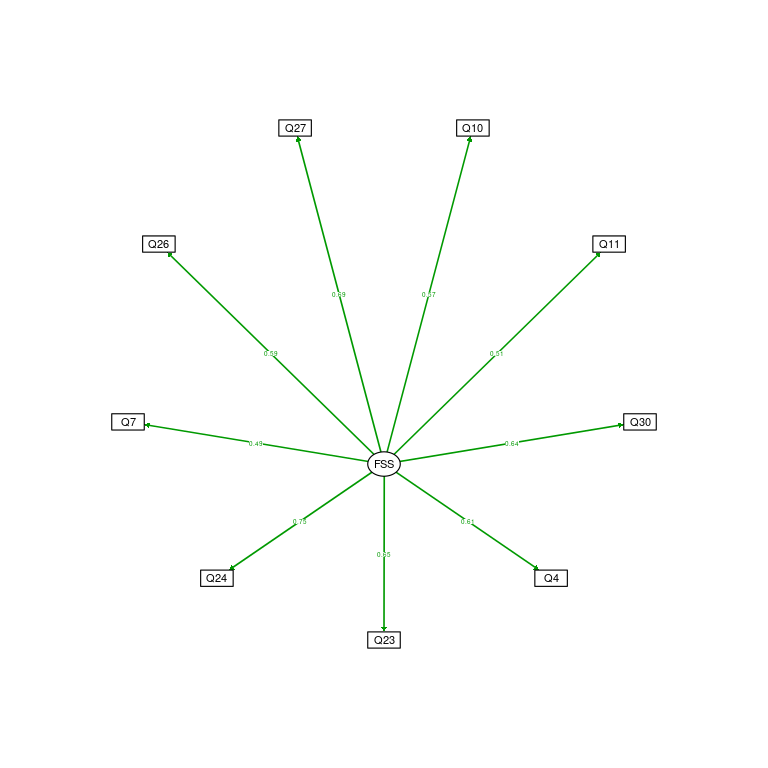
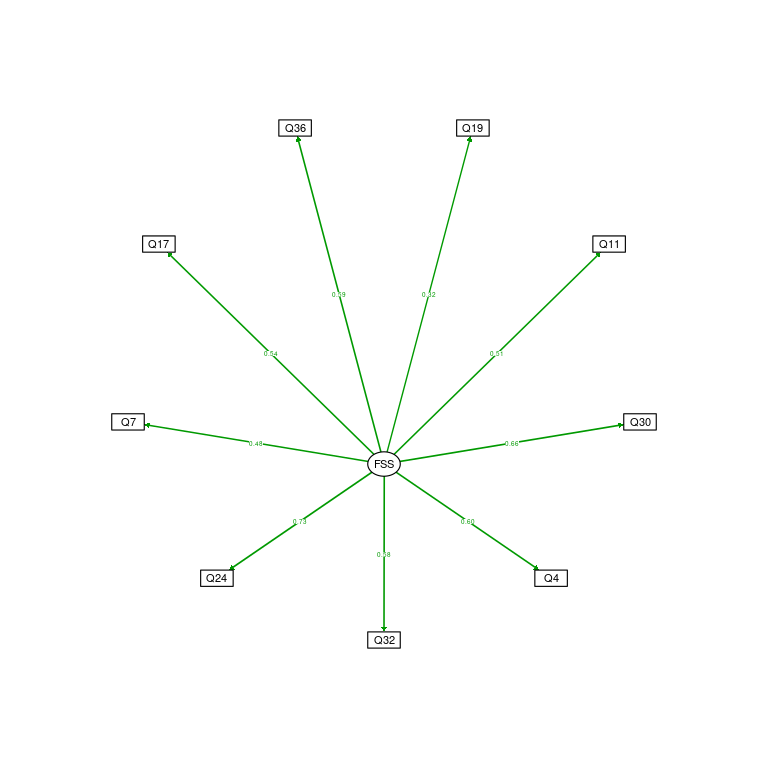

Factor Analysis in Short Version of FSS-2
================
Geiser Chalco Challco <geiser@alumni.usp.br>

  - Data: [data/raw-data.csv](data/raw-data.csv)
  - Source code:
    [02-factor-analysis-short-FSS.Rmd](02-factor-analysis-short-FSS.Rmd)

## Loading libs

``` r
library(GPArotation)
library(readr)
library(dplyr)
library(psych)
library(lavaan)
library(ggraph)
library(semPlot)
library(MVN)
library(daff)
library(robustHD)
library(parameters)
```

## Loading data

  - As in the identification of [careless](00-careless.md), there was
    only 2 data, we decided to use all the raw data.

<!-- end list -->

``` r
raw_data <- read.csv("data/raw-data.csv")
dat <- select(raw_data, starts_with("gender"), starts_with("age"), starts_with("Q"))
datItem <- select(dat, starts_with("Q"))
```

## Confirmatory Factorial Analisis (CFA)

Setting a list of models in the list variable “mdls” to be tested using
lavaan SEM syntax.

``` r
mdls <- c('original short FSS-2'='
FSS =~ Q19+Q29+Q12+Q22+Q32+Q24+Q34+Q17+Q36
', 
'alternative short FSS-2'='
FSS =~ Q10+Q11+Q30+Q4+Q23+Q24+Q7+Q26+Q27
',
'alternative min short FSS-2'='
FSS =~ Q19+Q11+Q30+Q4+Q32+Q24+Q7+Q17+Q36
')
```

Perform CFA in all the defined models and obtain the fit measurements in
the variable “*cfa\_results*”

Print the basic fit measures for all the CFA models.

``` r
do.call(rbind, lapply(cfa_results, FUN = function(x) {
  x$fit[c('chisq','df','cfi','tli','rmsea','rmsea.ci','cfi.obs','tli.obs','rmsea.obs')]
}))
```

<table>

<thead>

<tr>

<th style="text-align:left;">

</th>

<th style="text-align:left;">

chisq

</th>

<th style="text-align:left;">

df

</th>

<th style="text-align:left;">

cfi

</th>

<th style="text-align:left;">

tli

</th>

<th style="text-align:left;">

rmsea

</th>

<th style="text-align:left;">

rmsea.ci

</th>

<th style="text-align:left;">

cfi.obs

</th>

<th style="text-align:left;">

tli.obs

</th>

<th style="text-align:left;">

rmsea.obs

</th>

</tr>

</thead>

<tbody>

<tr>

<td style="text-align:left;">

original short FSS-2

</td>

<td style="text-align:left;">

205.454

</td>

<td style="text-align:left;">

27

</td>

<td style="text-align:left;">

0.697

</td>

<td style="text-align:left;">

0.596

</td>

<td style="text-align:left;">

0.13

</td>

<td style="text-align:left;">

\[0.113; 0.146\]

</td>

<td style="text-align:left;">

unacceptable fit

</td>

<td style="text-align:left;">

unacceptable fit

</td>

<td style="text-align:left;">

poor fit

</td>

</tr>

<tr>

<td style="text-align:left;">

alternative short FSS-2

</td>

<td style="text-align:left;">

43.511

</td>

<td style="text-align:left;">

27

</td>

<td style="text-align:left;">

0.99

</td>

<td style="text-align:left;">

0.987

</td>

<td style="text-align:left;">

0.039

</td>

<td style="text-align:left;">

\[0.015; 0.06\]

</td>

<td style="text-align:left;">

NA

</td>

<td style="text-align:left;">

NA

</td>

<td style="text-align:left;">

NA

</td>

</tr>

<tr>

<td style="text-align:left;">

alternative min short FSS-2

</td>

<td style="text-align:left;">

61.654

</td>

<td style="text-align:left;">

27

</td>

<td style="text-align:left;">

0.973

</td>

<td style="text-align:left;">

0.964

</td>

<td style="text-align:left;">

0.057

</td>

<td style="text-align:left;">

\[0.038; 0.076\]

</td>

<td style="text-align:left;">

NA

</td>

<td style="text-align:left;">

NA

</td>

<td style="text-align:left;">

NA

</td>

</tr>

</tbody>

</table>

Calculate fit measures for all the CFA models.

``` r
t(do.call(rbind, lapply(cfa_results, FUN = function(x) x$fit)))
```

<table>

<thead>

<tr>

<th style="text-align:left;">

</th>

<th style="text-align:left;">

original short FSS-2

</th>

<th style="text-align:left;">

alternative short FSS-2

</th>

<th style="text-align:left;">

alternative min short FSS-2

</th>

</tr>

</thead>

<tbody>

<tr>

<td style="text-align:left;">

npar

</td>

<td style="text-align:left;">

27

</td>

<td style="text-align:left;">

27

</td>

<td style="text-align:left;">

27

</td>

</tr>

<tr>

<td style="text-align:left;">

fmin

</td>

<td style="text-align:left;">

0.26

</td>

<td style="text-align:left;">

0.055

</td>

<td style="text-align:left;">

0.078

</td>

</tr>

<tr>

<td style="text-align:left;">

chisq

</td>

<td style="text-align:left;">

205.454

</td>

<td style="text-align:left;">

43.511

</td>

<td style="text-align:left;">

61.654

</td>

</tr>

<tr>

<td style="text-align:left;">

df

</td>

<td style="text-align:left;">

27

</td>

<td style="text-align:left;">

27

</td>

<td style="text-align:left;">

27

</td>

</tr>

<tr>

<td style="text-align:left;">

pvalue

</td>

<td style="text-align:left;">

0

</td>

<td style="text-align:left;">

0.023

</td>

<td style="text-align:left;">

0

</td>

</tr>

<tr>

<td style="text-align:left;">

chisq.scaled

</td>

<td style="text-align:left;">

247.235

</td>

<td style="text-align:left;">

84.065

</td>

<td style="text-align:left;">

101.509

</td>

</tr>

<tr>

<td style="text-align:left;">

df.scaled

</td>

<td style="text-align:left;">

27

</td>

<td style="text-align:left;">

27

</td>

<td style="text-align:left;">

27

</td>

</tr>

<tr>

<td style="text-align:left;">

pvalue.scaled

</td>

<td style="text-align:left;">

0

</td>

<td style="text-align:left;">

0

</td>

<td style="text-align:left;">

0

</td>

</tr>

<tr>

<td style="text-align:left;">

chisq.scaling.factor

</td>

<td style="text-align:left;">

0.848

</td>

<td style="text-align:left;">

0.556

</td>

<td style="text-align:left;">

0.64

</td>

</tr>

<tr>

<td style="text-align:left;">

baseline.chisq

</td>

<td style="text-align:left;">

625.547

</td>

<td style="text-align:left;">

1731.753

</td>

<td style="text-align:left;">

1314.631

</td>

</tr>

<tr>

<td style="text-align:left;">

baseline.df

</td>

<td style="text-align:left;">

36

</td>

<td style="text-align:left;">

36

</td>

<td style="text-align:left;">

36

</td>

</tr>

<tr>

<td style="text-align:left;">

baseline.pvalue

</td>

<td style="text-align:left;">

0

</td>

<td style="text-align:left;">

0

</td>

<td style="text-align:left;">

0

</td>

</tr>

<tr>

<td style="text-align:left;">

baseline.chisq.scaled

</td>

<td style="text-align:left;">

438.967

</td>

<td style="text-align:left;">

873.879

</td>

<td style="text-align:left;">

761.149

</td>

</tr>

<tr>

<td style="text-align:left;">

baseline.df.scaled

</td>

<td style="text-align:left;">

36

</td>

<td style="text-align:left;">

36

</td>

<td style="text-align:left;">

36

</td>

</tr>

<tr>

<td style="text-align:left;">

baseline.pvalue.scaled

</td>

<td style="text-align:left;">

0

</td>

<td style="text-align:left;">

0

</td>

<td style="text-align:left;">

0

</td>

</tr>

<tr>

<td style="text-align:left;">

baseline.chisq.scaling.factor

</td>

<td style="text-align:left;">

1.463

</td>

<td style="text-align:left;">

2.024

</td>

<td style="text-align:left;">

1.763

</td>

</tr>

<tr>

<td style="text-align:left;">

cfi

</td>

<td style="text-align:left;">

0.697

</td>

<td style="text-align:left;">

0.99

</td>

<td style="text-align:left;">

0.973

</td>

</tr>

<tr>

<td style="text-align:left;">

tli

</td>

<td style="text-align:left;">

0.596

</td>

<td style="text-align:left;">

0.987

</td>

<td style="text-align:left;">

0.964

</td>

</tr>

<tr>

<td style="text-align:left;">

nnfi

</td>

<td style="text-align:left;">

0.596

</td>

<td style="text-align:left;">

0.987

</td>

<td style="text-align:left;">

0.964

</td>

</tr>

<tr>

<td style="text-align:left;">

rfi

</td>

<td style="text-align:left;">

0.562

</td>

<td style="text-align:left;">

0.966

</td>

<td style="text-align:left;">

0.937

</td>

</tr>

<tr>

<td style="text-align:left;">

nfi

</td>

<td style="text-align:left;">

0.672

</td>

<td style="text-align:left;">

0.975

</td>

<td style="text-align:left;">

0.953

</td>

</tr>

<tr>

<td style="text-align:left;">

pnfi

</td>

<td style="text-align:left;">

0.504

</td>

<td style="text-align:left;">

0.731

</td>

<td style="text-align:left;">

0.715

</td>

</tr>

<tr>

<td style="text-align:left;">

ifi

</td>

<td style="text-align:left;">

0.702

</td>

<td style="text-align:left;">

0.99

</td>

<td style="text-align:left;">

0.973

</td>

</tr>

<tr>

<td style="text-align:left;">

rni

</td>

<td style="text-align:left;">

0.697

</td>

<td style="text-align:left;">

0.99

</td>

<td style="text-align:left;">

0.973

</td>

</tr>

<tr>

<td style="text-align:left;">

cfi.scaled

</td>

<td style="text-align:left;">

0.453

</td>

<td style="text-align:left;">

0.932

</td>

<td style="text-align:left;">

0.897

</td>

</tr>

<tr>

<td style="text-align:left;">

tli.scaled

</td>

<td style="text-align:left;">

0.271

</td>

<td style="text-align:left;">

0.909

</td>

<td style="text-align:left;">

0.863

</td>

</tr>

<tr>

<td style="text-align:left;">

cfi.robust

</td>

<td style="text-align:left;">

NA

</td>

<td style="text-align:left;">

NA

</td>

<td style="text-align:left;">

NA

</td>

</tr>

<tr>

<td style="text-align:left;">

tli.robust

</td>

<td style="text-align:left;">

NA

</td>

<td style="text-align:left;">

NA

</td>

<td style="text-align:left;">

NA

</td>

</tr>

<tr>

<td style="text-align:left;">

nnfi.scaled

</td>

<td style="text-align:left;">

0.271

</td>

<td style="text-align:left;">

0.909

</td>

<td style="text-align:left;">

0.863

</td>

</tr>

<tr>

<td style="text-align:left;">

nnfi.robust

</td>

<td style="text-align:left;">

NA

</td>

<td style="text-align:left;">

NA

</td>

<td style="text-align:left;">

NA

</td>

</tr>

<tr>

<td style="text-align:left;">

rfi.scaled

</td>

<td style="text-align:left;">

0.249

</td>

<td style="text-align:left;">

0.872

</td>

<td style="text-align:left;">

0.822

</td>

</tr>

<tr>

<td style="text-align:left;">

nfi.scaled

</td>

<td style="text-align:left;">

0.437

</td>

<td style="text-align:left;">

0.904

</td>

<td style="text-align:left;">

0.867

</td>

</tr>

<tr>

<td style="text-align:left;">

ifi.scaled

</td>

<td style="text-align:left;">

0.465

</td>

<td style="text-align:left;">

0.933

</td>

<td style="text-align:left;">

0.899

</td>

</tr>

<tr>

<td style="text-align:left;">

rni.scaled

</td>

<td style="text-align:left;">

0.453

</td>

<td style="text-align:left;">

0.932

</td>

<td style="text-align:left;">

0.897

</td>

</tr>

<tr>

<td style="text-align:left;">

rni.robust

</td>

<td style="text-align:left;">

NA

</td>

<td style="text-align:left;">

NA

</td>

<td style="text-align:left;">

NA

</td>

</tr>

<tr>

<td style="text-align:left;">

rmsea

</td>

<td style="text-align:left;">

0.13

</td>

<td style="text-align:left;">

0.039

</td>

<td style="text-align:left;">

0.057

</td>

</tr>

<tr>

<td style="text-align:left;">

rmsea.ci.lower

</td>

<td style="text-align:left;">

0.113

</td>

<td style="text-align:left;">

0.015

</td>

<td style="text-align:left;">

0.038

</td>

</tr>

<tr>

<td style="text-align:left;">

rmsea.ci.upper

</td>

<td style="text-align:left;">

0.146

</td>

<td style="text-align:left;">

0.06

</td>

<td style="text-align:left;">

0.076

</td>

</tr>

<tr>

<td style="text-align:left;">

rmsea.pvalue

</td>

<td style="text-align:left;">

0

</td>

<td style="text-align:left;">

0.78

</td>

<td style="text-align:left;">

0.249

</td>

</tr>

<tr>

<td style="text-align:left;">

rmsea.scaled

</td>

<td style="text-align:left;">

0.144

</td>

<td style="text-align:left;">

0.073

</td>

<td style="text-align:left;">

0.084

</td>

</tr>

<tr>

<td style="text-align:left;">

rmsea.ci.lower.scaled

</td>

<td style="text-align:left;">

0.128

</td>

<td style="text-align:left;">

0.056

</td>

<td style="text-align:left;">

0.067

</td>

</tr>

<tr>

<td style="text-align:left;">

rmsea.ci.upper.scaled

</td>

<td style="text-align:left;">

0.161

</td>

<td style="text-align:left;">

0.091

</td>

<td style="text-align:left;">

0.101

</td>

</tr>

<tr>

<td style="text-align:left;">

rmsea.pvalue.scaled

</td>

<td style="text-align:left;">

0

</td>

<td style="text-align:left;">

0.015

</td>

<td style="text-align:left;">

0.001

</td>

</tr>

<tr>

<td style="text-align:left;">

rmsea.robust

</td>

<td style="text-align:left;">

NA

</td>

<td style="text-align:left;">

NA

</td>

<td style="text-align:left;">

NA

</td>

</tr>

<tr>

<td style="text-align:left;">

rmsea.ci.lower.robust

</td>

<td style="text-align:left;">

NA

</td>

<td style="text-align:left;">

NA

</td>

<td style="text-align:left;">

NA

</td>

</tr>

<tr>

<td style="text-align:left;">

rmsea.ci.upper.robust

</td>

<td style="text-align:left;">

NA

</td>

<td style="text-align:left;">

NA

</td>

<td style="text-align:left;">

NA

</td>

</tr>

<tr>

<td style="text-align:left;">

rmsea.pvalue.robust

</td>

<td style="text-align:left;">

NA

</td>

<td style="text-align:left;">

NA

</td>

<td style="text-align:left;">

NA

</td>

</tr>

<tr>

<td style="text-align:left;">

rmr

</td>

<td style="text-align:left;">

0.115

</td>

<td style="text-align:left;">

0.047

</td>

<td style="text-align:left;">

0.057

</td>

</tr>

<tr>

<td style="text-align:left;">

rmr\_nomean

</td>

<td style="text-align:left;">

0.126

</td>

<td style="text-align:left;">

0.052

</td>

<td style="text-align:left;">

0.063

</td>

</tr>

<tr>

<td style="text-align:left;">

srmr

</td>

<td style="text-align:left;">

0.106

</td>

<td style="text-align:left;">

0.05

</td>

<td style="text-align:left;">

0.058

</td>

</tr>

<tr>

<td style="text-align:left;">

srmr\_bentler

</td>

<td style="text-align:left;">

0.106

</td>

<td style="text-align:left;">

0.05

</td>

<td style="text-align:left;">

0.058

</td>

</tr>

<tr>

<td style="text-align:left;">

srmr\_bentler\_nomean

</td>

<td style="text-align:left;">

0.116

</td>

<td style="text-align:left;">

0.054

</td>

<td style="text-align:left;">

0.063

</td>

</tr>

<tr>

<td style="text-align:left;">

crmr

</td>

<td style="text-align:left;">

0.116

</td>

<td style="text-align:left;">

0.054

</td>

<td style="text-align:left;">

0.063

</td>

</tr>

<tr>

<td style="text-align:left;">

crmr\_nomean

</td>

<td style="text-align:left;">

0.13

</td>

<td style="text-align:left;">

0.061

</td>

<td style="text-align:left;">

0.071

</td>

</tr>

<tr>

<td style="text-align:left;">

srmr\_mplus

</td>

<td style="text-align:left;">

0.106

</td>

<td style="text-align:left;">

0.05

</td>

<td style="text-align:left;">

0.058

</td>

</tr>

<tr>

<td style="text-align:left;">

srmr\_mplus\_nomean

</td>

<td style="text-align:left;">

0.116

</td>

<td style="text-align:left;">

0.054

</td>

<td style="text-align:left;">

0.063

</td>

</tr>

<tr>

<td style="text-align:left;">

cn\_05

</td>

<td style="text-align:left;">

77.925

</td>

<td style="text-align:left;">

364.236

</td>

<td style="text-align:left;">

257.342

</td>

</tr>

<tr>

<td style="text-align:left;">

cn\_01

</td>

<td style="text-align:left;">

91.061

</td>

<td style="text-align:left;">

426.262

</td>

<td style="text-align:left;">

301.115

</td>

</tr>

<tr>

<td style="text-align:left;">

gfi

</td>

<td style="text-align:left;">

0.995

</td>

<td style="text-align:left;">

0.999

</td>

<td style="text-align:left;">

0.999

</td>

</tr>

<tr>

<td style="text-align:left;">

agfi

</td>

<td style="text-align:left;">

0.99

</td>

<td style="text-align:left;">

0.998

</td>

<td style="text-align:left;">

0.998

</td>

</tr>

<tr>

<td style="text-align:left;">

pgfi

</td>

<td style="text-align:left;">

0.498

</td>

<td style="text-align:left;">

0.5

</td>

<td style="text-align:left;">

0.499

</td>

</tr>

<tr>

<td style="text-align:left;">

mfi

</td>

<td style="text-align:left;">

0.797

</td>

<td style="text-align:left;">

0.979

</td>

<td style="text-align:left;">

0.957

</td>

</tr>

<tr>

<td style="text-align:left;">

ecvi

</td>

<td style="text-align:left;">

0.659

</td>

<td style="text-align:left;">

0.247

</td>

<td style="text-align:left;">

0.294

</td>

</tr>

<tr>

<td style="text-align:left;">

rmsea.ci

</td>

<td style="text-align:left;">

\[0.113; 0.146\]

</td>

<td style="text-align:left;">

\[0.015; 0.06\]

</td>

<td style="text-align:left;">

\[0.038; 0.076\]

</td>

</tr>

<tr>

<td style="text-align:left;">

rmsea.ci.scaled

</td>

<td style="text-align:left;">

\[0.128; 0.161\]

</td>

<td style="text-align:left;">

\[0.056; 0.091\]

</td>

<td style="text-align:left;">

\[0.067; 0.101\]

</td>

</tr>

<tr>

<td style="text-align:left;">

rmsea.ci.robust

</td>

<td style="text-align:left;">

\[NA; NA\]

</td>

<td style="text-align:left;">

\[NA; NA\]

</td>

<td style="text-align:left;">

\[NA; NA\]

</td>

</tr>

<tr>

<td style="text-align:left;">

cfi.obs

</td>

<td style="text-align:left;">

unacceptable fit

</td>

<td style="text-align:left;">

NA

</td>

<td style="text-align:left;">

NA

</td>

</tr>

<tr>

<td style="text-align:left;">

cfi.obs.scaled

</td>

<td style="text-align:left;">

unacceptable fit

</td>

<td style="text-align:left;">

NA

</td>

<td style="text-align:left;">

NA

</td>

</tr>

<tr>

<td style="text-align:left;">

cfi.obs.robust

</td>

<td style="text-align:left;">

NA

</td>

<td style="text-align:left;">

NA

</td>

<td style="text-align:left;">

NA

</td>

</tr>

<tr>

<td style="text-align:left;">

tli.obs

</td>

<td style="text-align:left;">

unacceptable fit

</td>

<td style="text-align:left;">

NA

</td>

<td style="text-align:left;">

NA

</td>

</tr>

<tr>

<td style="text-align:left;">

tli.obs.scaled

</td>

<td style="text-align:left;">

unacceptable fit

</td>

<td style="text-align:left;">

NA

</td>

<td style="text-align:left;">

NA

</td>

</tr>

<tr>

<td style="text-align:left;">

tli.obs.robust

</td>

<td style="text-align:left;">

NA

</td>

<td style="text-align:left;">

NA

</td>

<td style="text-align:left;">

NA

</td>

</tr>

<tr>

<td style="text-align:left;">

rmsea.obs

</td>

<td style="text-align:left;">

poor fit

</td>

<td style="text-align:left;">

NA

</td>

<td style="text-align:left;">

NA

</td>

</tr>

<tr>

<td style="text-align:left;">

rmsea.obs.scaled

</td>

<td style="text-align:left;">

poor fit

</td>

<td style="text-align:left;">

NA

</td>

<td style="text-align:left;">

NA

</td>

</tr>

<tr>

<td style="text-align:left;">

rmsea.obs.robust

</td>

<td style="text-align:left;">

NA

</td>

<td style="text-align:left;">

NA

</td>

<td style="text-align:left;">

NA

</td>

</tr>

</tbody>

</table>

### Summarize and draw diagrams of CFA models without negative observations

Select CFA models without negative observations

``` r
(mdls <- names(cfa_results)[sapply(cfa_results, FUN = function(x) {
  all(is.na(x$fit[c('cfi.obs','tli.obs','rmsea.obs')]))
})])
```

    ## [1] "alternative short FSS-2"     "alternative min short FSS-2"

Print summaries and diagrams for the CFA models without negative
observations

``` r
for (mdl in mdls) {
  cat(mdl,"\n"); summary(cfa_results[[mdl]]$cfa, standardized = T)
  semPaths(cfa_results[[mdl]]$cfa,  "std"
           , curvePivot = T, layout = "circle", rotation = 1, fade = F, intercepts = F, residuals = F
           , sizeLat = 4, sizeLat2 = 3, sizeMan = 4, sizeMan2 = 2, curvature = 2.5, esize = 1.5, asize = 1.5
           , edge.label.cex = 0.35, edge.label.position = 0.5)
}
```

    ## alternative short FSS-2 
    ## lavaan 0.6-7 ended normally after 21 iterations
    ## 
    ##   Estimator                                       DWLS
    ##   Optimization method                           NLMINB
    ##   Number of free parameters                         27
    ##                                                       
    ##   Number of observations                           395
    ##                                                       
    ## Model Test User Model:
    ##                                               Standard      Robust
    ##   Test Statistic                                43.511      84.065
    ##   Degrees of freedom                                27          27
    ##   P-value (Chi-square)                           0.023       0.000
    ##   Scaling correction factor                                  0.556
    ##   Shift parameter                                            5.759
    ##        simple second-order correction                             
    ## 
    ## Parameter Estimates:
    ## 
    ##   Standard errors                           Robust.sem
    ##   Information                                 Expected
    ##   Information saturated (h1) model        Unstructured
    ## 
    ## Latent Variables:
    ##                    Estimate  Std.Err  z-value  P(>|z|)   Std.lv  Std.all
    ##   FSS =~                                                                
    ##     Q10               0.572    0.049   11.561    0.000    0.572    0.570
    ##     Q11               0.532    0.055    9.706    0.000    0.532    0.511
    ##     Q30               0.609    0.044   13.698    0.000    0.609    0.638
    ##     Q4                0.539    0.044   12.215    0.000    0.539    0.608
    ##     Q23               0.649    0.045   14.318    0.000    0.649    0.650
    ##     Q24               0.677    0.038   17.681    0.000    0.677    0.751
    ##     Q7                0.505    0.053    9.541    0.000    0.505    0.488
    ##     Q26               0.633    0.054   11.785    0.000    0.633    0.591
    ##     Q27               0.674    0.044   15.253    0.000    0.674    0.689
    ## 
    ## Intercepts:
    ##                    Estimate  Std.Err  z-value  P(>|z|)   Std.lv  Std.all
    ##    .Q10               3.795    0.050   75.195    0.000    3.795    3.783
    ##    .Q11               3.413    0.052   65.096    0.000    3.413    3.275
    ##    .Q30               3.846    0.048   80.004    0.000    3.846    4.025
    ##    .Q4                3.716    0.045   83.239    0.000    3.716    4.188
    ##    .Q23               3.509    0.050   69.851    0.000    3.509    3.515
    ##    .Q24               3.681    0.045   81.203    0.000    3.681    4.086
    ##    .Q7                3.514    0.052   67.588    0.000    3.514    3.401
    ##    .Q26               3.324    0.054   61.645    0.000    3.324    3.102
    ##    .Q27               3.441    0.049   69.871    0.000    3.441    3.516
    ##     FSS               0.000                               0.000    0.000
    ## 
    ## Variances:
    ##                    Estimate  Std.Err  z-value  P(>|z|)   Std.lv  Std.all
    ##    .Q10               0.679    0.058   11.647    0.000    0.679    0.675
    ##    .Q11               0.802    0.062   12.909    0.000    0.802    0.739
    ##    .Q30               0.541    0.053   10.274    0.000    0.541    0.593
    ##    .Q4                0.497    0.042   11.773    0.000    0.497    0.631
    ##    .Q23               0.576    0.050   11.475    0.000    0.576    0.578
    ##    .Q24               0.353    0.033   10.821    0.000    0.353    0.435
    ##    .Q7                0.813    0.066   12.265    0.000    0.813    0.762
    ##    .Q26               0.748    0.070   10.628    0.000    0.748    0.651
    ##    .Q27               0.503    0.050   10.140    0.000    0.503    0.525
    ##     FSS               1.000                               1.000    1.000

<!-- -->

    ## alternative min short FSS-2 
    ## lavaan 0.6-7 ended normally after 20 iterations
    ## 
    ##   Estimator                                       DWLS
    ##   Optimization method                           NLMINB
    ##   Number of free parameters                         27
    ##                                                       
    ##   Number of observations                           395
    ##                                                       
    ## Model Test User Model:
    ##                                               Standard      Robust
    ##   Test Statistic                                61.654     101.509
    ##   Degrees of freedom                                27          27
    ##   P-value (Chi-square)                           0.000       0.000
    ##   Scaling correction factor                                  0.640
    ##   Shift parameter                                            5.159
    ##        simple second-order correction                             
    ## 
    ## Parameter Estimates:
    ## 
    ##   Standard errors                           Robust.sem
    ##   Information                                 Expected
    ##   Information saturated (h1) model        Unstructured
    ## 
    ## Latent Variables:
    ##                    Estimate  Std.Err  z-value  P(>|z|)   Std.lv  Std.all
    ##   FSS =~                                                                
    ##     Q19               0.324    0.054    5.958    0.000    0.324    0.317
    ##     Q11               0.535    0.054    9.986    0.000    0.535    0.514
    ##     Q30               0.632    0.042   14.903    0.000    0.632    0.662
    ##     Q4                0.533    0.046   11.631    0.000    0.533    0.601
    ##     Q32               0.613    0.054   11.309    0.000    0.613    0.582
    ##     Q24               0.655    0.041   15.929    0.000    0.655    0.727
    ##     Q7                0.494    0.053    9.365    0.000    0.494    0.478
    ##     Q17               0.553    0.053   10.356    0.000    0.553    0.542
    ##     Q36               0.621    0.048   12.918    0.000    0.621    0.590
    ## 
    ## Intercepts:
    ##                    Estimate  Std.Err  z-value  P(>|z|)   Std.lv  Std.all
    ##    .Q19               3.557    0.051   69.176    0.000    3.557    3.481
    ##    .Q11               3.413    0.052   65.096    0.000    3.413    3.275
    ##    .Q30               3.846    0.048   80.004    0.000    3.846    4.025
    ##    .Q4                3.716    0.045   83.239    0.000    3.716    4.188
    ##    .Q32               3.671    0.053   69.258    0.000    3.671    3.485
    ##    .Q24               3.681    0.045   81.203    0.000    3.681    4.086
    ##    .Q7                3.514    0.052   67.588    0.000    3.514    3.401
    ##    .Q17               3.278    0.051   63.924    0.000    3.278    3.216
    ##    .Q36               3.848    0.053   72.629    0.000    3.848    3.654
    ##     FSS               0.000                               0.000    0.000
    ## 
    ## Variances:
    ##                    Estimate  Std.Err  z-value  P(>|z|)   Std.lv  Std.all
    ##    .Q19               0.939    0.067   14.091    0.000    0.939    0.899
    ##    .Q11               0.799    0.061   13.186    0.000    0.799    0.736
    ##    .Q30               0.513    0.051   10.007    0.000    0.513    0.562
    ##    .Q4                0.503    0.044   11.508    0.000    0.503    0.639
    ##    .Q32               0.734    0.070   10.522    0.000    0.734    0.662
    ##    .Q24               0.383    0.038   10.183    0.000    0.383    0.472
    ##    .Q7                0.824    0.066   12.486    0.000    0.824    0.771
    ##    .Q17               0.734    0.064   11.394    0.000    0.734    0.706
    ##    .Q36               0.723    0.062   11.578    0.000    0.723    0.652
    ##     FSS               1.000                               1.000    1.000

<!-- -->

### Summarize comparison between CFA models without negative observations

``` r
combn(mdls, 2, simplify = F, FUN = function(x) {
  lavTestLRT(cfa_results[[x[1]]]$cfa, cfa_results[[x[2]]]$cfa, model.names=x)
})
```

    ## [[1]]
    ## Scaled Chi-Squared Difference Test (method = "satorra.2000")
    ## 
    ## lavaan NOTE:
    ##     The "Chisq" column contains standard test statistics, not the
    ##     robust test that should be reported per model. A robust difference
    ##     test is a function of two standard (not robust) statistics.
    ##  
    ##                             Df AIC BIC  Chisq Chisq diff Df diff Pr(>Chisq)
    ## alternative short FSS-2     27         43.511                              
    ## alternative min short FSS-2 27         61.654     18.144       0

> *Note*: Significant difference Pr(\>Chisq) indicates that: The model1
> fits the gathered data significantly different (better/worse) than the
> model2
