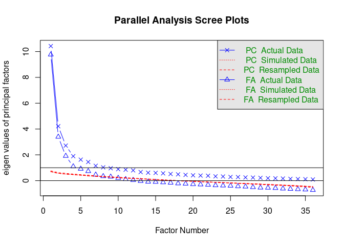
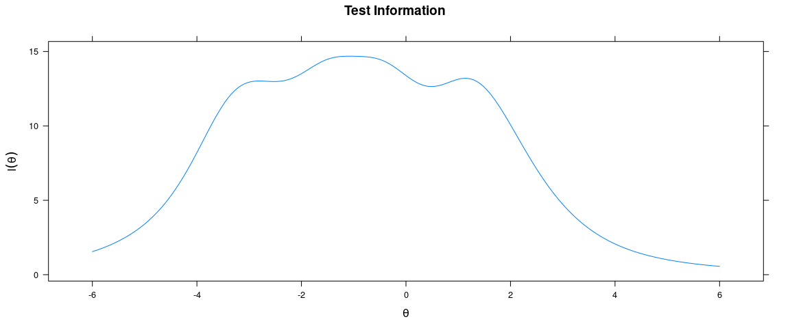
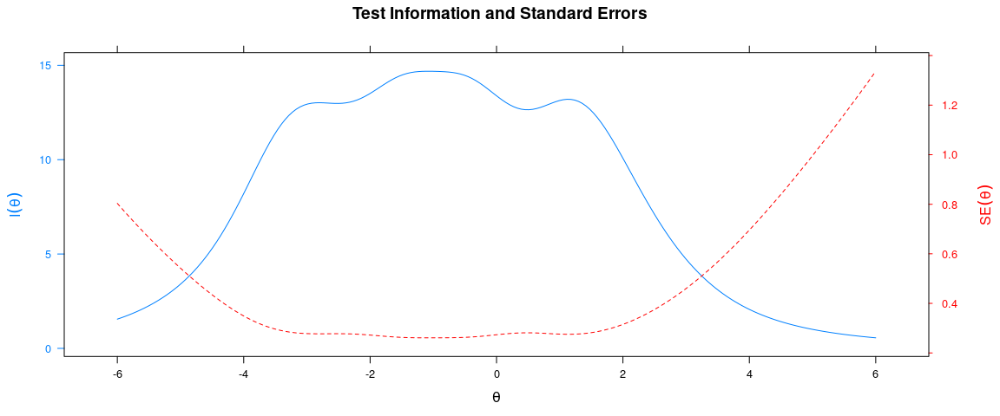
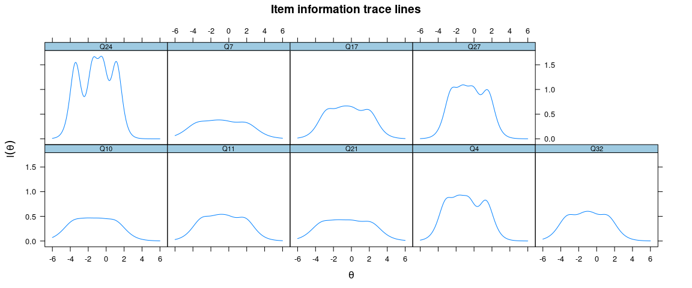
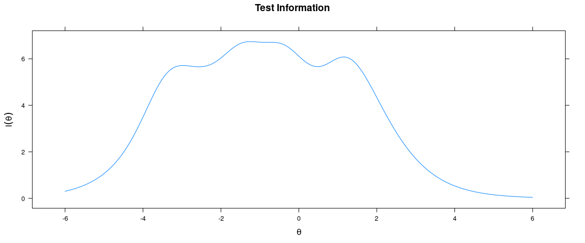
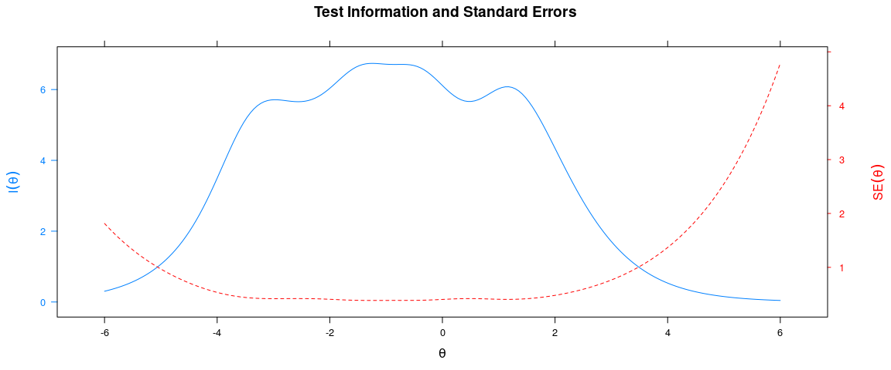

Factor Analysis of FSS-BR
================
Geiser Chalco Challco <geiser@alumni.usp.br>

-   [Prerequisites](#prerequisites)
    -   [Loading libs, functions and
        data](#loading-libs-functions-and-data)
    -   [Loading functions](#loading-functions)
-   [Checking assumptions](#checking-assumptions)
    -   [Performing Bartlett’s test of
        sphericity](#performing-bartletts-test-of-sphericity)
    -   [Performing Kaiser, Meyer, Olkin (KMO) based on Measure of
        Sampling Adequacy
        (MSA)](#performing-kaiser-meyer-olkin-kmo-based-on-measure-of-sampling-adequacy-msa)
    -   [Evaluating normality](#evaluating-normality)
    -   [Summarizing assumptions to perform
        analysis](#summarizing-assumptions-to-perform-analysis)
-   [Exploratory Factorial Analysis
    (EFA)](#exploratory-factorial-analysis-efa)
-   [Construct validity](#construct-validity)
    -   [Multicorrelated models](#multicorrelated-models)
        -   [Multicorrelated nine factor original
            model](#multicorrelated-nine-factor-original-model)
        -   [Multicorrelated nine factor model - fixed convergence and
            discriminant](#multicorrelated-nine-factor-model---fixed-convergence-and-discriminant)
        -   [Multicorrelated eight factor model - merging
            CG\~UF](#multicorrelated-eight-factor-model---merging-cguf)
    -   [2nd-order factor models](#nd-order-factor-models)
        -   [2nd-order nine factor original
            model](#nd-order-nine-factor-original-model)
        -   [2nd-order eight factor model - fixed convergence and
            discriminant](#nd-order-eight-factor-model---fixed-convergence-and-discriminant)
        -   [2nd-order eight factor model - merging
            CG\~UF](#nd-order-eight-factor-model---merging-cguf)
    -   [Unidimensional models (Short version of
        FSS-BR)](#unidimensional-models-short-version-of-fss-br)
        -   [Original short version of FSS-BR
            (FSS-short)](#original-short-version-of-fss-br-fss-short)
        -   [Alternative short version of FSS-BR (alt
            FSS-short)](#alternative-short-version-of-fss-br-alt-fss-short)
    -   [Summary of construct validity (structural, reliability and
        convergent/discriminant)](#summary-of-construct-validity-structural-reliability-and-convergentdiscriminant)
        -   [Structural validity - CFAs](#structural-validity---cfas)
        -   [Reliability validity - Cronbach / Omega /
            CR](#reliability-validity---cronbach-omega-cr)
        -   [Convergent and discriminant
            validity](#convergent-and-discriminant-validity)
-   [Item quality analysis based on IRT (Item Response
    Theory)](#item-quality-analysis-based-on-irt-item-response-theory)
    -   [IRT analysis in the long version of the
        DFS-BR](#irt-analysis-in-the-long-version-of-the-dfs-br)
        -   [Estimate parameters](#estimate-parameters)
        -   [Graphs of test information
            curve](#graphs-of-test-information-curve)
    -   [IRT analysis in the short version of the alt
        FSS-BR](#irt-analysis-in-the-short-version-of-the-alt-fss-br)
        -   [Estimate parameters](#estimate-parameters-1)
        -   [Graphs of test information
            curve](#graphs-of-test-information-curve-1)

# Prerequisites

-   R-script: [script.R](script.R)
-   DataSet: [data-fss.csv](data-fss.csv) OR
    [fss2-data.xlsx](fss2-data.xlsx)

## Loading libs, functions and data

Loading needed libs (packages)

``` r
wants <- c('psych', 'dplyr','readxl','psy','olsrr','MVN','parameters')
has <- wants %in% rownames(installed.packages())
if (any(!has)) install.packages(wants[!has])
options("mc.cores"=parallel::detectCores())

if (!'OpenMx' %in% rownames(installed.packages())) {
#  source('https://vipbg.vcu.edu/vipbg/OpenMx2/software/getOpenMx.R')
}
```

    ## NULL

``` r
library(readr)
library(dplyr)
library(psych)
library(lavaan)
library(olsrr)
library(semTools)
library(mirt)
```

Loading data

``` r
if (!file.exists("data-fss.csv")) {
  library(readxl)
  fss <- read_excel("fss2-data.xlsx", sheet = "raw-data")
  write_csv(fss[!fss$is_invalid,], "data-fss.csv")
}
raw_data <- read.csv("data-fss.csv")
fss <- as.data.frame(sapply(select(raw_data, starts_with("Q")), as.integer))
```

## Loading functions

``` r
getFactors <- function(fit, secondFactor = NULL) {
  sl <- standardizedSolution(fit)
  sl <- sl[sl$op == '=~',]
  lfactors <- lapply(unique(sl$lhs), FUN = function(lhs) {
    sl$rhs[sl$lhs == lhs] 
  })
  names(lfactors) <- unique(sl$lhs)
  if (!is.null(secondFactor))
    lfactors[[secondFactor]] <- NULL
  return(lfactors)
}

#' Calculate composite reliability of factors
#'
#' This functions calculate composite reliability values of factors
#'
#' @param fit a lavaan object expected to contain a CFA model
#' @param return.total logical indicating whether to return a final column containing the reliability of a composite of all items.
#' @return Reliability values of each factor in each group.
compReliability <- function(fit, return.total = F) {
  toReturn <- sapply(getFactors(fit), FUN = function(x) {
    sl <- standardizedSolution(fit)
    sl <- sl$est.std[sl$op == "=~" & sl$rhs %in% x]
    names(sl) <- x
    
    re <- 1 - sl^2
    sum(sl)^2 / (sum(sl)^2 + sum(re))
  })
  if (return.total) {
    sl <- standardizedSolution(fit)
    sl <- sl$est.std[sl$op == "=~"]
    re <- 1 - sl^2
    toReturn <- c(toReturn, total=sum(sl)^2 / (sum(sl)^2 + sum(re)))
  }
  toReturn
}

#' Asessing convergent and discriminant validity
#'
#' This functions assess the discriminant and convergent validity of factors 
#' based on Heterotrait-Monotrait Ratio (semTools::htmt).
#'
#' @param fit a lavaan object expected to contain a CFA model
#' @param lnv string with the lavaan syntax of the fit CFA model.
#' @param dat data.frame with the data used in the CFA model
#' @param secondFactor second factor to be used in the CFA model
#' @return Composite Reliability, AVE and matrix of Heterotrait-Monotrait Ratio
convergentDiscriminantValidity <- function(fit, lvn, dat, secondFactor = NULL) {
  library(olsrr)
  library(semTools)
  
  CR <- compReliability(fit)
  AVE <- reliability(fit)[c("avevar"),]
  if (!is.null(secondFactor)) {
    AVE[secondFactor] <- reliability(fit, return.total = TRUE)["avevar","total"]
  }
  
  factors <- getFactors(fit, secondFactor)
  
  for (f1 in names(factors)) dat[[f1]] <- rowSums(dat[,factors[[f1]]])
  if (is.null(secondFactor)) secondFactor <- 'F0'
  dat[[secondFactor]] <- rowSums(dat[,names(factors)])
  
  mdl <- lm(as.formula(paste0(secondFactor,' ~ ', paste0(names(factors), collapse = '+'))), data = dat)
  VIF <- ols_vif_tol(mdl)$VIF
  VIF.i <- sapply(names(factors), FUN = function(f1) {
    mdl <- lm(as.formula(paste0(f1,' ~ ',paste0(factors[[f1]], collapse = '+'))), data = dat)
    max(ols_vif_tol(mdl)$VIF)
  })
  
  
  lvn2 <- stringr::str_replace(lvn, paste0("\n\\s*",secondFactor,"\\s*.*=~\\s*.*\n","\n"),"\n\n")
  corr.df <- as.table(inspect(fit, "cor.lv"))
  corr.df[upper.tri(corr.df)] <- NA
  htmt.df <- as.table(semTools::htmt(lvn2, dat))
  if (is.null(secondFactor) || secondFactor != 'F0') {
    cnames <- colnames(htmt.df)
    htmt.df <- cbind(htmt.df, rep(NA, nrow(htmt.df)))
    htmt.df <- rbind(htmt.df, rep(NA, ncol(htmt.df)))
    rownames(htmt.df) <- c(cnames, secondFactor)
    colnames(htmt.df) <- c(cnames, secondFactor)  
  }
  htmt.df[lower.tri(htmt.df)] <- NA
  
  df <- corr.df
  df[upper.tri(corr.df)] <- htmt.df[upper.tri(df)]
  for (cname in names(AVE)) df[cname,cname] <-  sqrt(AVE[[cname]])
  
  as.data.frame(cbind(CR,AVE, VIF, VIF.i, df))
}

#' Summarize fit indexes of CFA models
#'
#' This functions summarize fit indexes from CFA models
#'
#' @param fits a list of lavaan objects with CFA models
#' @return fit indexes results of CFA models
summariseFits <- function(fits) {
 df_fit <- do.call(rbind, lapply(fits, FUN = function(fit) {
  dat <- as.list(round(fitMeasures(fit, c("chisq","df","cfi","tli","srmr","rmsea","rmsea.ci.lower","rmsea.ci.upper")), 3))
  rbind(c(dat[c("chisq","df")],"chisq/df"=round(dat$chisq/dat$df,3)
          , dat[c("cfi","tli","srmr","rmsea")]
          , "rmsea.ci" = paste0("[",dat$rmsea.ci.lower,"; ",dat$rmsea.ci.upper,"]")))
  }))
 rownames(df_fit) <- names(fits)
 return(df_fit) 
}
```

# Checking assumptions

### Performing Bartlett’s test of sphericity

``` r
(parameters::check_sphericity(fss)) 
```

    ## # Test of Sphericity
    ## 
    ## Bartlett's test of sphericity suggests that there is sufficient significant correlation in the data for factor analysis (Chisq(630) = 6543.72, p < .001).

-   Obs: We didn’t use *bartlett.test()* because it performs homogeneity
    of variances

### Performing Kaiser, Meyer, Olkin (KMO) based on Measure of Sampling Adequacy (MSA)

``` r
(kmo_mod <- KMO(fss)) 
```

    ## Kaiser-Meyer-Olkin factor adequacy
    ## Call: KMO(r = fss)
    ## Overall MSA =  0.86
    ## MSA for each item = 
    ##   Q1   Q2   Q3   Q4   Q5   Q6   Q7   Q8   Q9  Q10  Q11  Q12  Q13  Q14  Q15  Q16 
    ## 0.90 0.89 0.88 0.90 0.90 0.83 0.90 0.68 0.78 0.88 0.91 0.83 0.84 0.91 0.90 0.79 
    ##  Q17  Q18  Q19  Q20  Q21  Q22  Q23  Q24  Q25  Q26  Q27  Q28  Q29  Q30  Q31  Q32 
    ## 0.84 0.79 0.83 0.81 0.88 0.84 0.88 0.91 0.88 0.88 0.91 0.81 0.64 0.92 0.87 0.86 
    ##  Q33  Q34  Q35  Q36 
    ## 0.94 0.80 0.77 0.86

### Evaluating normality

``` r
(mvn_mod <- MVN::mvn(fss))
```

    ## Registered S3 method overwritten by 'GGally':
    ##   method from   
    ##   +.gg   ggplot2

    ## sROC 0.1-2 loaded

    ## $multivariateNormality
    ##              Test       Statistic               p value Result
    ## 1 Mardia Skewness 14306.451580769 6.06332246876875e-310     NO
    ## 2 Mardia Kurtosis 40.226562392401                     0     NO
    ## 3             MVN            <NA>                  <NA>     NO
    ## 
    ## $univariateNormality
    ##            Test  Variable Statistic   p value Normality
    ## 1  Shapiro-Wilk    Q1        0.8104  <0.001      NO    
    ## 2  Shapiro-Wilk    Q2        0.9051  <0.001      NO    
    ## 3  Shapiro-Wilk    Q3        0.8950  <0.001      NO    
    ## 4  Shapiro-Wilk    Q4        0.8596  <0.001      NO    
    ## 5  Shapiro-Wilk    Q5        0.8861  <0.001      NO    
    ## 6  Shapiro-Wilk    Q6        0.8949  <0.001      NO    
    ## 7  Shapiro-Wilk    Q7        0.8842  <0.001      NO    
    ## 8  Shapiro-Wilk    Q8        0.9131  <0.001      NO    
    ## 9  Shapiro-Wilk    Q9        0.8873  <0.001      NO    
    ## 10 Shapiro-Wilk    Q10       0.8709  <0.001      NO    
    ## 11 Shapiro-Wilk    Q11       0.8955  <0.001      NO    
    ## 12 Shapiro-Wilk    Q12       0.9059  <0.001      NO    
    ## 13 Shapiro-Wilk    Q13       0.8969  <0.001      NO    
    ## 14 Shapiro-Wilk    Q14       0.8642  <0.001      NO    
    ## 15 Shapiro-Wilk    Q15       0.8723  <0.001      NO    
    ## 16 Shapiro-Wilk    Q16       0.8974  <0.001      NO    
    ## 17 Shapiro-Wilk    Q17       0.9025  <0.001      NO    
    ## 18 Shapiro-Wilk    Q18       0.9143  <0.001      NO    
    ## 19 Shapiro-Wilk    Q19       0.8907  <0.001      NO    
    ## 20 Shapiro-Wilk    Q20       0.8933  <0.001      NO    
    ## 21 Shapiro-Wilk    Q21       0.8991  <0.001      NO    
    ## 22 Shapiro-Wilk    Q22       0.8792  <0.001      NO    
    ## 23 Shapiro-Wilk    Q23       0.8916  <0.001      NO    
    ## 24 Shapiro-Wilk    Q24       0.8702  <0.001      NO    
    ## 25 Shapiro-Wilk    Q25       0.8867  <0.001      NO    
    ## 26 Shapiro-Wilk    Q26       0.8998  <0.001      NO    
    ## 27 Shapiro-Wilk    Q27       0.8960  <0.001      NO    
    ## 28 Shapiro-Wilk    Q28       0.9122  <0.001      NO    
    ## 29 Shapiro-Wilk    Q29       0.9093  <0.001      NO    
    ## 30 Shapiro-Wilk    Q30       0.8660  <0.001      NO    
    ## 31 Shapiro-Wilk    Q31       0.8741  <0.001      NO    
    ## 32 Shapiro-Wilk    Q32       0.8692  <0.001      NO    
    ## 33 Shapiro-Wilk    Q33       0.8518  <0.001      NO    
    ## 34 Shapiro-Wilk    Q34       0.8931  <0.001      NO    
    ## 35 Shapiro-Wilk    Q35       0.9096  <0.001      NO    
    ## 36 Shapiro-Wilk    Q36       0.8597  <0.001      NO    
    ## 
    ## $Descriptives
    ##       n     Mean   Std.Dev Median Min Max 25th 75th         Skew    Kurtosis
    ## Q1  386 3.981865 0.8231600      4   1   5    4    4 -0.969842243  1.49902651
    ## Q2  386 3.178756 1.1629182      3   1   5    2    4 -0.221429494 -0.90797752
    ## Q3  386 3.316062 0.9769292      3   1   5    3    4 -0.162795183 -0.70192506
    ## Q4  386 3.722798 0.8817624      4   1   5    3    4 -0.611587654  0.22811532
    ## Q5  386 3.549223 0.9823967      4   1   5    3    4 -0.399386729 -0.48143364
    ## Q6  386 3.132124 1.2234310      3   1   5    2    4 -0.226788477 -1.06280655
    ## Q7  386 3.510363 1.0300152      4   1   5    3    4 -0.497138482 -0.41167692
    ## Q8  386 3.072539 1.2016968      3   1   5    2    4 -0.147998301 -0.87662668
    ## Q9  386 3.510363 1.0325338      4   1   5    3    4 -0.543077568 -0.20464608
    ## Q10 386 3.808290 0.9984579      4   1   5    3    5 -0.610430732 -0.15088868
    ## Q11 386 3.417098 1.0392894      4   1   5    3    4 -0.367768223 -0.56820771
    ## Q12 386 3.072539 1.0493893      3   1   5    2    4 -0.077141382 -0.78978922
    ## Q13 386 3.170984 0.9865525      3   1   5    2    4 -0.119094912 -0.72972884
    ## Q14 386 3.608808 1.1094986      4   1   5    3    4 -0.712645236 -0.24247765
    ## Q15 386 3.639896 0.9015796      4   1   5    3    4 -0.462731650 -0.19069571
    ## Q16 386 3.321244 1.1533867      4   1   5    2    4 -0.220150638 -0.97643312
    ## Q17 386 3.282383 1.0195749      3   1   5    3    4 -0.231569369 -0.62162702
    ## Q18 386 3.033679 1.0721530      3   1   5    2    4 -0.054084770 -0.69542352
    ## Q19 386 3.559585 1.0156305      4   1   5    3    4 -0.450860854 -0.37496631
    ## Q20 386 3.551813 1.1182822      4   1   5    3    4 -0.424023772 -0.65960338
    ## Q21 386 3.375648 0.9757196      3   1   5    3    4 -0.302656785 -0.31875307
    ## Q22 386 3.246114 1.0162564      3   1   5    2    4 -0.267402012 -0.84871179
    ## Q23 386 3.507772 1.0019159      4   1   5    3    4 -0.399928218 -0.44499552
    ## Q24 386 3.686528 0.8843076      4   1   5    3    4 -0.359567964 -0.45213541
    ## Q25 386 3.391192 1.0268222      4   1   5    3    4 -0.360126498 -0.66322150
    ## Q26 386 3.326425 1.0725264      3   1   5    3    4 -0.321524120 -0.67326964
    ## Q27 386 3.443005 0.9793267      4   1   5    3    4 -0.345586965 -0.35997124
    ## Q28 386 3.238342 1.1532816      3   1   5    2    4 -0.096895085 -0.86643754
    ## Q29 386 3.054404 1.1047213      3   1   5    2    4 -0.003360323 -0.87960252
    ## Q30 386 3.847150 0.9561583      4   1   5    3    5 -0.545960821 -0.37527951
    ## Q31 386 3.580311 0.9230249      4   1   5    3    4 -0.423255283 -0.38139194
    ## Q32 386 3.668394 1.0587353      4   1   5    3    4 -0.568899492 -0.51146027
    ## Q33 386 3.699482 0.8696019      4   1   5    3    4 -0.587178209  0.03500656
    ## Q34 386 3.398964 1.2322080      4   1   5    2    4 -0.374104088 -0.91755268
    ## Q35 386 3.266839 1.1436051      3   1   5    2    4 -0.262259461 -0.75298082
    ## Q36 386 3.860104 1.0475024      4   1   5    3    5 -0.666379448 -0.31718022

### Summarizing assumptions to perform analysis

``` r
df <- cbind(mvn_mod$Descriptives[,c("Mean","Median","Std.Dev")]
            , "MSAi"=as.numeric(kmo_mod$MSAi)
            , "Statistic"=as.numeric(mvn_mod$univariateNormality$Statistic)
            , mvn_mod$Descriptives[,c("Skew","Kurtosis")]
            , mvn_mod$univariateNormality[,c("p value","Normality")])
knitr::kable(df, digits = 3)
```

<table>
<thead>
<tr>
<th style="text-align:left;">
</th>
<th style="text-align:right;">
Mean
</th>
<th style="text-align:right;">
Median
</th>
<th style="text-align:right;">
Std.Dev
</th>
<th style="text-align:right;">
MSAi
</th>
<th style="text-align:right;">
Statistic
</th>
<th style="text-align:right;">
Skew
</th>
<th style="text-align:right;">
Kurtosis
</th>
<th style="text-align:left;">
p value
</th>
<th style="text-align:left;">
Normality
</th>
</tr>
</thead>
<tbody>
<tr>
<td style="text-align:left;">
Q1
</td>
<td style="text-align:right;">
3.982
</td>
<td style="text-align:right;">
4
</td>
<td style="text-align:right;">
0.823
</td>
<td style="text-align:right;">
0.896
</td>
<td style="text-align:right;">
0.810
</td>
<td style="text-align:right;">
-0.970
</td>
<td style="text-align:right;">
1.499
</td>
<td style="text-align:left;">
&lt;0.001
</td>
<td style="text-align:left;">
NO
</td>
</tr>
<tr>
<td style="text-align:left;">
Q2
</td>
<td style="text-align:right;">
3.179
</td>
<td style="text-align:right;">
3
</td>
<td style="text-align:right;">
1.163
</td>
<td style="text-align:right;">
0.887
</td>
<td style="text-align:right;">
0.905
</td>
<td style="text-align:right;">
-0.221
</td>
<td style="text-align:right;">
-0.908
</td>
<td style="text-align:left;">
&lt;0.001
</td>
<td style="text-align:left;">
NO
</td>
</tr>
<tr>
<td style="text-align:left;">
Q3
</td>
<td style="text-align:right;">
3.316
</td>
<td style="text-align:right;">
3
</td>
<td style="text-align:right;">
0.977
</td>
<td style="text-align:right;">
0.880
</td>
<td style="text-align:right;">
0.895
</td>
<td style="text-align:right;">
-0.163
</td>
<td style="text-align:right;">
-0.702
</td>
<td style="text-align:left;">
&lt;0.001
</td>
<td style="text-align:left;">
NO
</td>
</tr>
<tr>
<td style="text-align:left;">
Q4
</td>
<td style="text-align:right;">
3.723
</td>
<td style="text-align:right;">
4
</td>
<td style="text-align:right;">
0.882
</td>
<td style="text-align:right;">
0.904
</td>
<td style="text-align:right;">
0.860
</td>
<td style="text-align:right;">
-0.612
</td>
<td style="text-align:right;">
0.228
</td>
<td style="text-align:left;">
&lt;0.001
</td>
<td style="text-align:left;">
NO
</td>
</tr>
<tr>
<td style="text-align:left;">
Q5
</td>
<td style="text-align:right;">
3.549
</td>
<td style="text-align:right;">
4
</td>
<td style="text-align:right;">
0.982
</td>
<td style="text-align:right;">
0.897
</td>
<td style="text-align:right;">
0.886
</td>
<td style="text-align:right;">
-0.399
</td>
<td style="text-align:right;">
-0.481
</td>
<td style="text-align:left;">
&lt;0.001
</td>
<td style="text-align:left;">
NO
</td>
</tr>
<tr>
<td style="text-align:left;">
Q6
</td>
<td style="text-align:right;">
3.132
</td>
<td style="text-align:right;">
3
</td>
<td style="text-align:right;">
1.223
</td>
<td style="text-align:right;">
0.832
</td>
<td style="text-align:right;">
0.895
</td>
<td style="text-align:right;">
-0.227
</td>
<td style="text-align:right;">
-1.063
</td>
<td style="text-align:left;">
&lt;0.001
</td>
<td style="text-align:left;">
NO
</td>
</tr>
<tr>
<td style="text-align:left;">
Q7
</td>
<td style="text-align:right;">
3.510
</td>
<td style="text-align:right;">
4
</td>
<td style="text-align:right;">
1.030
</td>
<td style="text-align:right;">
0.901
</td>
<td style="text-align:right;">
0.884
</td>
<td style="text-align:right;">
-0.497
</td>
<td style="text-align:right;">
-0.412
</td>
<td style="text-align:left;">
&lt;0.001
</td>
<td style="text-align:left;">
NO
</td>
</tr>
<tr>
<td style="text-align:left;">
Q8
</td>
<td style="text-align:right;">
3.073
</td>
<td style="text-align:right;">
3
</td>
<td style="text-align:right;">
1.202
</td>
<td style="text-align:right;">
0.677
</td>
<td style="text-align:right;">
0.913
</td>
<td style="text-align:right;">
-0.148
</td>
<td style="text-align:right;">
-0.877
</td>
<td style="text-align:left;">
&lt;0.001
</td>
<td style="text-align:left;">
NO
</td>
</tr>
<tr>
<td style="text-align:left;">
Q9
</td>
<td style="text-align:right;">
3.510
</td>
<td style="text-align:right;">
4
</td>
<td style="text-align:right;">
1.033
</td>
<td style="text-align:right;">
0.780
</td>
<td style="text-align:right;">
0.887
</td>
<td style="text-align:right;">
-0.543
</td>
<td style="text-align:right;">
-0.205
</td>
<td style="text-align:left;">
&lt;0.001
</td>
<td style="text-align:left;">
NO
</td>
</tr>
<tr>
<td style="text-align:left;">
Q10
</td>
<td style="text-align:right;">
3.808
</td>
<td style="text-align:right;">
4
</td>
<td style="text-align:right;">
0.998
</td>
<td style="text-align:right;">
0.884
</td>
<td style="text-align:right;">
0.871
</td>
<td style="text-align:right;">
-0.610
</td>
<td style="text-align:right;">
-0.151
</td>
<td style="text-align:left;">
&lt;0.001
</td>
<td style="text-align:left;">
NO
</td>
</tr>
<tr>
<td style="text-align:left;">
Q11
</td>
<td style="text-align:right;">
3.417
</td>
<td style="text-align:right;">
4
</td>
<td style="text-align:right;">
1.039
</td>
<td style="text-align:right;">
0.909
</td>
<td style="text-align:right;">
0.895
</td>
<td style="text-align:right;">
-0.368
</td>
<td style="text-align:right;">
-0.568
</td>
<td style="text-align:left;">
&lt;0.001
</td>
<td style="text-align:left;">
NO
</td>
</tr>
<tr>
<td style="text-align:left;">
Q12
</td>
<td style="text-align:right;">
3.073
</td>
<td style="text-align:right;">
3
</td>
<td style="text-align:right;">
1.049
</td>
<td style="text-align:right;">
0.831
</td>
<td style="text-align:right;">
0.906
</td>
<td style="text-align:right;">
-0.077
</td>
<td style="text-align:right;">
-0.790
</td>
<td style="text-align:left;">
&lt;0.001
</td>
<td style="text-align:left;">
NO
</td>
</tr>
<tr>
<td style="text-align:left;">
Q13
</td>
<td style="text-align:right;">
3.171
</td>
<td style="text-align:right;">
3
</td>
<td style="text-align:right;">
0.987
</td>
<td style="text-align:right;">
0.839
</td>
<td style="text-align:right;">
0.897
</td>
<td style="text-align:right;">
-0.119
</td>
<td style="text-align:right;">
-0.730
</td>
<td style="text-align:left;">
&lt;0.001
</td>
<td style="text-align:left;">
NO
</td>
</tr>
<tr>
<td style="text-align:left;">
Q14
</td>
<td style="text-align:right;">
3.609
</td>
<td style="text-align:right;">
4
</td>
<td style="text-align:right;">
1.109
</td>
<td style="text-align:right;">
0.914
</td>
<td style="text-align:right;">
0.864
</td>
<td style="text-align:right;">
-0.713
</td>
<td style="text-align:right;">
-0.242
</td>
<td style="text-align:left;">
&lt;0.001
</td>
<td style="text-align:left;">
NO
</td>
</tr>
<tr>
<td style="text-align:left;">
Q15
</td>
<td style="text-align:right;">
3.640
</td>
<td style="text-align:right;">
4
</td>
<td style="text-align:right;">
0.902
</td>
<td style="text-align:right;">
0.902
</td>
<td style="text-align:right;">
0.872
</td>
<td style="text-align:right;">
-0.463
</td>
<td style="text-align:right;">
-0.191
</td>
<td style="text-align:left;">
&lt;0.001
</td>
<td style="text-align:left;">
NO
</td>
</tr>
<tr>
<td style="text-align:left;">
Q16
</td>
<td style="text-align:right;">
3.321
</td>
<td style="text-align:right;">
4
</td>
<td style="text-align:right;">
1.153
</td>
<td style="text-align:right;">
0.791
</td>
<td style="text-align:right;">
0.897
</td>
<td style="text-align:right;">
-0.220
</td>
<td style="text-align:right;">
-0.976
</td>
<td style="text-align:left;">
&lt;0.001
</td>
<td style="text-align:left;">
NO
</td>
</tr>
<tr>
<td style="text-align:left;">
Q17
</td>
<td style="text-align:right;">
3.282
</td>
<td style="text-align:right;">
3
</td>
<td style="text-align:right;">
1.020
</td>
<td style="text-align:right;">
0.841
</td>
<td style="text-align:right;">
0.902
</td>
<td style="text-align:right;">
-0.232
</td>
<td style="text-align:right;">
-0.622
</td>
<td style="text-align:left;">
&lt;0.001
</td>
<td style="text-align:left;">
NO
</td>
</tr>
<tr>
<td style="text-align:left;">
Q18
</td>
<td style="text-align:right;">
3.034
</td>
<td style="text-align:right;">
3
</td>
<td style="text-align:right;">
1.072
</td>
<td style="text-align:right;">
0.795
</td>
<td style="text-align:right;">
0.914
</td>
<td style="text-align:right;">
-0.054
</td>
<td style="text-align:right;">
-0.695
</td>
<td style="text-align:left;">
&lt;0.001
</td>
<td style="text-align:left;">
NO
</td>
</tr>
<tr>
<td style="text-align:left;">
Q19
</td>
<td style="text-align:right;">
3.560
</td>
<td style="text-align:right;">
4
</td>
<td style="text-align:right;">
1.016
</td>
<td style="text-align:right;">
0.831
</td>
<td style="text-align:right;">
0.891
</td>
<td style="text-align:right;">
-0.451
</td>
<td style="text-align:right;">
-0.375
</td>
<td style="text-align:left;">
&lt;0.001
</td>
<td style="text-align:left;">
NO
</td>
</tr>
<tr>
<td style="text-align:left;">
Q20
</td>
<td style="text-align:right;">
3.552
</td>
<td style="text-align:right;">
4
</td>
<td style="text-align:right;">
1.118
</td>
<td style="text-align:right;">
0.813
</td>
<td style="text-align:right;">
0.893
</td>
<td style="text-align:right;">
-0.424
</td>
<td style="text-align:right;">
-0.660
</td>
<td style="text-align:left;">
&lt;0.001
</td>
<td style="text-align:left;">
NO
</td>
</tr>
<tr>
<td style="text-align:left;">
Q21
</td>
<td style="text-align:right;">
3.376
</td>
<td style="text-align:right;">
3
</td>
<td style="text-align:right;">
0.976
</td>
<td style="text-align:right;">
0.881
</td>
<td style="text-align:right;">
0.899
</td>
<td style="text-align:right;">
-0.303
</td>
<td style="text-align:right;">
-0.319
</td>
<td style="text-align:left;">
&lt;0.001
</td>
<td style="text-align:left;">
NO
</td>
</tr>
<tr>
<td style="text-align:left;">
Q22
</td>
<td style="text-align:right;">
3.246
</td>
<td style="text-align:right;">
3
</td>
<td style="text-align:right;">
1.016
</td>
<td style="text-align:right;">
0.843
</td>
<td style="text-align:right;">
0.879
</td>
<td style="text-align:right;">
-0.267
</td>
<td style="text-align:right;">
-0.849
</td>
<td style="text-align:left;">
&lt;0.001
</td>
<td style="text-align:left;">
NO
</td>
</tr>
<tr>
<td style="text-align:left;">
Q23
</td>
<td style="text-align:right;">
3.508
</td>
<td style="text-align:right;">
4
</td>
<td style="text-align:right;">
1.002
</td>
<td style="text-align:right;">
0.881
</td>
<td style="text-align:right;">
0.892
</td>
<td style="text-align:right;">
-0.400
</td>
<td style="text-align:right;">
-0.445
</td>
<td style="text-align:left;">
&lt;0.001
</td>
<td style="text-align:left;">
NO
</td>
</tr>
<tr>
<td style="text-align:left;">
Q24
</td>
<td style="text-align:right;">
3.687
</td>
<td style="text-align:right;">
4
</td>
<td style="text-align:right;">
0.884
</td>
<td style="text-align:right;">
0.914
</td>
<td style="text-align:right;">
0.870
</td>
<td style="text-align:right;">
-0.360
</td>
<td style="text-align:right;">
-0.452
</td>
<td style="text-align:left;">
&lt;0.001
</td>
<td style="text-align:left;">
NO
</td>
</tr>
<tr>
<td style="text-align:left;">
Q25
</td>
<td style="text-align:right;">
3.391
</td>
<td style="text-align:right;">
4
</td>
<td style="text-align:right;">
1.027
</td>
<td style="text-align:right;">
0.885
</td>
<td style="text-align:right;">
0.887
</td>
<td style="text-align:right;">
-0.360
</td>
<td style="text-align:right;">
-0.663
</td>
<td style="text-align:left;">
&lt;0.001
</td>
<td style="text-align:left;">
NO
</td>
</tr>
<tr>
<td style="text-align:left;">
Q26
</td>
<td style="text-align:right;">
3.326
</td>
<td style="text-align:right;">
3
</td>
<td style="text-align:right;">
1.073
</td>
<td style="text-align:right;">
0.879
</td>
<td style="text-align:right;">
0.900
</td>
<td style="text-align:right;">
-0.322
</td>
<td style="text-align:right;">
-0.673
</td>
<td style="text-align:left;">
&lt;0.001
</td>
<td style="text-align:left;">
NO
</td>
</tr>
<tr>
<td style="text-align:left;">
Q27
</td>
<td style="text-align:right;">
3.443
</td>
<td style="text-align:right;">
4
</td>
<td style="text-align:right;">
0.979
</td>
<td style="text-align:right;">
0.914
</td>
<td style="text-align:right;">
0.896
</td>
<td style="text-align:right;">
-0.346
</td>
<td style="text-align:right;">
-0.360
</td>
<td style="text-align:left;">
&lt;0.001
</td>
<td style="text-align:left;">
NO
</td>
</tr>
<tr>
<td style="text-align:left;">
Q28
</td>
<td style="text-align:right;">
3.238
</td>
<td style="text-align:right;">
3
</td>
<td style="text-align:right;">
1.153
</td>
<td style="text-align:right;">
0.806
</td>
<td style="text-align:right;">
0.912
</td>
<td style="text-align:right;">
-0.097
</td>
<td style="text-align:right;">
-0.866
</td>
<td style="text-align:left;">
&lt;0.001
</td>
<td style="text-align:left;">
NO
</td>
</tr>
<tr>
<td style="text-align:left;">
Q29
</td>
<td style="text-align:right;">
3.054
</td>
<td style="text-align:right;">
3
</td>
<td style="text-align:right;">
1.105
</td>
<td style="text-align:right;">
0.643
</td>
<td style="text-align:right;">
0.909
</td>
<td style="text-align:right;">
-0.003
</td>
<td style="text-align:right;">
-0.880
</td>
<td style="text-align:left;">
&lt;0.001
</td>
<td style="text-align:left;">
NO
</td>
</tr>
<tr>
<td style="text-align:left;">
Q30
</td>
<td style="text-align:right;">
3.847
</td>
<td style="text-align:right;">
4
</td>
<td style="text-align:right;">
0.956
</td>
<td style="text-align:right;">
0.921
</td>
<td style="text-align:right;">
0.866
</td>
<td style="text-align:right;">
-0.546
</td>
<td style="text-align:right;">
-0.375
</td>
<td style="text-align:left;">
&lt;0.001
</td>
<td style="text-align:left;">
NO
</td>
</tr>
<tr>
<td style="text-align:left;">
Q31
</td>
<td style="text-align:right;">
3.580
</td>
<td style="text-align:right;">
4
</td>
<td style="text-align:right;">
0.923
</td>
<td style="text-align:right;">
0.872
</td>
<td style="text-align:right;">
0.874
</td>
<td style="text-align:right;">
-0.423
</td>
<td style="text-align:right;">
-0.381
</td>
<td style="text-align:left;">
&lt;0.001
</td>
<td style="text-align:left;">
NO
</td>
</tr>
<tr>
<td style="text-align:left;">
Q32
</td>
<td style="text-align:right;">
3.668
</td>
<td style="text-align:right;">
4
</td>
<td style="text-align:right;">
1.059
</td>
<td style="text-align:right;">
0.865
</td>
<td style="text-align:right;">
0.869
</td>
<td style="text-align:right;">
-0.569
</td>
<td style="text-align:right;">
-0.511
</td>
<td style="text-align:left;">
&lt;0.001
</td>
<td style="text-align:left;">
NO
</td>
</tr>
<tr>
<td style="text-align:left;">
Q33
</td>
<td style="text-align:right;">
3.699
</td>
<td style="text-align:right;">
4
</td>
<td style="text-align:right;">
0.870
</td>
<td style="text-align:right;">
0.938
</td>
<td style="text-align:right;">
0.852
</td>
<td style="text-align:right;">
-0.587
</td>
<td style="text-align:right;">
0.035
</td>
<td style="text-align:left;">
&lt;0.001
</td>
<td style="text-align:left;">
NO
</td>
</tr>
<tr>
<td style="text-align:left;">
Q34
</td>
<td style="text-align:right;">
3.399
</td>
<td style="text-align:right;">
4
</td>
<td style="text-align:right;">
1.232
</td>
<td style="text-align:right;">
0.803
</td>
<td style="text-align:right;">
0.893
</td>
<td style="text-align:right;">
-0.374
</td>
<td style="text-align:right;">
-0.918
</td>
<td style="text-align:left;">
&lt;0.001
</td>
<td style="text-align:left;">
NO
</td>
</tr>
<tr>
<td style="text-align:left;">
Q35
</td>
<td style="text-align:right;">
3.267
</td>
<td style="text-align:right;">
3
</td>
<td style="text-align:right;">
1.144
</td>
<td style="text-align:right;">
0.774
</td>
<td style="text-align:right;">
0.910
</td>
<td style="text-align:right;">
-0.262
</td>
<td style="text-align:right;">
-0.753
</td>
<td style="text-align:left;">
&lt;0.001
</td>
<td style="text-align:left;">
NO
</td>
</tr>
<tr>
<td style="text-align:left;">
Q36
</td>
<td style="text-align:right;">
3.860
</td>
<td style="text-align:right;">
4
</td>
<td style="text-align:right;">
1.048
</td>
<td style="text-align:right;">
0.860
</td>
<td style="text-align:right;">
0.860
</td>
<td style="text-align:right;">
-0.666
</td>
<td style="text-align:right;">
-0.317
</td>
<td style="text-align:left;">
&lt;0.001
</td>
<td style="text-align:left;">
NO
</td>
</tr>
</tbody>
</table>

# Exploratory Factorial Analysis (EFA)

Performing parallel factorial analysis

``` r
if (!file.exists("pfa_mod.RData")) {
  pfa_mod <- fa.parallel(fss, fm = 'wls', fa = 'fa', cor='poly', plot = F)
  save(pfa_mod, file = "pfa_mod.RData")
}
load("pfa_mod.RData")
(pfa_mod)
```

    ## Call: fa.parallel(x = fss, fm = "wls", fa = "fa", cor = "poly", plot = F)
    ## Parallel analysis suggests that the number of factors =  8  and the number of components =  NA 
    ## 
    ##  Eigen Values of 
    ## 
    ##  eigen values of factors
    ##  [1]  9.76  3.39  1.91  1.10  0.91  0.73  0.46  0.34  0.30  0.20  0.11  0.05
    ## [13] -0.03 -0.09 -0.10 -0.14 -0.17 -0.22 -0.24 -0.28 -0.30 -0.32 -0.36 -0.38
    ## [25] -0.40 -0.44 -0.47 -0.51 -0.55 -0.56 -0.58 -0.62 -0.64 -0.66 -0.69 -0.73
    ## 
    ##  eigen values of simulated factors
    ##  [1]  0.70  0.57  0.51  0.47  0.42  0.37  0.34  0.30  0.27  0.23  0.20  0.17
    ## [13]  0.14  0.10  0.08  0.05  0.02  0.00 -0.03 -0.05 -0.07 -0.10 -0.12 -0.15
    ## [25] -0.17 -0.20 -0.22 -0.24 -0.27 -0.29 -0.32 -0.34 -0.37 -0.40 -0.43 -0.47
    ## 
    ##  eigen values of components 
    ##  [1] 10.42  4.22  2.72  1.89  1.63  1.45  1.15  1.03  0.96  0.89  0.85  0.80
    ## [13]  0.67  0.62  0.60  0.57  0.52  0.49  0.44  0.41  0.39  0.38  0.33  0.32
    ## [25]  0.29  0.28  0.25  0.24  0.22  0.19  0.18  0.16  0.14  0.12  0.11  0.09
    ## 
    ##  eigen values of simulated components
    ## [1] NA

``` r
plot(pfa_mod)
```

<!-- -->

Running EFA with the factors sugested by the parallel factorial
analysis.

``` r
efa_mod <- fa(fss, nfactors = pfa_mod$nfact, cor = 'poly', fm = 'wls')
print(loadings(fa.sort(efa_mod)), cutoff = 0.3)
```

    ## 
    ## Loadings:
    ##     WLS2   WLS1   WLS8   WLS4   WLS3   WLS5   WLS6   WLS7  
    ## Q22  0.829                                                 
    ## Q13  0.743                                                 
    ## Q12  0.723                                                 
    ## Q21  0.609                                                 
    ## Q3   0.549                                                 
    ## Q6   0.467                                                 
    ## Q31  0.349         0.319                                   
    ## Q23         0.911                                          
    ## Q5          0.651                                          
    ## Q24         0.596                                          
    ## Q33         0.555                                          
    ## Q32         0.532                                          
    ## Q4          0.505                                          
    ## Q15  0.313  0.364                                          
    ## Q10                0.674                                   
    ## Q36                0.665                                   
    ## Q30                0.665                                   
    ## Q1   0.312         0.332                                   
    ## Q28                       0.715                            
    ## Q18                       0.694                            
    ## Q8                        0.688                            
    ## Q34                       0.678         0.444              
    ## Q9                               0.715                     
    ## Q19                              0.654                     
    ## Q35                              0.640                     
    ## Q16                                     0.930              
    ## Q7                                      0.508              
    ## Q25                                     0.476              
    ## Q20                0.350                       0.661       
    ## Q29                              0.550         0.612       
    ## Q2                                             0.574       
    ## Q11                                            0.455  0.365
    ## Q14                                            0.326       
    ## Q17                                                   0.807
    ## Q26                                                   0.450
    ## Q27                                                   0.372
    ## 
    ##                 WLS2  WLS1  WLS8  WLS4  WLS3  WLS5  WLS6  WLS7
    ## SS loadings    3.423 3.135 2.225 2.136 1.933 1.853 1.731 1.557
    ## Proportion Var 0.095 0.087 0.062 0.059 0.054 0.051 0.048 0.043
    ## Cumulative Var 0.095 0.182 0.244 0.303 0.357 0.408 0.457 0.500

Running EFA with nine (09) factors sugested by the parallel factorial
analysis.

``` r
efa_mod <- fa(fss, nfactors = 9, cor = 'poly', fm = 'wls')
print(loadings(fa.sort(efa_mod)), cutoff = 0.3)
```

    ## 
    ## Loadings:
    ##     WLS2   WLS1   WLS4   WLS8   WLS3   WLS5   WLS6   WLS7   WLS9  
    ## Q22  0.868                                                        
    ## Q13  0.711                                                        
    ## Q12  0.695                                                        
    ## Q21  0.592                                                        
    ## Q3   0.582                                                        
    ## Q6   0.477                                                        
    ## Q1   0.351                0.322                                   
    ## Q23         0.885                                                 
    ## Q32         0.685                                                 
    ## Q5          0.592                                                 
    ## Q33         0.413                                                 
    ## Q24         0.411                                            0.402
    ## Q4          0.353                                            0.305
    ## Q28                0.707                                          
    ## Q18                0.693                                          
    ## Q34                0.685                0.412                     
    ## Q8                 0.685                                          
    ## Q36                       0.656                                   
    ## Q10                       0.635                                   
    ## Q30                       0.632                                   
    ## Q31  0.314                0.317                                   
    ## Q19                              0.715                            
    ## Q9                               0.705                            
    ## Q35                              0.628                            
    ## Q16                                     0.932                     
    ## Q7                                      0.462                     
    ## Q25                                     0.431                0.350
    ## Q20                       0.329                0.692              
    ## Q29                              0.470         0.674              
    ## Q2                                             0.571              
    ## Q11                                            0.467  0.342       
    ## Q17                                                   0.840       
    ## Q26                                                   0.441       
    ## Q27                                                   0.357       
    ## Q14                                                          0.512
    ## Q15                                                          0.443
    ## 
    ##                 WLS2  WLS1  WLS4  WLS8  WLS3  WLS5  WLS6  WLS7  WLS9
    ## SS loadings    3.345 2.436 2.134 2.061 1.910 1.729 1.726 1.604 1.293
    ## Proportion Var 0.093 0.068 0.059 0.057 0.053 0.048 0.048 0.045 0.036
    ## Cumulative Var 0.093 0.161 0.220 0.277 0.330 0.378 0.426 0.471 0.507

# Construct validity

As there is not normality in the results, we decided to use the mean-
and variance-adjusted weighted least squares (WLSMV) estimator, based on
that WLSMV does not assume normal variables and it is a robust estimator
developed to model categorical or ordered data (our case 5-likert
scale).

-   Brown, T. (2006). Confirmatory factor analysis for applied research.
    New York: Guildford.
-   Proitsi, P., et al. (2009). A multiple indicators multiple causes
    (MIMIC) model of behavioural and psychological symptoms in dementia
    (BPSD). Neurobiology Aging.
    <doi:10.1016/j.neurobiolaging.2009.03.005>

## Multicorrelated models

### Multicorrelated nine factor original model

``` r
Modelo1a <- '
CSB =~ Q1 + Q10 + Q19 + Q28
MAA =~ Q2 + Q11 + Q20 + Q29
CG  =~ Q3 + Q12 + Q21 + Q30
UF  =~ Q4 + Q13 + Q22 + Q31
CTH =~ Q5 + Q14 + Q23 + Q32
SC  =~ Q6 + Q15 + Q24 + Q33
LSC =~ Q7 + Q16 + Q25 + Q34
TT  =~ Q8 + Q17 + Q26 + Q35
AE  =~ Q9 + Q18 + Q27 + Q36

CSB ~~ MAA
CSB ~~ CG
CSB ~~ UF
CSB ~~ CTH
CSB ~~ SC
CSB ~~ LSC
CSB ~~ TT
CSB ~~ AE

MAA ~~ CG
MAA ~~ UF
MAA ~~ CTH
MAA ~~ SC
MAA ~~ LSC
MAA ~~ TT
MAA ~~ AE

CG ~~ UF
CG ~~ CTH
CG ~~ SC
CG ~~ LSC
CG ~~ TT
CG ~~ AE

UF ~~ CTH
UF ~~ SC
UF ~~ LSC
UF ~~ TT
UF ~~ AE

CTH ~~ SC
CTH ~~ LSC
CTH ~~ TT
CTH ~~ AE

SC ~~ LSC
SC ~~ TT
SC ~~ AE

LSC ~~ TT
LSC ~~ AE

TT ~~ AE
'

fit1a <-cfa(Modelo1a, data=fss, estimator="WLSMV", std.lv=TRUE)
summary(fit1a, fit.measures=TRUE)
```

    ## lavaan 0.6-7 ended normally after 47 iterations
    ## 
    ##   Estimator                                       DWLS
    ##   Optimization method                           NLMINB
    ##   Number of free parameters                        108
    ##                                                       
    ##   Number of observations                           386
    ##                                                       
    ## Model Test User Model:
    ##                                               Standard      Robust
    ##   Test Statistic                              2354.280    2051.033
    ##   Degrees of freedom                               558         558
    ##   P-value (Chi-square)                           0.000       0.000
    ##   Scaling correction factor                                  1.371
    ##   Shift parameter                                          333.788
    ##        simple second-order correction                             
    ## 
    ## Model Test Baseline Model:
    ## 
    ##   Test statistic                             13760.031    3821.873
    ##   Degrees of freedom                               630         630
    ##   P-value                                        0.000       0.000
    ##   Scaling correction factor                                  4.114
    ## 
    ## User Model versus Baseline Model:
    ## 
    ##   Comparative Fit Index (CFI)                    0.863       0.532
    ##   Tucker-Lewis Index (TLI)                       0.846       0.472
    ##                                                                   
    ##   Robust Comparative Fit Index (CFI)                            NA
    ##   Robust Tucker-Lewis Index (TLI)                               NA
    ## 
    ## Root Mean Square Error of Approximation:
    ## 
    ##   RMSEA                                          0.091       0.083
    ##   90 Percent confidence interval - lower         0.088       0.080
    ##   90 Percent confidence interval - upper         0.095       0.087
    ##   P-value RMSEA <= 0.05                          0.000       0.000
    ##                                                                   
    ##   Robust RMSEA                                                  NA
    ##   90 Percent confidence interval - lower                        NA
    ##   90 Percent confidence interval - upper                        NA
    ## 
    ## Standardized Root Mean Square Residual:
    ## 
    ##   SRMR                                           0.104       0.104
    ## 
    ## Parameter Estimates:
    ## 
    ##   Standard errors                           Robust.sem
    ##   Information                                 Expected
    ##   Information saturated (h1) model        Unstructured
    ## 
    ## Latent Variables:
    ##                    Estimate  Std.Err  z-value  P(>|z|)
    ##   CSB =~                                              
    ##     Q1                0.427    0.046    9.284    0.000
    ##     Q10               0.632    0.051   12.355    0.000
    ##     Q19               0.455    0.051    8.977    0.000
    ##     Q28               0.521    0.059    8.833    0.000
    ##   MAA =~                                              
    ##     Q2                0.807    0.058   13.881    0.000
    ##     Q11               0.816    0.062   13.215    0.000
    ##     Q20               0.706    0.060   11.764    0.000
    ##     Q29               0.379    0.077    4.903    0.000
    ##   CG =~                                               
    ##     Q3                0.425    0.058    7.390    0.000
    ##     Q12               0.214    0.065    3.309    0.001
    ##     Q21               0.566    0.053   10.650    0.000
    ##     Q30               0.632    0.053   11.977    0.000
    ##   UF =~                                               
    ##     Q4                0.720    0.052   13.842    0.000
    ##     Q13               0.373    0.061    6.095    0.000
    ##     Q22               0.438    0.062    7.106    0.000
    ##     Q31               0.594    0.052   11.493    0.000
    ##   CTH =~                                              
    ##     Q5                0.590    0.051   11.679    0.000
    ##     Q14               0.602    0.054   11.112    0.000
    ##     Q23               0.667    0.048   13.985    0.000
    ##     Q32               0.680    0.053   12.875    0.000
    ##   SC =~                                               
    ##     Q6                0.246    0.069    3.582    0.000
    ##     Q15               0.594    0.045   13.193    0.000
    ##     Q24               0.668    0.040   16.708    0.000
    ##     Q33               0.593    0.042   14.058    0.000
    ##   LSC =~                                              
    ##     Q7                0.805    0.057   14.118    0.000
    ##     Q16               0.797    0.063   12.693    0.000
    ##     Q25               0.736    0.053   13.894    0.000
    ##     Q34               0.678    0.069    9.754    0.000
    ##   TT =~                                               
    ##     Q8                0.444    0.076    5.863    0.000
    ##     Q17               0.712    0.059   12.138    0.000
    ##     Q26               0.819    0.064   12.889    0.000
    ##     Q35               0.496    0.069    7.196    0.000
    ##   AE =~                                               
    ##     Q9                0.389    0.062    6.266    0.000
    ##     Q18               0.466    0.065    7.223    0.000
    ##     Q27               0.797    0.048   16.619    0.000
    ##     Q36               0.691    0.054   12.688    0.000
    ## 
    ## Covariances:
    ##                    Estimate  Std.Err  z-value  P(>|z|)
    ##   CSB ~~                                              
    ##     MAA               0.509    0.088    5.777    0.000
    ##     CG                0.909    0.069   13.249    0.000
    ##     UF                0.651    0.070    9.316    0.000
    ##     CTH               0.744    0.069   10.751    0.000
    ##     SC                0.786    0.060   13.109    0.000
    ##     LSC               0.619    0.073    8.518    0.000
    ##     TT                0.606    0.075    8.073    0.000
    ##     AE                0.879    0.064   13.707    0.000
    ##   MAA ~~                                              
    ##     CG                0.463    0.088    5.284    0.000
    ##     UF                0.241    0.080    3.016    0.003
    ##     CTH               0.562    0.074    7.644    0.000
    ##     SC                0.423    0.078    5.427    0.000
    ##     LSC               0.413    0.070    5.930    0.000
    ##     TT                0.644    0.060   10.796    0.000
    ##     AE                0.645    0.066    9.843    0.000
    ##   CG ~~                                               
    ##     UF                0.931    0.055   17.006    0.000
    ##     CTH               0.728    0.081    9.043    0.000
    ##     SC                0.948    0.055   17.225    0.000
    ##     LSC               0.584    0.081    7.224    0.000
    ##     TT                0.470    0.097    4.844    0.000
    ##     AE                0.582    0.073    7.984    0.000
    ##   UF ~~                                               
    ##     CTH               0.600    0.078    7.695    0.000
    ##     SC                0.832    0.046   17.923    0.000
    ##     LSC               0.451    0.075    5.971    0.000
    ##     TT                0.217    0.082    2.632    0.008
    ##     AE                0.358    0.079    4.552    0.000
    ##   CTH ~~                                              
    ##     SC                0.951    0.048   19.841    0.000
    ##     LSC               0.694    0.062   11.215    0.000
    ##     TT                0.658    0.071    9.228    0.000
    ##     AE                0.677    0.064   10.513    0.000
    ##   SC ~~                                               
    ##     LSC               0.586    0.066    8.901    0.000
    ##     TT                0.513    0.080    6.446    0.000
    ##     AE                0.577    0.061    9.485    0.000
    ##   LSC ~~                                              
    ##     TT                0.447    0.080    5.617    0.000
    ##     AE                0.545    0.070    7.775    0.000
    ##   TT ~~                                               
    ##     AE                0.860    0.054   16.033    0.000
    ## 
    ## Variances:
    ##                    Estimate  Std.Err  z-value  P(>|z|)
    ##    .Q1                0.496    0.056    8.853    0.000
    ##    .Q10               0.597    0.064    9.357    0.000
    ##    .Q19               0.824    0.065   12.611    0.000
    ##    .Q28               1.058    0.073   14.403    0.000
    ##    .Q2                0.702    0.085    8.276    0.000
    ##    .Q11               0.414    0.081    5.117    0.000
    ##    .Q20               0.752    0.088    8.582    0.000
    ##    .Q29               1.077    0.074   14.533    0.000
    ##    .Q3                0.773    0.048   16.082    0.000
    ##    .Q12               1.056    0.061   17.187    0.000
    ##    .Q21               0.632    0.052   12.193    0.000
    ##    .Q30               0.515    0.068    7.548    0.000
    ##    .Q4                0.258    0.057    4.539    0.000
    ##    .Q13               0.834    0.057   14.626    0.000
    ##    .Q22               0.841    0.061   13.735    0.000
    ##    .Q31               0.499    0.056    8.966    0.000
    ##    .Q5                0.617    0.054   11.497    0.000
    ##    .Q14               0.869    0.080   10.913    0.000
    ##    .Q23               0.559    0.051   10.932    0.000
    ##    .Q32               0.659    0.062   10.584    0.000
    ##    .Q6                1.436    0.078   18.503    0.000
    ##    .Q15               0.460    0.043   10.673    0.000
    ##    .Q24               0.336    0.040    8.333    0.000
    ##    .Q33               0.405    0.037   10.803    0.000
    ##    .Q7                0.413    0.074    5.575    0.000
    ##    .Q16               0.696    0.085    8.210    0.000
    ##    .Q25               0.512    0.061    8.442    0.000
    ##    .Q34               1.059    0.086   12.352    0.000
    ##    .Q8                1.247    0.076   16.311    0.000
    ##    .Q17               0.533    0.066    8.077    0.000
    ##    .Q26               0.480    0.088    5.428    0.000
    ##    .Q35               1.062    0.082   12.882    0.000
    ##    .Q9                0.915    0.075   12.228    0.000
    ##    .Q18               0.932    0.066   14.117    0.000
    ##    .Q27               0.325    0.050    6.436    0.000
    ##    .Q36               0.620    0.062    9.926    0.000
    ##     CSB               1.000                           
    ##     MAA               1.000                           
    ##     CG                1.000                           
    ##     UF                1.000                           
    ##     CTH               1.000                           
    ##     SC                1.000                           
    ##     LSC               1.000                           
    ##     TT                1.000                           
    ##     AE                1.000

*Observations (**fit indexes**)*:

-   CFI and TLI do not achieve 0.90s values.

``` r
reliability(fit1a, return.total = TRUE)
```

    ##              CSB       MAA        CG        UF       CTH        SC       LSC
    ## alpha  0.5803449 0.7191396 0.5892662 0.6989406 0.6944780 0.6032188 0.7758457
    ## omega  0.5821001 0.7134549 0.5312373 0.6502134 0.7044913 0.6258340 0.7723475
    ## omega2 0.5821001 0.7134549 0.5312373 0.6502134 0.7044913 0.6258340 0.7723475
    ## omega3 0.5798357 0.6887733 0.4799315 0.5916500 0.7146978 0.6277596 0.7659038
    ## avevar 0.2628942 0.3994678 0.2411247 0.3310513 0.3743179 0.3145961 0.4600699
    ##               TT        AE     total
    ## alpha  0.6512167 0.6610580 0.9032067
    ## omega  0.6476554 0.6626880 0.9196391
    ## omega2 0.6476554 0.6626880 0.9196391
    ## omega3 0.6320262 0.6473995 0.9143113
    ## avevar 0.3278914 0.3464392 0.3444874

*Observations (**reliability**)*:

-   less than 0.60 in CSB and CG.

``` r
convergentDiscriminantValidity(fit1a, Modelo1a, fss)
```

    ##            CR       AVE      VIF    VIF.i       CSB       MAA        CG
    ## CSB 0.5901002 0.2628942 2.051490 1.338167 0.5127321 0.5491145 0.8490849
    ## MAA 0.7161025 0.3994678 1.403274 1.672072 0.5091070 0.6320347 0.4901649
    ## CG  0.5410786 0.2411247 2.178275 1.430092 0.9090157 0.4631680 0.4910445
    ## UF  0.6656885 0.3310513 1.989352 1.766786 0.6506752 0.2411204 0.9307093
    ## CTH 0.7069982 0.3743179 2.156430 1.767734 0.7437842 0.5623354 0.7283452
    ## SC  0.6792292 0.3145961 2.462381 1.609705 0.7856544 0.4228389 0.9483835
    ## LSC 0.7816508 0.4600699 1.506810 1.664968 0.6192135 0.4127502 0.5836254
    ## TT  0.6632146 0.3278914 1.743574 1.480520 0.6060000 0.6442573 0.4704864
    ## AE  0.6696859 0.3464392 2.101808 1.562181 0.8787177 0.6454494 0.5820791
    ##            UF       CTH        SC       LSC        TT        AE
    ## CSB 0.6601975 0.7457629 0.8317423 0.6424276 0.6524711 0.9560090
    ## MAA 0.3343935 0.5689242 0.4697885 0.4060196 0.6660926 0.6195077
    ## CG  1.0053516 0.6796351 0.9925814 0.5158094 0.4289835 0.5760505
    ## UF  0.5753706 0.5695896 0.8835910 0.4080997 0.2591158 0.4273592
    ## CTH 0.6002346 0.6118152 1.0042116 0.7059522 0.6335204 0.6476611
    ## SC  0.8321718 0.9513076 0.5608887 0.5937076 0.5387951 0.6500179
    ## LSC 0.4508071 0.6943127 0.5859139 0.6782845 0.4469299 0.5472759
    ## TT  0.2171178 0.6584487 0.5130844 0.4467818 0.5726180 0.9011199
    ## AE  0.3584276 0.6767690 0.5774101 0.5447653 0.8602279 0.5885909

*Observations (**convergent and discriminant validity**)*:

-   Composite Reliability less than 0.60 in CSB and CG
-   Based on the HTMT0.85 rule dicriminant are inadequate for CSB\~AE
    CG\~UF CG\~SC UF\~SC CTH\~SC TT\~AE.

### Multicorrelated nine factor model - fixed convergence and discriminant

Based on the EFA, the following values should be observed:

-   In the `CSB`, the items `Q1+Q10` or `Q19` or `Q28`
-   In the `TT`, the items `Q26+Q17` or `Q35` or `Q8`
-   In the `AE`, the items `Q27`. or `Q36` or `Q18` or `Q9`

Based on the HTMT0.85, the convergent and discriminant validity suggest
combine:

-   (challenge-skill balance) CSB \~ AE (autotelic experience)
-   (clear goal) CG \~ UF (unambiguous feedback)
-   (transformation of time) TT \~ AE (autotelic experience)

``` r
Modelo1b <- '
CSB =~ Q1 + Q10 + Q19
MAA =~ Q2 + Q11 + Q20 + Q29
CG  =~ Q3 + Q12 + Q21 
UF  =~ Q4 + Q13 + Q22 + Q31
CTH =~ Q5       + Q23 + Q32
SC  =~      Q15 + Q24 + Q33
LSC =~ Q7 + Q16 + Q25
TT  =~ Q8 + Q17 + Q26
AE  =~ Q9 + Q18 + Q27 

CSB ~~ MAA
CSB ~~ CG
CSB ~~ UF
CSB ~~ CTH
CSB ~~ SC
CSB ~~ LSC
CSB ~~ TT
CSB ~~ AE

MAA ~~ CG
MAA ~~ UF
MAA ~~ CTH
MAA ~~ SC
MAA ~~ LSC
MAA ~~ TT
MAA ~~ AE

CG ~~ UF
CG ~~ CTH
CG ~~ SC
CG ~~ LSC
CG ~~ TT
CG ~~ AE

UF ~~ CTH
UF ~~ SC
UF ~~ LSC
UF ~~ TT
UF ~~ AE

CTH ~~ SC
CTH ~~ LSC
CTH ~~ TT
CTH ~~ AE

SC ~~ LSC
SC ~~ TT
SC ~~ AE

LSC ~~ TT
LSC ~~ AE

TT ~~ AE
'

fit1b <-cfa(Modelo1b, data=fss, estimator="WLSMV", std.lv=TRUE)
summary(fit1b, fit.measures=TRUE)
```

    ## lavaan 0.6-7 ended normally after 45 iterations
    ## 
    ##   Estimator                                       DWLS
    ##   Optimization method                           NLMINB
    ##   Number of free parameters                         94
    ##                                                       
    ##   Number of observations                           386
    ##                                                       
    ## Model Test User Model:
    ##                                               Standard      Robust
    ##   Test Statistic                              1189.257    1286.392
    ##   Degrees of freedom                               341         341
    ##   P-value (Chi-square)                           0.000       0.000
    ##   Scaling correction factor                                  1.073
    ##   Shift parameter                                          178.107
    ##        simple second-order correction                             
    ## 
    ## Model Test Baseline Model:
    ## 
    ##   Test statistic                              9184.247    2773.227
    ##   Degrees of freedom                               406         406
    ##   P-value                                        0.000       0.000
    ##   Scaling correction factor                                  3.708
    ## 
    ## User Model versus Baseline Model:
    ## 
    ##   Comparative Fit Index (CFI)                    0.903       0.601
    ##   Tucker-Lewis Index (TLI)                       0.885       0.525
    ##                                                                   
    ##   Robust Comparative Fit Index (CFI)                            NA
    ##   Robust Tucker-Lewis Index (TLI)                               NA
    ## 
    ## Root Mean Square Error of Approximation:
    ## 
    ##   RMSEA                                          0.080       0.085
    ##   90 Percent confidence interval - lower         0.075       0.080
    ##   90 Percent confidence interval - upper         0.085       0.090
    ##   P-value RMSEA <= 0.05                          0.000       0.000
    ##                                                                   
    ##   Robust RMSEA                                                  NA
    ##   90 Percent confidence interval - lower                        NA
    ##   90 Percent confidence interval - upper                        NA
    ## 
    ## Standardized Root Mean Square Residual:
    ## 
    ##   SRMR                                           0.092       0.092
    ## 
    ## Parameter Estimates:
    ## 
    ##   Standard errors                           Robust.sem
    ##   Information                                 Expected
    ##   Information saturated (h1) model        Unstructured
    ## 
    ## Latent Variables:
    ##                    Estimate  Std.Err  z-value  P(>|z|)
    ##   CSB =~                                              
    ##     Q1                0.484    0.050    9.606    0.000
    ##     Q10               0.654    0.058   11.248    0.000
    ##     Q19               0.483    0.057    8.498    0.000
    ##   MAA =~                                              
    ##     Q2                0.806    0.059   13.738    0.000
    ##     Q11               0.845    0.064   13.305    0.000
    ##     Q20               0.688    0.062   11.033    0.000
    ##     Q29               0.335    0.078    4.268    0.000
    ##   CG =~                                               
    ##     Q3                0.610    0.060   10.138    0.000
    ##     Q12               0.408    0.067    6.052    0.000
    ##     Q21               0.751    0.056   13.327    0.000
    ##   UF =~                                               
    ##     Q4                0.689    0.050   13.757    0.000
    ##     Q13               0.442    0.057    7.793    0.000
    ##     Q22               0.502    0.057    8.850    0.000
    ##     Q31               0.566    0.050   11.358    0.000
    ##   CTH =~                                              
    ##     Q5                0.692    0.051   13.495    0.000
    ##     Q23               0.754    0.049   15.551    0.000
    ##     Q32               0.752    0.055   13.720    0.000
    ##   SC =~                                               
    ##     Q15               0.597    0.045   13.178    0.000
    ##     Q24               0.666    0.041   16.414    0.000
    ##     Q33               0.601    0.042   14.262    0.000
    ##   LSC =~                                              
    ##     Q7                0.792    0.057   13.953    0.000
    ##     Q16               0.776    0.062   12.475    0.000
    ##     Q25               0.709    0.054   13.191    0.000
    ##   TT =~                                               
    ##     Q8                0.404    0.077    5.272    0.000
    ##     Q17               0.730    0.058   12.538    0.000
    ##     Q26               0.809    0.063   12.791    0.000
    ##   AE =~                                               
    ##     Q9                0.388    0.065    5.967    0.000
    ##     Q18               0.480    0.066    7.298    0.000
    ##     Q27               0.876    0.062   14.033    0.000
    ## 
    ## Covariances:
    ##                    Estimate  Std.Err  z-value  P(>|z|)
    ##   CSB ~~                                              
    ##     MAA               0.481    0.084    5.694    0.000
    ##     CG                0.620    0.069    9.044    0.000
    ##     UF                0.627    0.082    7.678    0.000
    ##     CTH               0.613    0.074    8.305    0.000
    ##     SC                0.738    0.075    9.866    0.000
    ##     LSC               0.584    0.074    7.914    0.000
    ##     TT                0.485    0.079    6.112    0.000
    ##     AE                0.674    0.074    9.121    0.000
    ##   MAA ~~                                              
    ##     CG                0.147    0.091    1.612    0.107
    ##     UF                0.223    0.081    2.764    0.006
    ##     CTH               0.415    0.075    5.542    0.000
    ##     SC                0.457    0.075    6.105    0.000
    ##     LSC               0.444    0.069    6.408    0.000
    ##     TT                0.635    0.061   10.357    0.000
    ##     AE                0.511    0.072    7.072    0.000
    ##   CG ~~                                               
    ##     UF                0.914    0.043   21.185    0.000
    ##     CTH               0.471    0.073    6.443    0.000
    ##     SC                0.666    0.055   12.047    0.000
    ##     LSC               0.383    0.076    5.008    0.000
    ##     TT                0.174    0.091    1.922    0.055
    ##     AE                0.358    0.076    4.722    0.000
    ##   UF ~~                                               
    ##     CTH               0.579    0.072    8.017    0.000
    ##     SC                0.770    0.048   16.198    0.000
    ##     LSC               0.466    0.076    6.152    0.000
    ##     TT                0.216    0.084    2.582    0.010
    ##     AE                0.392    0.078    5.039    0.000
    ##   CTH ~~                                              
    ##     SC                0.840    0.051   16.562    0.000
    ##     LSC               0.604    0.069    8.758    0.000
    ##     TT                0.548    0.074    7.415    0.000
    ##     AE                0.566    0.066    8.578    0.000
    ##   SC ~~                                               
    ##     LSC               0.617    0.065    9.554    0.000
    ##     TT                0.592    0.075    7.844    0.000
    ##     AE                0.571    0.063    9.041    0.000
    ##   LSC ~~                                              
    ##     TT                0.495    0.079    6.233    0.000
    ##     AE                0.520    0.072    7.248    0.000
    ##   TT ~~                                               
    ##     AE                0.760    0.065   11.606    0.000
    ## 
    ## Variances:
    ##                    Estimate  Std.Err  z-value  P(>|z|)
    ##    .Q1                0.443    0.055    8.050    0.000
    ##    .Q10               0.569    0.065    8.703    0.000
    ##    .Q19               0.798    0.069   11.601    0.000
    ##    .Q2                0.703    0.087    8.071    0.000
    ##    .Q11               0.366    0.086    4.255    0.000
    ##    .Q20               0.777    0.089    8.708    0.000
    ##    .Q29               1.108    0.072   15.328    0.000
    ##    .Q3                0.583    0.063    9.239    0.000
    ##    .Q12               0.934    0.068   13.666    0.000
    ##    .Q21               0.388    0.078    4.967    0.000
    ##    .Q4                0.303    0.050    6.079    0.000
    ##    .Q13               0.778    0.057   13.694    0.000
    ##    .Q22               0.780    0.061   12.888    0.000
    ##    .Q31               0.532    0.052   10.139    0.000
    ##    .Q5                0.486    0.055    8.889    0.000
    ##    .Q23               0.435    0.055    7.948    0.000
    ##    .Q32               0.556    0.065    8.502    0.000
    ##    .Q15               0.456    0.043   10.496    0.000
    ##    .Q24               0.338    0.039    8.610    0.000
    ##    .Q33               0.395    0.036   10.898    0.000
    ##    .Q7                0.433    0.074    5.835    0.000
    ##    .Q16               0.728    0.082    8.911    0.000
    ##    .Q25               0.551    0.063    8.812    0.000
    ##    .Q8                1.281    0.076   16.854    0.000
    ##    .Q17               0.507    0.068    7.466    0.000
    ##    .Q26               0.497    0.086    5.771    0.000
    ##    .Q9                0.915    0.077   11.859    0.000
    ##    .Q18               0.920    0.067   13.679    0.000
    ##    .Q27               0.192    0.095    2.026    0.043
    ##     CSB               1.000                           
    ##     MAA               1.000                           
    ##     CG                1.000                           
    ##     UF                1.000                           
    ##     CTH               1.000                           
    ##     SC                1.000                           
    ##     LSC               1.000                           
    ##     TT                1.000                           
    ##     AE                1.000

*Observations (**fit indexes**)*:

-   TLI does not achieve 0.90s value but its close with 0.885

``` r
reliability(fit1b, return.total = TRUE)
```

    ##              CSB       MAA        CG        UF       CTH        SC       LSC
    ## alpha  0.5934344 0.7191396 0.6339465 0.6989406 0.7647409 0.7439148 0.7521790
    ## omega  0.5923087 0.7075505 0.6215101 0.6688201 0.7659015 0.7451296 0.7519564
    ## omega2 0.5923087 0.7075505 0.6215101 0.6688201 0.7659015 0.7451296 0.7519564
    ## omega3 0.5873214 0.6715534 0.6006296 0.6326442 0.7664913 0.7453840 0.7508901
    ## avevar 0.3311152 0.3974304 0.3664817 0.3415925 0.5220485 0.4941888 0.5031729
    ##               TT        AE     total
    ## alpha  0.6174260 0.5963732 0.8878116
    ## omega  0.6227936 0.6000892 0.9155323
    ## omega2 0.6227936 0.6000892 0.9155323
    ## omega3 0.6107029 0.5770398 0.9175226
    ## avevar 0.3713548 0.3616552 0.4072146

*Observations (**reliability**)*:

-   less than 0.60 in CSB and AE (but close to 0.60 with 0.59)

``` r
convergentDiscriminantValidity(fit1b, Modelo1b, fss)
```

    ##            CR       AVE      VIF    VIF.i       CSB       MAA        CG
    ## CSB 0.5966686 0.3311152 1.655338 1.333860 0.5754261 0.5231496 0.6493433
    ## MAA 0.7110469 0.3974304 1.341964 1.672072 0.4811070 0.6304208 0.3179512
    ## CG  0.6299459 0.3664817 1.850738 1.281195 0.6204880 0.1470398 0.6053774
    ## UF  0.6798943 0.3415925 2.028546 1.766786 0.6273637 0.2231351 0.9139430
    ## CTH 0.7662772 0.5220485 1.847649 1.676972 0.6126636 0.4145491 0.4713774
    ## SC  0.7454829 0.4941888 2.274309 1.605942 0.7381201 0.4567437 0.6656835
    ## LSC 0.7548454 0.5031729 1.463987 1.587952 0.5844023 0.4438743 0.3825976
    ## TT  0.6434987 0.3713548 1.580416 1.458711 0.4849383 0.6349021 0.1739561
    ## AE  0.6135887 0.3616552 1.609283 1.304209 0.6744972 0.5105371 0.3584078
    ##            UF       CTH        SC       LSC        TT        AE
    ## CSB 0.6374709 0.6123117 0.7368030 0.5910707 0.4631082 0.7804386
    ## MAA 0.3343935 0.3872338 0.4302974 0.4398669 0.6273849 0.5054660
    ## CG  0.9778317 0.4711559 0.6482011 0.3658158 0.2717332 0.4346909
    ## UF  0.5844591 0.5378309 0.7320650 0.4279098 0.2995317 0.4253087
    ## CTH 0.5787569 0.7225292 0.8448819 0.6054889 0.5308638 0.5362922
    ## SC  0.7700676 0.8401016 0.7029856 0.6193045 0.5719674 0.5401687
    ## LSC 0.4662504 0.6036078 0.6172419 0.7093468 0.4811568 0.5048797
    ## TT  0.2163809 0.5482385 0.5917267 0.4951569 0.6093889 0.8042737
    ## AE  0.3918404 0.5657411 0.5712461 0.5201587 0.7599002 0.6013778

*Observations (**convergent and discriminant validity**)*:

-   Composite Reliability of CSB is 0.597 (close to 0.60s)
-   Based on the HTMT0.85 rule dicriminant are inadequate only for
    CG\~UF

### Multicorrelated eight factor model - merging CG\~UF

``` r
Modelo1c <- '
CSB =~    Q1 + Q10 + Q19
MAA =~    Q2 + Q11 + Q20 + Q29
CG_UF  =~ Q3 + Q12 + Q21       + Q4 + Q13 + Q22 + Q31
CTH =~    Q5       + Q23 + Q32
SC  =~         Q15 + Q24 + Q33
LSC =~    Q7 + Q16 + Q25
TT  =~    Q8 + Q17 + Q26
AE  =~    Q9 + Q18 + Q27

CSB ~~ MAA
CSB ~~ CG_UF
CSB ~~ CTH
CSB ~~ SC
CSB ~~ LSC
CSB ~~ TT
CSB ~~ AE

MAA ~~ CG_UF
MAA ~~ CTH
MAA ~~ SC
MAA ~~ LSC
MAA ~~ TT
MAA ~~ AE

CG_UF ~~ CTH
CG_UF ~~ SC
CG_UF ~~ LSC
CG_UF ~~ TT
CG_UF ~~ AE

CTH ~~ SC
CTH ~~ LSC
CTH ~~ TT
CTH ~~ AE

SC ~~ LSC
SC ~~ TT
SC ~~ AE

LSC ~~ TT
LSC ~~ AE

TT ~~ AE
'

fit1c <-cfa(Modelo1c, data=fss, estimator="WLSMV", std.lv=TRUE)
summary(fit1c, fit.measures=TRUE)
```

    ## lavaan 0.6-7 ended normally after 46 iterations
    ## 
    ##   Estimator                                       DWLS
    ##   Optimization method                           NLMINB
    ##   Number of free parameters                         86
    ##                                                       
    ##   Number of observations                           386
    ##                                                       
    ## Model Test User Model:
    ##                                               Standard      Robust
    ##   Test Statistic                              1195.424    1274.843
    ##   Degrees of freedom                               349         349
    ##   P-value (Chi-square)                           0.000       0.000
    ##   Scaling correction factor                                  1.095
    ##   Shift parameter                                          183.265
    ##        simple second-order correction                             
    ## 
    ## Model Test Baseline Model:
    ## 
    ##   Test statistic                              9184.247    2773.227
    ##   Degrees of freedom                               406         406
    ##   P-value                                        0.000       0.000
    ##   Scaling correction factor                                  3.708
    ## 
    ## User Model versus Baseline Model:
    ## 
    ##   Comparative Fit Index (CFI)                    0.904       0.609
    ##   Tucker-Lewis Index (TLI)                       0.888       0.545
    ##                                                                   
    ##   Robust Comparative Fit Index (CFI)                            NA
    ##   Robust Tucker-Lewis Index (TLI)                               NA
    ## 
    ## Root Mean Square Error of Approximation:
    ## 
    ##   RMSEA                                          0.079       0.083
    ##   90 Percent confidence interval - lower         0.074       0.078
    ##   90 Percent confidence interval - upper         0.084       0.088
    ##   P-value RMSEA <= 0.05                          0.000       0.000
    ##                                                                   
    ##   Robust RMSEA                                                  NA
    ##   90 Percent confidence interval - lower                        NA
    ##   90 Percent confidence interval - upper                        NA
    ## 
    ## Standardized Root Mean Square Residual:
    ## 
    ##   SRMR                                           0.092       0.092
    ## 
    ## Parameter Estimates:
    ## 
    ##   Standard errors                           Robust.sem
    ##   Information                                 Expected
    ##   Information saturated (h1) model        Unstructured
    ## 
    ## Latent Variables:
    ##                    Estimate  Std.Err  z-value  P(>|z|)
    ##   CSB =~                                              
    ##     Q1                0.484    0.050    9.602    0.000
    ##     Q10               0.655    0.058   11.253    0.000
    ##     Q19               0.483    0.057    8.494    0.000
    ##   MAA =~                                              
    ##     Q2                0.806    0.059   13.723    0.000
    ##     Q11               0.846    0.064   13.316    0.000
    ##     Q20               0.686    0.062   11.003    0.000
    ##     Q29               0.335    0.079    4.268    0.000
    ##   CG_UF =~                                            
    ##     Q3                0.564    0.057    9.867    0.000
    ##     Q12               0.371    0.066    5.587    0.000
    ##     Q21               0.694    0.054   12.867    0.000
    ##     Q4                0.692    0.049   14.213    0.000
    ##     Q13               0.454    0.057    8.038    0.000
    ##     Q22               0.516    0.056    9.250    0.000
    ##     Q31               0.569    0.051   11.085    0.000
    ##   CTH =~                                              
    ##     Q5                0.692    0.051   13.482    0.000
    ##     Q23               0.755    0.049   15.541    0.000
    ##     Q32               0.752    0.055   13.708    0.000
    ##   SC =~                                               
    ##     Q15               0.597    0.045   13.179    0.000
    ##     Q24               0.666    0.041   16.407    0.000
    ##     Q33               0.601    0.042   14.260    0.000
    ##   LSC =~                                              
    ##     Q7                0.792    0.057   13.944    0.000
    ##     Q16               0.776    0.062   12.482    0.000
    ##     Q25               0.709    0.054   13.175    0.000
    ##   TT =~                                               
    ##     Q8                0.404    0.077    5.274    0.000
    ##     Q17               0.730    0.058   12.542    0.000
    ##     Q26               0.808    0.063   12.793    0.000
    ##   AE =~                                               
    ##     Q9                0.388    0.065    5.970    0.000
    ##     Q18               0.480    0.066    7.301    0.000
    ##     Q27               0.876    0.062   14.035    0.000
    ## 
    ## Covariances:
    ##                    Estimate  Std.Err  z-value  P(>|z|)
    ##   CSB ~~                                              
    ##     MAA               0.481    0.084    5.692    0.000
    ##     CG_UF             0.640    0.065    9.911    0.000
    ##     CTH               0.613    0.074    8.305    0.000
    ##     SC                0.738    0.075    9.867    0.000
    ##     LSC               0.584    0.074    7.915    0.000
    ##     TT                0.485    0.079    6.113    0.000
    ##     AE                0.675    0.074    9.124    0.000
    ##   MAA ~~                                              
    ##     CG_UF             0.198    0.080    2.477    0.013
    ##     CTH               0.415    0.075    5.543    0.000
    ##     SC                0.457    0.075    6.106    0.000
    ##     LSC               0.444    0.069    6.405    0.000
    ##     TT                0.635    0.061   10.357    0.000
    ##     AE                0.511    0.072    7.073    0.000
    ##   CG_UF ~~                                            
    ##     CTH               0.548    0.066    8.343    0.000
    ##     SC                0.744    0.041   17.981    0.000
    ##     LSC               0.443    0.072    6.179    0.000
    ##     TT                0.203    0.081    2.496    0.013
    ##     AE                0.388    0.069    5.591    0.000
    ##   CTH ~~                                              
    ##     SC                0.840    0.051   16.562    0.000
    ##     LSC               0.604    0.069    8.758    0.000
    ##     TT                0.548    0.074    7.415    0.000
    ##     AE                0.566    0.066    8.579    0.000
    ##   SC ~~                                               
    ##     LSC               0.617    0.065    9.554    0.000
    ##     TT                0.592    0.075    7.844    0.000
    ##     AE                0.571    0.063    9.042    0.000
    ##   LSC ~~                                              
    ##     TT                0.495    0.079    6.233    0.000
    ##     AE                0.520    0.072    7.248    0.000
    ##   TT ~~                                               
    ##     AE                0.760    0.065   11.608    0.000
    ## 
    ## Variances:
    ##                    Estimate  Std.Err  z-value  P(>|z|)
    ##    .Q1                0.443    0.055    8.044    0.000
    ##    .Q10               0.568    0.065    8.702    0.000
    ##    .Q19               0.798    0.069   11.594    0.000
    ##    .Q2                0.703    0.087    8.064    0.000
    ##    .Q11               0.364    0.086    4.221    0.000
    ##    .Q20               0.779    0.089    8.730    0.000
    ##    .Q29               1.108    0.072   15.309    0.000
    ##    .Q3                0.636    0.053   11.902    0.000
    ##    .Q12               0.963    0.066   14.527    0.000
    ##    .Q21               0.471    0.067    7.042    0.000
    ##    .Q4                0.298    0.048    6.160    0.000
    ##    .Q13               0.767    0.057   13.401    0.000
    ##    .Q22               0.767    0.060   12.854    0.000
    ##    .Q31               0.528    0.055    9.630    0.000
    ##    .Q5                0.486    0.055    8.882    0.000
    ##    .Q23               0.434    0.055    7.933    0.000
    ##    .Q32               0.556    0.065    8.500    0.000
    ##    .Q15               0.456    0.043   10.502    0.000
    ##    .Q24               0.338    0.039    8.599    0.000
    ##    .Q33               0.395    0.036   10.898    0.000
    ##    .Q7                0.433    0.074    5.822    0.000
    ##    .Q16               0.727    0.082    8.907    0.000
    ##    .Q25               0.552    0.063    8.815    0.000
    ##    .Q8                1.281    0.076   16.852    0.000
    ##    .Q17               0.507    0.068    7.464    0.000
    ##    .Q26               0.497    0.086    5.777    0.000
    ##    .Q9                0.915    0.077   11.858    0.000
    ##    .Q18               0.919    0.067   13.677    0.000
    ##    .Q27               0.192    0.094    2.035    0.042
    ##     CSB               1.000                           
    ##     MAA               1.000                           
    ##     CG_UF             1.000                           
    ##     CTH               1.000                           
    ##     SC                1.000                           
    ##     LSC               1.000                           
    ##     TT                1.000                           
    ##     AE                1.000

*Observations (**fit indexes**)*:

-   TLI does not achieve 0.90s value but its close with 0.888

``` r
reliability(fit1c, return.total = TRUE)
```

    ##              CSB       MAA     CG_UF       CTH        SC       LSC        TT
    ## alpha  0.5934344 0.7191396 0.7995720 0.7647409 0.7439148 0.7521790 0.6174260
    ## omega  0.5923782 0.7074979 0.7709934 0.7659036 0.7451327 0.7519775 0.6228007
    ## omega2 0.5923782 0.7074979 0.7709934 0.7659036 0.7451327 0.7519775 0.6228007
    ## omega3 0.5874201 0.6714395 0.7062941 0.7664936 0.7453884 0.7509204 0.6107317
    ## avevar 0.3311949 0.3973788 0.3332673 0.5220523 0.4941939 0.5032089 0.3713452
    ##               AE     total
    ## alpha  0.5963732 0.8878116
    ## omega  0.6000575 0.9149621
    ## omega2 0.6000575 0.9149621
    ## omega3 0.5770454 0.9174908
    ## avevar 0.3615644 0.4028612

\*Observations (\*\*reliability*)*:

-   less than 0.60 in CSB and AE (but close to 0.60s with 0.59)

``` r
convergentDiscriminantValidity(fit1c, Modelo1c, fss)
```

    ##              CR       AVE      VIF    VIF.i       CSB       MAA     CG_UF
    ## CSB   0.5966921 0.3311949 1.654153 1.333860 0.5754954 0.5231496 0.6466831
    ## MAA   0.7110330 0.3973788 1.340314 1.672072 0.4809428 0.6303799 0.3294244
    ## CG_UF 0.7790041 0.3332673 1.553688 2.095230 0.6401879 0.1975019 0.5772931
    ## CTH   0.7662808 0.5220523 1.843057 1.676972 0.6125996 0.4146126 0.5480315
    ## SC    0.7454861 0.4941939 2.271261 1.605942 0.7380720 0.4567654 0.7437219
    ## LSC   0.7548578 0.5032089 1.463635 1.587952 0.5843807 0.4437136 0.4430417
    ## TT    0.6435031 0.3713452 1.578424 1.458711 0.4849568 0.6350036 0.2033492
    ## AE    0.6135409 0.3615644 1.609282 1.304209 0.6747660 0.5107173 0.3875705
    ##             CTH        SC       LSC        TT        AE
    ## CSB   0.6123117 0.7368030 0.5910707 0.4631082 0.7804386
    ## MAA   0.3872338 0.4302974 0.4398669 0.6273849 0.5054660
    ## CG_UF 0.5124450 0.7004903 0.4038012 0.2894295 0.4320867
    ## CTH   0.7225319 0.8448819 0.6054889 0.5308638 0.5362922
    ## SC    0.8400939 0.7029892 0.6193045 0.5719674 0.5401687
    ## LSC   0.6036006 0.6172047 0.7093722 0.4811568 0.5048797
    ## TT    0.5482224 0.5917279 0.4951407 0.6093810 0.8042737
    ## AE    0.5658066 0.5713042 0.5202019 0.7600157 0.6013022

*Observations (**convergent and discriminant validity**)*:

-   Composite Reliability of CSB is 0.597 (close to 0.60s)

## 2nd-order factor models

### 2nd-order nine factor original model

``` r
Modelo2a <- '
CSB =~ Q1 + Q10 + Q19 + Q28
MAA =~ Q2 + Q11 + Q20 + Q29
CG  =~ Q3 + Q12 + Q21 + Q30
UF  =~ Q4 + Q13 + Q22 + Q31
CTH =~ Q5 + Q14 + Q23 + Q32
SC  =~ Q6 + Q15 + Q24 + Q33
LSC =~ Q7 + Q16 + Q25 + Q34
TT  =~ Q8 + Q17 + Q26 + Q35
AE  =~ Q9 + Q18 + Q27 + Q36

FSS  =~ CSB + MAA + CG + UF + CTH + SC + LSC + TT + AE

CSB ~~ 0*MAA
CSB ~~ 0*CG
CSB ~~ 0*UF
CSB ~~ 0*CTH
CSB ~~ 0*SC
CSB ~~ 0*LSC
CSB ~~ 0*TT
CSB ~~ 0*AE

MAA ~~ 0*CG
MAA ~~ 0*UF
MAA ~~ 0*CTH
MAA ~~ 0*SC
MAA ~~ 0*LSC
MAA ~~ 0*TT
MAA ~~ 0*AE

CG ~~ 0*UF
CG ~~ 0*CTH
CG ~~ 0*SC
CG ~~ 0*LSC
CG ~~ 0*TT
CG ~~ 0*AE

UF ~~ 0*CTH
UF ~~ 0*SC
UF ~~ 0*LSC
UF ~~ 0*TT
UF ~~ 0*AE

CTH ~~ 0*SC
CTH ~~ 0*LSC
CTH ~~ 0*TT
CTH ~~ 0*AE

SC ~~ 0*LSC
SC ~~ 0*TT
SC ~~ 0*AE

LSC ~~ 0*TT
LSC ~~ 0*AE

TT ~~ 0*AE
'

fit2a <-cfa(Modelo2a, data=fss, estimator="WLSMV", std.lv=TRUE)
summary(fit2a, fit.measures=TRUE)
```

    ## lavaan 0.6-7 ended normally after 112 iterations
    ## 
    ##   Estimator                                       DWLS
    ##   Optimization method                           NLMINB
    ##   Number of free parameters                         81
    ##                                                       
    ##   Number of observations                           386
    ##                                                       
    ## Model Test User Model:
    ##                                               Standard      Robust
    ##   Test Statistic                              2732.684    2087.269
    ##   Degrees of freedom                               585         585
    ##   P-value (Chi-square)                           0.000       0.000
    ##   Scaling correction factor                                  1.586
    ##   Shift parameter                                          364.465
    ##        simple second-order correction                             
    ## 
    ## Model Test Baseline Model:
    ## 
    ##   Test statistic                             13760.031    3821.873
    ##   Degrees of freedom                               630         630
    ##   P-value                                        0.000       0.000
    ##   Scaling correction factor                                  4.114
    ## 
    ## User Model versus Baseline Model:
    ## 
    ##   Comparative Fit Index (CFI)                    0.836       0.529
    ##   Tucker-Lewis Index (TLI)                       0.824       0.493
    ##                                                                   
    ##   Robust Comparative Fit Index (CFI)                            NA
    ##   Robust Tucker-Lewis Index (TLI)                               NA
    ## 
    ## Root Mean Square Error of Approximation:
    ## 
    ##   RMSEA                                          0.098       0.082
    ##   90 Percent confidence interval - lower         0.094       0.078
    ##   90 Percent confidence interval - upper         0.101       0.085
    ##   P-value RMSEA <= 0.05                          0.000       0.000
    ##                                                                   
    ##   Robust RMSEA                                                  NA
    ##   90 Percent confidence interval - lower                        NA
    ##   90 Percent confidence interval - upper                        NA
    ## 
    ## Standardized Root Mean Square Residual:
    ## 
    ##   SRMR                                           0.112       0.112
    ## 
    ## Parameter Estimates:
    ## 
    ##   Standard errors                           Robust.sem
    ##   Information                                 Expected
    ##   Information saturated (h1) model        Unstructured
    ## 
    ## Latent Variables:
    ##                    Estimate  Std.Err  z-value  P(>|z|)
    ##   CSB =~                                              
    ##     Q1                0.176    0.044    3.967    0.000
    ##     Q10               0.261    0.066    3.953    0.000
    ##     Q19               0.182    0.047    3.912    0.000
    ##     Q28               0.213    0.054    3.958    0.000
    ##   MAA =~                                              
    ##     Q2                0.641    0.064   10.053    0.000
    ##     Q11               0.653    0.072    9.020    0.000
    ##     Q20               0.560    0.059    9.453    0.000
    ##     Q29               0.279    0.061    4.590    0.000
    ##   CG =~                                               
    ##     Q3                0.173    0.050    3.478    0.001
    ##     Q12               0.071    0.032    2.217    0.027
    ##     Q21               0.238    0.063    3.765    0.000
    ##     Q30               0.288    0.083    3.471    0.001
    ##   UF =~                                               
    ##     Q4                0.556    0.061    9.179    0.000
    ##     Q13               0.242    0.047    5.194    0.000
    ##     Q22               0.290    0.048    6.047    0.000
    ##     Q31               0.452    0.052    8.748    0.000
    ##   CTH =~                                              
    ##     Q5                0.223    0.062    3.629    0.000
    ##     Q14               0.229    0.064    3.560    0.000
    ##     Q23               0.254    0.070    3.624    0.000
    ##     Q32               0.259    0.072    3.609    0.000
    ##   SC =~                                               
    ##     Q6                0.093    0.032    2.879    0.004
    ##     Q15               0.261    0.039    6.754    0.000
    ##     Q24               0.301    0.047    6.416    0.000
    ##     Q33               0.263    0.041    6.428    0.000
    ##   LSC =~                                              
    ##     Q7                0.588    0.060    9.787    0.000
    ##     Q16               0.585    0.060    9.690    0.000
    ##     Q25               0.542    0.053   10.243    0.000
    ##     Q34               0.495    0.059    8.391    0.000
    ##   TT =~                                               
    ##     Q8                0.313    0.062    5.062    0.000
    ##     Q17               0.516    0.068    7.564    0.000
    ##     Q26               0.598    0.083    7.218    0.000
    ##     Q35               0.333    0.059    5.667    0.000
    ##   AE =~                                               
    ##     Q9                0.227    0.043    5.212    0.000
    ##     Q18               0.275    0.045    6.149    0.000
    ##     Q27               0.486    0.060    8.105    0.000
    ##     Q36               0.406    0.054    7.499    0.000
    ##   FSS =~                                              
    ##     CSB               2.226    0.588    3.784    0.000
    ##     MAA               0.769    0.126    6.090    0.000
    ##     CG                2.077    0.601    3.453    0.001
    ##     UF                0.889    0.124    7.166    0.000
    ##     CTH               2.434    0.708    3.438    0.001
    ##     SC                2.031    0.330    6.146    0.000
    ##     LSC               0.928    0.125    7.446    0.000
    ##     TT                0.973    0.167    5.824    0.000
    ##     AE                1.346    0.184    7.317    0.000
    ## 
    ## Covariances:
    ##                    Estimate  Std.Err  z-value  P(>|z|)
    ##  .CSB ~~                                              
    ##    .MAA               0.000                           
    ##    .CG                0.000                           
    ##    .UF                0.000                           
    ##    .CTH               0.000                           
    ##    .SC                0.000                           
    ##    .LSC               0.000                           
    ##    .TT                0.000                           
    ##    .AE                0.000                           
    ##  .MAA ~~                                              
    ##    .CG                0.000                           
    ##    .UF                0.000                           
    ##    .CTH               0.000                           
    ##    .SC                0.000                           
    ##    .LSC               0.000                           
    ##    .TT                0.000                           
    ##    .AE                0.000                           
    ##  .CG ~~                                               
    ##    .UF                0.000                           
    ##    .CTH               0.000                           
    ##    .SC                0.000                           
    ##    .LSC               0.000                           
    ##    .TT                0.000                           
    ##    .AE                0.000                           
    ##  .UF ~~                                               
    ##    .CTH               0.000                           
    ##    .SC                0.000                           
    ##    .LSC               0.000                           
    ##    .TT                0.000                           
    ##    .AE                0.000                           
    ##  .CTH ~~                                              
    ##    .SC                0.000                           
    ##    .LSC               0.000                           
    ##    .TT                0.000                           
    ##    .AE                0.000                           
    ##  .SC ~~                                               
    ##    .LSC               0.000                           
    ##    .TT                0.000                           
    ##    .AE                0.000                           
    ##  .LSC ~~                                              
    ##    .TT                0.000                           
    ##    .AE                0.000                           
    ##  .TT ~~                                               
    ##    .AE                0.000                           
    ## 
    ## Variances:
    ##                    Estimate  Std.Err  z-value  P(>|z|)
    ##    .Q1                0.492    0.056    8.803    0.000
    ##    .Q10               0.591    0.065    9.124    0.000
    ##    .Q19               0.834    0.066   12.691    0.000
    ##    .Q28               1.059    0.074   14.291    0.000
    ##    .Q2                0.698    0.090    7.793    0.000
    ##    .Q11               0.401    0.086    4.650    0.000
    ##    .Q20               0.751    0.092    8.187    0.000
    ##    .Q29               1.096    0.073   14.941    0.000
    ##    .Q3                0.795    0.048   16.521    0.000
    ##    .Q12               1.075    0.061   17.568    0.000
    ##    .Q21               0.651    0.053   12.270    0.000
    ##    .Q30               0.473    0.073    6.510    0.000
    ##    .Q4                0.225    0.067    3.382    0.001
    ##    .Q13               0.868    0.058   15.024    0.000
    ##    .Q22               0.882    0.063   14.096    0.000
    ##    .Q31               0.486    0.060    8.040    0.000
    ##    .Q5                0.620    0.054   11.485    0.000
    ##    .Q14               0.869    0.080   10.900    0.000
    ##    .Q23               0.557    0.051   10.827    0.000
    ##    .Q32               0.657    0.062   10.531    0.000
    ##    .Q6                1.453    0.077   18.818    0.000
    ##    .Q15               0.465    0.044   10.636    0.000
    ##    .Q24               0.318    0.042    7.546    0.000
    ##    .Q33               0.401    0.038   10.502    0.000
    ##    .Q7                0.418    0.074    5.654    0.000
    ##    .Q16               0.693    0.085    8.170    0.000
    ##    .Q25               0.507    0.061    8.306    0.000
    ##    .Q34               1.063    0.086   12.378    0.000
    ##    .Q8                1.253    0.079   15.915    0.000
    ##    .Q17               0.520    0.070    7.408    0.000
    ##    .Q26               0.453    0.097    4.686    0.000
    ##    .Q35               1.092    0.083   13.202    0.000
    ##    .Q9                0.922    0.076   12.129    0.000
    ##    .Q18               0.936    0.067   13.922    0.000
    ##    .Q27               0.294    0.057    5.185    0.000
    ##    .Q36               0.633    0.065    9.815    0.000
    ##    .CSB               1.000                           
    ##    .MAA               1.000                           
    ##    .CG                1.000                           
    ##    .UF                1.000                           
    ##    .CTH               1.000                           
    ##    .SC                1.000                           
    ##    .LSC               1.000                           
    ##    .TT                1.000                           
    ##    .AE                1.000                           
    ##     FSS               1.000

*Observations (**fit indexes**)*:

-   CFI and TLI do not achieve 0.90s values.

``` r
reliability(fit2a, return.total = TRUE)
```

    ## Higher-order factors were ignored.

    ##              CSB       MAA        CG        UF       CTH        SC       LSC
    ## alpha  0.5803449 0.7191396 0.5892662 0.6989406 0.6944780 0.6032188 0.7758457
    ## omega  0.5813764 0.7107983 0.5126569 0.6332147 0.7046375 0.6208137 0.7722128
    ## omega2 0.5813764 0.7107983 0.5126569 0.6332147 0.7046375 0.6208137 0.7722128
    ## omega3 0.5782897 0.6805285 0.4481260 0.5559578 0.7149287 0.6141959 0.7655611
    ## avevar 0.2626710 0.3989181 0.2366293 0.3231641 0.3745556 0.3149113 0.4598983
    ##               TT        AE     total
    ## alpha  0.6512167 0.6610580 0.9032067
    ## omega  0.6452029 0.6623996 0.9181711
    ## omega2 0.6452029 0.6623996 0.9181711
    ## omega3 0.6248071 0.6451415 0.8978793
    ## avevar 0.3284020 0.3478765 0.3434615

``` r
reliabilityL2(fit2a, "FSS")
```

    ##        omegaL1        omegaL2 partialOmegaL1 
    ##      0.8542808      0.9540754      0.9125862

*Observations (**reliability**)*:

-   less than 0.60 in CSB and CG.

``` r
convergentDiscriminantValidity(fit2a, Modelo2a, fss, "FSS")
```

    ## Higher-order factors were ignored.
    ## 
    ## Higher-order factors were ignored.

    ##            CR       AVE      VIF    VIF.i       CSB       MAA        CG
    ## CSB 0.5898286 0.2626710 2.051490 1.338167 0.5125144 0.5491145 0.8490849
    ## MAA 0.7136180 0.3989181 1.403274 1.672072 0.5559508 0.6315996 0.4901649
    ## CG  0.5240410 0.2366293 2.178275 1.430092 0.8219122 0.5491296 0.4864456
    ## UF  0.6520276 0.3231641 1.989352 1.766786 0.6060646 0.4049192 0.5986285
    ## CTH 0.7071092 0.3745556 2.156430 1.767734 0.8437726 0.5637348 0.8334200
    ## SC  0.6775048 0.3149113 2.462381 1.609705 0.8184073 0.5467879 0.8083659
    ## LSC 0.7815957 0.4598983 1.506810 1.664968 0.6205962 0.4146279 0.6129818
    ## TT  0.6618600 0.3284020 1.743574 1.480520 0.6362526 0.4250882 0.6284462
    ## AE  0.6699938 0.3478765 2.101808 1.562181 0.7321997 0.4891916 0.7232161
    ## FSS 0.9385826 0.3434615 2.051490 1.338167 0.9122071 0.6094568 0.9010149
    ##            UF       CTH        SC       LSC        TT        AE       FSS
    ## CSB 0.6601975 0.7457629 0.8317423 0.6424276 0.6524711 0.9560090        NA
    ## MAA 0.3343935 0.5689242 0.4697885 0.4060196 0.6660926 0.6195077        NA
    ## CG  1.0053516 0.6796351 0.9925814 0.5158094 0.4289835 0.5760505        NA
    ## UF  0.5684752 0.5695896 0.8835910 0.4080997 0.2591158 0.4273592        NA
    ## CTH 0.6145503 0.6120094 1.0042116 0.7059522 0.6335204 0.6476611        NA
    ## SC  0.5960758 0.8298660 0.5611696 0.5937076 0.5387951 0.6500179        NA
    ## LSC 0.4520028 0.6292853 0.6103679 0.6781580 0.4469299 0.5472759        NA
    ## TT  0.4634059 0.6451610 0.6257663 0.4745170 0.5730637 0.9011199        NA
    ## AE  0.5332877 0.7424515 0.7201321 0.5460743 0.5598507 0.5898105        NA
    ## FSS 0.6643936 0.9249792 0.8971726 0.6803238 0.6974870 0.8026683 0.5860559

*Observations (**convergent and discriminant validity**)*:

-   Composite Reliability less than 0.60 in CSB and CG
-   Based on the HTMT0.85 rule dicriminant are inadequate for CSB\~AE
    CG\~UF CG\~SC UF\~SC CTH\~SC TT\~AE.

### 2nd-order eight factor model - fixed convergence and discriminant

Based on the EFA, the following values should be observed:

-   In the `CSB`, the items `Q1+Q10` or `Q19` or `Q28`
-   In the `TT`, the items `Q26+Q17` or `Q35` or `Q8`
-   In the `AE`, the items `Q27`. or `Q36` or `Q18` or `Q9`

Based on the HTMT0.85, the convergent and discriminant validity suggest
combine:

-   (challenge-skill balance) CSB \~ AE (autotelic experience)
-   (clear goal) CG \~ UF (unambiguous feedback)
-   (transformation of time) TT \~ AE (autotelic experience)

``` r
Modelo2b <- '
CSB =~ Q1 + Q10 + Q19
MAA =~ Q2 + Q11 + Q20 + Q29
CG  =~ Q3 + Q12 + Q21 
UF  =~ Q4 + Q13 + Q22 + Q31
CTH =~ Q5       + Q23 + Q32
SC  =~      Q15 + Q24 + Q33
LSC =~ Q7 + Q16 + Q25
TT  =~ Q8 + Q17 + Q26
AE  =~ Q9 + Q18 + Q27 

FSS  =~ CSB + MAA + CG + UF + CTH + SC + LSC + TT + AE

CSB ~~ 0*MAA
CSB ~~ 0*CG
CSB ~~ 0*UF
CSB ~~ 0*CTH
CSB ~~ 0*SC
CSB ~~ 0*LSC
CSB ~~ 0*TT
CSB ~~ 0*AE

MAA ~~ 0*CG
MAA ~~ 0*UF
MAA ~~ 0*CTH
MAA ~~ 0*SC
MAA ~~ 0*LSC
MAA ~~ 0*TT
MAA ~~ 0*AE

CG ~~ 0*UF
CG ~~ 0*CTH
CG ~~ 0*SC
CG ~~ 0*LSC
CG ~~ 0*TT
CG ~~ 0*AE

UF ~~ 0*CTH
UF ~~ 0*SC
UF ~~ 0*LSC
UF ~~ 0*TT
UF ~~ 0*AE

CTH ~~ 0*SC
CTH ~~ 0*LSC
CTH ~~ 0*TT
CTH ~~ 0*AE

SC ~~ 0*LSC
SC ~~ 0*TT
SC ~~ 0*AE

LSC ~~ 0*TT
LSC ~~ 0*AE

TT ~~ 0*AE
'

fit2b <-cfa(Modelo2b, data=fss, estimator="WLSMV", std.lv=TRUE)
summary(fit2b, fit.measures=TRUE)
```

    ## lavaan 0.6-7 ended normally after 92 iterations
    ## 
    ##   Estimator                                       DWLS
    ##   Optimization method                           NLMINB
    ##   Number of free parameters                         67
    ##                                                       
    ##   Number of observations                           386
    ##                                                       
    ## Model Test User Model:
    ##                                               Standard      Robust
    ##   Test Statistic                              1517.341    1380.044
    ##   Degrees of freedom                               368         368
    ##   P-value (Chi-square)                           0.000       0.000
    ##   Scaling correction factor                                  1.290
    ##   Shift parameter                                          203.800
    ##        simple second-order correction                             
    ## 
    ## Model Test Baseline Model:
    ## 
    ##   Test statistic                              9184.247    2773.227
    ##   Degrees of freedom                               406         406
    ##   P-value                                        0.000       0.000
    ##   Scaling correction factor                                  3.708
    ## 
    ## User Model versus Baseline Model:
    ## 
    ##   Comparative Fit Index (CFI)                    0.869       0.572
    ##   Tucker-Lewis Index (TLI)                       0.856       0.528
    ##                                                                   
    ##   Robust Comparative Fit Index (CFI)                            NA
    ##   Robust Tucker-Lewis Index (TLI)                               NA
    ## 
    ## Root Mean Square Error of Approximation:
    ## 
    ##   RMSEA                                          0.090       0.085
    ##   90 Percent confidence interval - lower         0.085       0.080
    ##   90 Percent confidence interval - upper         0.095       0.089
    ##   P-value RMSEA <= 0.05                          0.000       0.000
    ##                                                                   
    ##   Robust RMSEA                                                  NA
    ##   90 Percent confidence interval - lower                        NA
    ##   90 Percent confidence interval - upper                        NA
    ## 
    ## Standardized Root Mean Square Residual:
    ## 
    ##   SRMR                                           0.104       0.104
    ## 
    ## Parameter Estimates:
    ## 
    ##   Standard errors                           Robust.sem
    ##   Information                                 Expected
    ##   Information saturated (h1) model        Unstructured
    ## 
    ## Latent Variables:
    ##                    Estimate  Std.Err  z-value  P(>|z|)
    ##   CSB =~                                              
    ##     Q1                0.277    0.054    5.162    0.000
    ##     Q10               0.378    0.073    5.206    0.000
    ##     Q19               0.268    0.055    4.911    0.000
    ##   MAA =~                                              
    ##     Q2                0.670    0.063   10.604    0.000
    ##     Q11               0.725    0.078    9.243    0.000
    ##     Q20               0.553    0.061    9.069    0.000
    ##     Q29               0.260    0.066    3.955    0.000
    ##   CG =~                                               
    ##     Q3                0.454    0.054    8.403    0.000
    ##     Q12               0.251    0.055    4.592    0.000
    ##     Q21               0.613    0.071    8.636    0.000
    ##   UF =~                                               
    ##     Q4                0.509    0.058    8.839    0.000
    ##     Q13               0.257    0.042    6.169    0.000
    ##     Q22               0.298    0.044    6.830    0.000
    ##     Q31               0.410    0.050    8.279    0.000
    ##   CTH =~                                              
    ##     Q5                0.395    0.052    7.561    0.000
    ##     Q23               0.433    0.057    7.605    0.000
    ##     Q32               0.430    0.058    7.403    0.000
    ##   SC =~                                               
    ##     Q15               0.204    0.044    4.665    0.000
    ##     Q24               0.230    0.051    4.538    0.000
    ##     Q33               0.206    0.045    4.543    0.000
    ##   LSC =~                                              
    ##     Q7                0.567    0.063    9.057    0.000
    ##     Q16               0.553    0.060    9.168    0.000
    ##     Q25               0.508    0.052    9.721    0.000
    ##   TT =~                                               
    ##     Q8                0.293    0.062    4.715    0.000
    ##     Q17               0.553    0.069    8.003    0.000
    ##     Q26               0.604    0.080    7.545    0.000
    ##   AE =~                                               
    ##     Q9                0.269    0.047    5.719    0.000
    ##     Q18               0.331    0.047    7.061    0.000
    ##     Q27               0.605    0.083    7.267    0.000
    ##   FSS =~                                              
    ##     CSB               1.447    0.304    4.755    0.000
    ##     MAA               0.663    0.117    5.684    0.000
    ##     CG                0.844    0.123    6.872    0.000
    ##     UF                1.031    0.145    7.130    0.000
    ##     CTH               1.434    0.216    6.628    0.000
    ##     SC                2.732    0.610    4.481    0.000
    ##     LSC               0.978    0.138    7.088    0.000
    ##     TT                0.885    0.156    5.687    0.000
    ##     AE                1.047    0.159    6.591    0.000
    ## 
    ## Covariances:
    ##                    Estimate  Std.Err  z-value  P(>|z|)
    ##  .CSB ~~                                              
    ##    .MAA               0.000                           
    ##    .CG                0.000                           
    ##    .UF                0.000                           
    ##    .CTH               0.000                           
    ##    .SC                0.000                           
    ##    .LSC               0.000                           
    ##    .TT                0.000                           
    ##    .AE                0.000                           
    ##  .MAA ~~                                              
    ##    .CG                0.000                           
    ##    .UF                0.000                           
    ##    .CTH               0.000                           
    ##    .SC                0.000                           
    ##    .LSC               0.000                           
    ##    .TT                0.000                           
    ##    .AE                0.000                           
    ##  .CG ~~                                               
    ##    .UF                0.000                           
    ##    .CTH               0.000                           
    ##    .SC                0.000                           
    ##    .LSC               0.000                           
    ##    .TT                0.000                           
    ##    .AE                0.000                           
    ##  .UF ~~                                               
    ##    .CTH               0.000                           
    ##    .SC                0.000                           
    ##    .LSC               0.000                           
    ##    .TT                0.000                           
    ##    .AE                0.000                           
    ##  .CTH ~~                                              
    ##    .SC                0.000                           
    ##    .LSC               0.000                           
    ##    .TT                0.000                           
    ##    .AE                0.000                           
    ##  .SC ~~                                               
    ##    .LSC               0.000                           
    ##    .TT                0.000                           
    ##    .AE                0.000                           
    ##  .LSC ~~                                              
    ##    .TT                0.000                           
    ##    .AE                0.000                           
    ##  .TT ~~                                               
    ##    .AE                0.000                           
    ## 
    ## Variances:
    ##                    Estimate  Std.Err  z-value  P(>|z|)
    ##    .Q1                0.440    0.055    8.006    0.000
    ##    .Q10               0.555    0.067    8.339    0.000
    ##    .Q19               0.808    0.069   11.705    0.000
    ##    .Q2                0.706    0.095    7.450    0.000
    ##    .Q11               0.323    0.098    3.290    0.001
    ##    .Q20               0.811    0.095    8.513    0.000
    ##    .Q29               1.123    0.072   15.519    0.000
    ##    .Q3                0.601    0.066    9.059    0.000
    ##    .Q12               0.993    0.068   14.589    0.000
    ##    .Q21               0.308    0.102    3.019    0.003
    ##    .Q4                0.244    0.059    4.123    0.000
    ##    .Q13               0.837    0.058   14.484    0.000
    ##    .Q22               0.849    0.062   13.649    0.000
    ##    .Q31               0.504    0.057    8.877    0.000
    ##    .Q5                0.489    0.055    8.905    0.000
    ##    .Q23               0.432    0.055    7.883    0.000
    ##    .Q32               0.556    0.065    8.498    0.000
    ##    .Q15               0.460    0.043   10.587    0.000
    ##    .Q24               0.333    0.040    8.345    0.000
    ##    .Q33               0.395    0.036   10.878    0.000
    ##    .Q7                0.431    0.075    5.765    0.000
    ##    .Q16               0.732    0.082    8.937    0.000
    ##    .Q25               0.550    0.063    8.686    0.000
    ##    .Q8                1.291    0.079   16.322    0.000
    ##    .Q17               0.494    0.074    6.671    0.000
    ##    .Q26               0.500    0.094    5.328    0.000
    ##    .Q9                0.915    0.078   11.743    0.000
    ##    .Q18               0.920    0.068   13.509    0.000
    ##    .Q27               0.191    0.102    1.868    0.062
    ##    .CSB               1.000                           
    ##    .MAA               1.000                           
    ##    .CG                1.000                           
    ##    .UF                1.000                           
    ##    .CTH               1.000                           
    ##    .SC                1.000                           
    ##    .LSC               1.000                           
    ##    .TT                1.000                           
    ##    .AE                1.000                           
    ##     FSS               1.000

*Observations (**fit indexes**)*:

-   CFI and TLI does not achieve 0.90s values

``` r
reliability(fit2b, return.total = TRUE)
```

    ## Higher-order factors were ignored.

    ##              CSB       MAA        CG        UF       CTH        SC       LSC
    ## alpha  0.5934344 0.7191396 0.6339465 0.6989406 0.7647409 0.7439148 0.7521790
    ## omega  0.5940460 0.7031315 0.6101932 0.6482537 0.7659718 0.7453555 0.7518164
    ## omega2 0.5940460 0.7031315 0.6101932 0.6482537 0.7659718 0.7453555 0.7518164
    ## omega3 0.5893843 0.6592254 0.5716495 0.5870888 0.7665811 0.7456531 0.7506250
    ## avevar 0.3335797 0.3957808 0.3675033 0.3304716 0.5221797 0.4946082 0.5029758
    ##               TT        AE     total
    ## alpha  0.6174260 0.5963732 0.8878116
    ## omega  0.6214201 0.6000678 0.9144292
    ## omega2 0.6214201 0.6000678 0.9144292
    ## omega3 0.6072671 0.5770160 0.9065707
    ## avevar 0.3712300 0.3616252 0.4059253

``` r
reliabilityL2(fit2b, "FSS")
```

    ##        omegaL1        omegaL2 partialOmegaL1 
    ##      0.8286409      0.9314949      0.9063993

*Observations (**reliability**)*:

-   less than 0.60 in CSB and AE (but close to 0.60 with 0.59)

``` r
convergentDiscriminantValidity(fit2b, Modelo2b, fss, "FSS")
```

    ## Higher-order factors were ignored.
    ## 
    ## Higher-order factors were ignored.

    ##            CR       AVE      VIF    VIF.i       CSB       MAA        CG
    ## CSB 0.5986668 0.3335797 1.655338 1.333860 0.5775636 0.5231496 0.6493433
    ## MAA 0.7074403 0.3957808 1.341964 1.672072 0.4546299 0.6291111 0.3179512
    ## CG  0.6211670 0.3675033 1.850738 1.281195 0.5307089 0.3564813 0.6062205
    ## UF  0.6644067 0.3304716 2.028546 1.766786 0.5905372 0.3966684 0.4630480
    ## CTH 0.7663384 0.5221797 1.847649 1.676972 0.6748456 0.4532990 0.5291553
    ## SC  0.7457424 0.4946082 2.274309 1.605942 0.7725819 0.5189493 0.6057917
    ## LSC 0.7548375 0.5029758 1.463987 1.587952 0.5752842 0.3864228 0.4510879
    ## TT  0.6429168 0.3712300 1.580416 1.458711 0.5453655 0.3663262 0.4276283
    ## AE  0.6135860 0.3616252 1.609283 1.304209 0.5948721 0.3995802 0.4664471
    ## FSS 0.9139408 0.4059253 1.655338 1.333860 0.8226949 0.5526105 0.6450859
    ##            UF       CTH        SC       LSC        TT        AE       FSS
    ## CSB 0.6374709 0.6123117 0.7368030 0.5910707 0.4631082 0.7804386        NA
    ## MAA 0.3343935 0.3872338 0.4302974 0.4398669 0.6273849 0.5054660        NA
    ## CG  0.9778317 0.4711559 0.6482011 0.3658158 0.2717332 0.4346909        NA
    ## UF  0.5748666 0.5378309 0.7320650 0.4279098 0.2995317 0.4253087        NA
    ## CTH 0.5888085 0.7226200 0.8448819 0.6054889 0.5308638 0.5362922        NA
    ## SC  0.6740843 0.7703203 0.7032838 0.6193045 0.5719674 0.5401687        NA
    ## LSC 0.5019403 0.5736001 0.6566733 0.7092079 0.4811568 0.5048797        NA
    ## TT  0.4758360 0.5437690 0.6225218 0.4635456 0.6092864 0.8042737        NA
    ## AE  0.5190310 0.5931307 0.6790325 0.5056248 0.4793289 0.6013528        NA
    ## FSS 0.7178083 0.8202866 0.9390868 0.6992679 0.6629013 0.7230774 0.6371226

*Observations (**convergent and discriminant validity**)*:

-   Composite Reliability of CSB is 0.597 (close to 0.60s)
-   Based on the HTMT0.85 rule dicriminant are inadequate only for
    CG\~UF

### 2nd-order eight factor model - merging CG\~UF

``` r
Modelo2c <- '
CSB =~    Q1 + Q10 + Q19
MAA =~    Q2 + Q11 + Q20 + Q29
CG_UF  =~ Q3 + Q12 + Q21       + Q4 + Q13 + Q22 + Q31
CTH =~    Q5       + Q23 + Q32
SC  =~         Q15 + Q24 + Q33
LSC =~    Q7 + Q16 + Q25
TT  =~    Q8 + Q17 + Q26
AE  =~    Q9 + Q18 + Q27

FSS  =~ CSB + MAA + CG_UF + CTH + SC + LSC + TT + AE

CSB ~~ 0*MAA
CSB ~~ 0*CG_UF
CSB ~~ 0*CTH
CSB ~~ 0*SC
CSB ~~ 0*LSC
CSB ~~ 0*TT
CSB ~~ 0*AE

MAA ~~ 0*CG_UF
MAA ~~ 0*CTH
MAA ~~ 0*SC
MAA ~~ 0*LSC
MAA ~~ 0*TT
MAA ~~ 0*AE

CG_UF ~~ 0*CTH
CG_UF ~~ 0*SC
CG_UF ~~ 0*LSC
CG_UF ~~ 0*TT
CG_UF ~~ 0*AE

CTH ~~ 0*SC
CTH ~~ 0*LSC
CTH ~~ 0*TT
CTH ~~ 0*AE

SC ~~ 0*LSC
SC ~~ 0*TT
SC ~~ 0*AE

LSC ~~ 0*TT
LSC ~~ 0*AE

TT ~~ 0*AE
'

fit2c <-cfa(Modelo2c, data=fss, estimator="WLSMV", std.lv=TRUE)
summary(fit2c, fit.measures=TRUE)
```

    ## lavaan 0.6-7 ended normally after 90 iterations
    ## 
    ##   Estimator                                       DWLS
    ##   Optimization method                           NLMINB
    ##   Number of free parameters                         66
    ##                                                       
    ##   Number of observations                           386
    ##                                                       
    ## Model Test User Model:
    ##                                               Standard      Robust
    ##   Test Statistic                              1415.981    1297.893
    ##   Degrees of freedom                               369         369
    ##   P-value (Chi-square)                           0.000       0.000
    ##   Scaling correction factor                                  1.294
    ##   Shift parameter                                          203.824
    ##        simple second-order correction                             
    ## 
    ## Model Test Baseline Model:
    ## 
    ##   Test statistic                              9184.247    2773.227
    ##   Degrees of freedom                               406         406
    ##   P-value                                        0.000       0.000
    ##   Scaling correction factor                                  3.708
    ## 
    ## User Model versus Baseline Model:
    ## 
    ##   Comparative Fit Index (CFI)                    0.881       0.608
    ##   Tucker-Lewis Index (TLI)                       0.869       0.568
    ##                                                                   
    ##   Robust Comparative Fit Index (CFI)                            NA
    ##   Robust Tucker-Lewis Index (TLI)                               NA
    ## 
    ## Root Mean Square Error of Approximation:
    ## 
    ##   RMSEA                                          0.086       0.081
    ##   90 Percent confidence interval - lower         0.081       0.076
    ##   90 Percent confidence interval - upper         0.091       0.086
    ##   P-value RMSEA <= 0.05                          0.000       0.000
    ##                                                                   
    ##   Robust RMSEA                                                  NA
    ##   90 Percent confidence interval - lower                        NA
    ##   90 Percent confidence interval - upper                        NA
    ## 
    ## Standardized Root Mean Square Residual:
    ## 
    ##   SRMR                                           0.101       0.101
    ## 
    ## Parameter Estimates:
    ## 
    ##   Standard errors                           Robust.sem
    ##   Information                                 Expected
    ##   Information saturated (h1) model        Unstructured
    ## 
    ## Latent Variables:
    ##                    Estimate  Std.Err  z-value  P(>|z|)
    ##   CSB =~                                              
    ##     Q1                0.271    0.054    4.983    0.000
    ##     Q10               0.374    0.074    5.025    0.000
    ##     Q19               0.264    0.055    4.765    0.000
    ##   MAA =~                                              
    ##     Q2                0.666    0.064   10.471    0.000
    ##     Q11               0.718    0.078    9.150    0.000
    ##     Q20               0.552    0.061    9.063    0.000
    ##     Q29               0.262    0.065    4.009    0.000
    ##   CG_UF =~                                            
    ##     Q3                0.439    0.048    9.091    0.000
    ##     Q12               0.270    0.053    5.129    0.000
    ##     Q21               0.547    0.048   11.464    0.000
    ##     Q4                0.550    0.046   11.905    0.000
    ##     Q13               0.337    0.043    7.850    0.000
    ##     Q22               0.387    0.042    9.128    0.000
    ##     Q31               0.446    0.048    9.239    0.000
    ##   CTH =~                                              
    ##     Q5                0.385    0.053    7.320    0.000
    ##     Q23               0.425    0.058    7.353    0.000
    ##     Q32               0.423    0.059    7.171    0.000
    ##   SC =~                                               
    ##     Q15               0.199    0.046    4.352    0.000
    ##     Q24               0.226    0.053    4.227    0.000
    ##     Q33               0.201    0.048    4.230    0.000
    ##   LSC =~                                              
    ##     Q7                0.559    0.063    8.878    0.000
    ##     Q16               0.547    0.061    9.007    0.000
    ##     Q25               0.500    0.053    9.519    0.000
    ##   TT =~                                               
    ##     Q8                0.288    0.061    4.703    0.000
    ##     Q17               0.543    0.069    7.827    0.000
    ##     Q26               0.595    0.081    7.387    0.000
    ##   AE =~                                               
    ##     Q9                0.263    0.046    5.699    0.000
    ##     Q18               0.324    0.046    6.976    0.000
    ##     Q27               0.591    0.084    7.050    0.000
    ##   FSS =~                                              
    ##     CSB               1.483    0.323    4.589    0.000
    ##     MAA               0.676    0.119    5.661    0.000
    ##     CG_UF             0.802    0.100    8.053    0.000
    ##     CTH               1.477    0.230    6.429    0.000
    ##     SC                2.807    0.675    4.156    0.000
    ##     LSC               1.006    0.144    6.981    0.000
    ##     TT                0.917    0.163    5.628    0.000
    ##     AE                1.090    0.169    6.435    0.000
    ## 
    ## Covariances:
    ##                    Estimate  Std.Err  z-value  P(>|z|)
    ##  .CSB ~~                                              
    ##    .MAA               0.000                           
    ##    .CG_UF             0.000                           
    ##    .CTH               0.000                           
    ##    .SC                0.000                           
    ##    .LSC               0.000                           
    ##    .TT                0.000                           
    ##    .AE                0.000                           
    ##  .MAA ~~                                              
    ##    .CG_UF             0.000                           
    ##    .CTH               0.000                           
    ##    .SC                0.000                           
    ##    .LSC               0.000                           
    ##    .TT                0.000                           
    ##    .AE                0.000                           
    ##  .CG_UF ~~                                            
    ##    .CTH               0.000                           
    ##    .SC                0.000                           
    ##    .LSC               0.000                           
    ##    .TT                0.000                           
    ##    .AE                0.000                           
    ##  .CTH ~~                                              
    ##    .SC                0.000                           
    ##    .LSC               0.000                           
    ##    .TT                0.000                           
    ##    .AE                0.000                           
    ##  .SC ~~                                               
    ##    .LSC               0.000                           
    ##    .TT                0.000                           
    ##    .AE                0.000                           
    ##  .LSC ~~                                              
    ##    .TT                0.000                           
    ##    .AE                0.000                           
    ##  .TT ~~                                               
    ##    .AE                0.000                           
    ## 
    ## Variances:
    ##                    Estimate  Std.Err  z-value  P(>|z|)
    ##    .Q1                0.443    0.055    8.063    0.000
    ##    .Q10               0.549    0.067    8.244    0.000
    ##    .Q19               0.808    0.069   11.694    0.000
    ##    .Q2                0.705    0.094    7.475    0.000
    ##    .Q11               0.329    0.097    3.388    0.001
    ##    .Q20               0.807    0.095    8.510    0.000
    ##    .Q29               1.121    0.073   15.452    0.000
    ##    .Q3                0.638    0.056   11.469    0.000
    ##    .Q12               0.982    0.066   14.812    0.000
    ##    .Q21               0.460    0.068    6.724    0.000
    ##    .Q4                0.281    0.052    5.393    0.000
    ##    .Q13               0.786    0.058   13.569    0.000
    ##    .Q22               0.786    0.061   12.940    0.000
    ##    .Q31               0.525    0.057    9.192    0.000
    ##    .Q5                0.493    0.055    8.975    0.000
    ##    .Q23               0.430    0.055    7.837    0.000
    ##    .Q32               0.553    0.066    8.425    0.000
    ##    .Q15               0.462    0.044   10.578    0.000
    ##    .Q24               0.330    0.040    8.227    0.000
    ##    .Q33               0.396    0.036   10.859    0.000
    ##    .Q7                0.432    0.075    5.782    0.000
    ##    .Q16               0.729    0.082    8.926    0.000
    ##    .Q25               0.551    0.063    8.741    0.000
    ##    .Q8                1.291    0.079   16.386    0.000
    ##    .Q17               0.496    0.073    6.756    0.000
    ##    .Q26               0.498    0.093    5.342    0.000
    ##    .Q9                0.914    0.078   11.769    0.000
    ##    .Q18               0.920    0.068   13.536    0.000
    ##    .Q27               0.194    0.101    1.917    0.055
    ##    .CSB               1.000                           
    ##    .MAA               1.000                           
    ##    .CG_UF             1.000                           
    ##    .CTH               1.000                           
    ##    .SC                1.000                           
    ##    .LSC               1.000                           
    ##    .TT                1.000                           
    ##    .AE                1.000                           
    ##     FSS               1.000

*Observations (**fit indexes**)*:

-   CFI and TLI does not achieve 0.90s value but its close with 0.888

``` r
reliability(fit2c, return.total = TRUE)
```

    ## Higher-order factors were ignored.

    ##              CSB       MAA     CG_UF       CTH        SC       LSC        TT
    ## alpha  0.5934344 0.7191396 0.7995720 0.7647409 0.7439148 0.7521790 0.6174260
    ## omega  0.5950010 0.7038607 0.7655189 0.7661456 0.7454623 0.7519289 0.6213814
    ## omega2 0.5950010 0.7038607 0.7655189 0.7661456 0.7454623 0.7519289 0.6213814
    ## omega3 0.5906799 0.6612640 0.6893823 0.7668375 0.7457637 0.7508242 0.6071185
    ## avevar 0.3347556 0.3960264 0.3289098 0.5224829 0.4948175 0.5031437 0.3712806
    ##               AE     total
    ## alpha  0.5963732 0.8878116
    ## omega  0.5999482 0.9145375
    ## omega2 0.5999482 0.9145375
    ## omega3 0.5770312 0.9137579
    ## avevar 0.3612893 0.4020438

``` r
reliabilityL2(fit2c, "FSS")
```

    ##        omegaL1        omegaL2 partialOmegaL1 
    ##      0.8074722      0.9293430      0.9042903

\*Observations (\*\*reliability*)*:

-   less than 0.60 in CSB and AE (but close to 0.60s with 0.59)

``` r
convergentDiscriminantValidity(fit2c, Modelo2c, fss, 'FSS')
```

    ## Higher-order factors were ignored.
    ## 
    ## Higher-order factors were ignored.

    ##              CR       AVE      VIF    VIF.i       CSB       MAA     CG_UF
    ## CSB   0.5991968 0.3347556 1.654153 1.333860 0.5785807 0.5231496 0.6466831
    ## MAA   0.7080591 0.3960264 1.340314 1.672072 0.4644731 0.6293063 0.3294244
    ## CG_UF 0.7744412 0.3289098 1.553688 2.095230 0.5187068 0.3504212 0.5735066
    ## CTH   0.7664222 0.5224829 1.843057 1.676972 0.6865702 0.4638241 0.5179820
    ## SC    0.7458597 0.4948175 2.271261 1.605942 0.7810935 0.5276810 0.5892950
    ## LSC   0.7548593 0.5031437 1.463635 1.587952 0.5879269 0.3971840 0.4435607
    ## TT    0.6428560 0.3712806 1.578424 1.458711 0.5603530 0.3785560 0.4227576
    ## AE    0.6134067 0.3612893 1.609282 1.304209 0.6110409 0.4127990 0.4609990
    ## FSS   0.9080755 0.4020438 1.654153 1.333860 0.8291748 0.5601631 0.6255699
    ##             CTH        SC       LSC        TT        AE       FSS
    ## CSB   0.6123117 0.7368030 0.5910707 0.4631082 0.7804386        NA
    ## MAA   0.3872338 0.4302974 0.4398669 0.6273849 0.5054660        NA
    ## CG_UF 0.5124450 0.7004903 0.4038012 0.2894295 0.4320867        NA
    ## CTH   0.7228298 0.8448819 0.6054889 0.5308638 0.5362922        NA
    ## SC    0.7800021 0.7034326 0.6193045 0.5719674 0.5401687        NA
    ## LSC   0.5871053 0.6679349 0.7093263 0.4811568 0.5048797        NA
    ## TT    0.5595700 0.6366087 0.4791735 0.6093280 0.8042737        NA
    ## AE    0.6101870 0.6941944 0.5225181 0.4980120 0.6010735        NA
    ## FSS   0.8280162 0.9420131 0.7090506 0.6757960 0.7369265 0.6340692

*Observations (**convergent and discriminant validity**)*:

-   Composite Reliability of CSB is 0.599 (close to 0.60s)

## Unidimensional models (Short version of FSS-BR)

### Original short version of FSS-BR (FSS-short)

``` r
Modelo3a <- 'FSS =~ Q19 + Q29 + Q12 + Q22 + Q32 + Q6 + Q7 + Q17 + Q36'

fit3a <-cfa(Modelo3a, data=fss, estimator="WLSMV", std.lv=TRUE)
summary(fit3a, fit.measures=TRUE)
```

    ## lavaan 0.6-7 ended normally after 25 iterations
    ## 
    ##   Estimator                                       DWLS
    ##   Optimization method                           NLMINB
    ##   Number of free parameters                         18
    ##                                                       
    ##   Number of observations                           386
    ##                                                       
    ## Model Test User Model:
    ##                                               Standard      Robust
    ##   Test Statistic                               296.506     327.033
    ##   Degrees of freedom                                27          27
    ##   P-value (Chi-square)                           0.000       0.000
    ##   Scaling correction factor                                  0.923
    ##   Shift parameter                                            5.689
    ##        simple second-order correction                             
    ## 
    ## Model Test Baseline Model:
    ## 
    ##   Test statistic                               599.675     437.360
    ##   Degrees of freedom                                36          36
    ##   P-value                                        0.000       0.000
    ##   Scaling correction factor                                  1.404
    ## 
    ## User Model versus Baseline Model:
    ## 
    ##   Comparative Fit Index (CFI)                    0.522       0.252
    ##   Tucker-Lewis Index (TLI)                       0.363       0.003
    ##                                                                   
    ##   Robust Comparative Fit Index (CFI)                            NA
    ##   Robust Tucker-Lewis Index (TLI)                               NA
    ## 
    ## Root Mean Square Error of Approximation:
    ## 
    ##   RMSEA                                          0.161       0.170
    ##   90 Percent confidence interval - lower         0.145       0.154
    ##   90 Percent confidence interval - upper         0.178       0.187
    ##   P-value RMSEA <= 0.05                          0.000       0.000
    ##                                                                   
    ##   Robust RMSEA                                                  NA
    ##   90 Percent confidence interval - lower                        NA
    ##   90 Percent confidence interval - upper                        NA
    ## 
    ## Standardized Root Mean Square Residual:
    ## 
    ##   SRMR                                           0.137       0.137
    ## 
    ## Parameter Estimates:
    ## 
    ##   Standard errors                           Robust.sem
    ##   Information                                 Expected
    ##   Information saturated (h1) model        Unstructured
    ## 
    ## Latent Variables:
    ##                    Estimate  Std.Err  z-value  P(>|z|)
    ##   FSS =~                                              
    ##     Q19               0.465    0.058    8.024    0.000
    ##     Q29               0.135    0.076    1.767    0.077
    ##     Q12               0.670    0.061   10.990    0.000
    ##     Q22               0.723    0.059   12.298    0.000
    ##     Q32               0.140    0.061    2.300    0.021
    ##     Q6                0.662    0.066   10.078    0.000
    ##     Q7                0.306    0.066    4.627    0.000
    ##     Q17               0.027    0.073    0.377    0.706
    ##     Q36              -0.041    0.061   -0.672    0.502
    ## 
    ## Variances:
    ##                    Estimate  Std.Err  z-value  P(>|z|)
    ##    .Q19               0.815    0.063   12.967    0.000
    ##    .Q29               1.202    0.067   17.863    0.000
    ##    .Q12               0.652    0.073    8.919    0.000
    ##    .Q22               0.510    0.074    6.911    0.000
    ##    .Q32               1.101    0.070   15.670    0.000
    ##    .Q6                1.058    0.092   11.550    0.000
    ##    .Q7                0.967    0.074   13.115    0.000
    ##    .Q17               1.039    0.063   16.607    0.000
    ##    .Q36               1.096    0.073   14.997    0.000
    ##     FSS               1.000

*Observations (**fit indexes**)*:

-   CFI and TLI does not achieve 0.90s value

``` r
reliability(fit3a, return.total = TRUE)
```

    ##              FSS
    ## alpha  0.5897855
    ## omega  0.5305905
    ## omega2 0.5305905
    ## omega3 0.4449016
    ## avevar 0.1726656

\*Observations (\*\*reliability*)*:

-   less than 0.60

### Alternative short version of FSS-BR (alt FSS-short)

To elaborate this version, we replaced the items from the original short
version that doesn’t have item loadings close or high to the value of
0.7 in the long version of the FSS-BR. Thus, we performed the following
changes:

-   In the CSB, the item Q19 was replaced for Q10.
-   In the MAA, the item Q29 was replaced for Q11.
-   In the CG, the item Q12 was replaced for Q21.
-   In the UF, the item Q22 was replaced for Q4.
-   In the SC, the item Q6 was replaced for Q24.
-   In the AE, the item Q36 was replaced for Q27.
-   For the rest of factors CTH, LSC and TT the items Q32, Q7 and Q17
    were maintained.

``` r
Modelo3b <- 'FSS =~ Q10 + Q11 + Q21 + Q4 + Q32 + Q24 + Q7 + Q17 + Q27'

fit3b <-cfa(Modelo3b, data=fss, estimator="WLSMV", std.lv=TRUE)
summary(fit3b, fit.measures=TRUE)
```

    ## lavaan 0.6-7 ended normally after 21 iterations
    ## 
    ##   Estimator                                       DWLS
    ##   Optimization method                           NLMINB
    ##   Number of free parameters                         18
    ##                                                       
    ##   Number of observations                           386
    ##                                                       
    ## Model Test User Model:
    ##                                               Standard      Robust
    ##   Test Statistic                                39.799      74.788
    ##   Degrees of freedom                                27          27
    ##   P-value (Chi-square)                           0.053       0.000
    ##   Scaling correction factor                                  0.570
    ##   Shift parameter                                            4.980
    ##        simple second-order correction                             
    ## 
    ## Model Test Baseline Model:
    ## 
    ##   Test statistic                              1350.095     705.005
    ##   Degrees of freedom                                36          36
    ##   P-value                                        0.000       0.000
    ##   Scaling correction factor                                  1.964
    ## 
    ## User Model versus Baseline Model:
    ## 
    ##   Comparative Fit Index (CFI)                    0.990       0.929
    ##   Tucker-Lewis Index (TLI)                       0.987       0.905
    ##                                                                   
    ##   Robust Comparative Fit Index (CFI)                            NA
    ##   Robust Tucker-Lewis Index (TLI)                               NA
    ## 
    ## Root Mean Square Error of Approximation:
    ## 
    ##   RMSEA                                          0.035       0.068
    ##   90 Percent confidence interval - lower         0.000       0.050
    ##   90 Percent confidence interval - upper         0.057       0.086
    ##   P-value RMSEA <= 0.05                          0.857       0.052
    ##                                                                   
    ##   Robust RMSEA                                                  NA
    ##   90 Percent confidence interval - lower                        NA
    ##   90 Percent confidence interval - upper                        NA
    ## 
    ## Standardized Root Mean Square Residual:
    ## 
    ##   SRMR                                           0.054       0.054
    ## 
    ## Parameter Estimates:
    ## 
    ##   Standard errors                           Robust.sem
    ##   Information                                 Expected
    ##   Information saturated (h1) model        Unstructured
    ## 
    ## Latent Variables:
    ##                    Estimate  Std.Err  z-value  P(>|z|)
    ##   FSS =~                                              
    ##     Q10               0.513    0.052    9.782    0.000
    ##     Q11               0.568    0.056   10.182    0.000
    ##     Q21               0.490    0.054    9.131    0.000
    ##     Q4                0.538    0.046   11.603    0.000
    ##     Q32               0.605    0.055   11.003    0.000
    ##     Q24               0.648    0.040   16.315    0.000
    ##     Q7                0.478    0.055    8.711    0.000
    ##     Q17               0.588    0.054   10.947    0.000
    ##     Q27               0.680    0.043   15.653    0.000
    ## 
    ## Variances:
    ##                    Estimate  Std.Err  z-value  P(>|z|)
    ##    .Q10               0.733    0.062   11.754    0.000
    ##    .Q11               0.758    0.064   11.912    0.000
    ##    .Q21               0.712    0.053   13.493    0.000
    ##    .Q4                0.488    0.044   11.132    0.000
    ##    .Q32               0.755    0.069   10.914    0.000
    ##    .Q24               0.362    0.038    9.497    0.000
    ##    .Q7                0.833    0.071   11.737    0.000
    ##    .Q17               0.694    0.068   10.263    0.000
    ##    .Q27               0.497    0.052    9.499    0.000
    ##     FSS               1.000

``` r
reliability(fit3b, return.total = TRUE)
```

    ##              FSS
    ## alpha  0.8166178
    ## omega  0.8172900
    ## omega2 0.8172900
    ## omega3 0.8154458
    ## avevar 0.3349650

## Summary of construct validity (structural, reliability and convergent/discriminant)

### Structural validity - CFAs

``` r
df <- summariseFits(list('nine-multicorrelated model'=fit1a
                         ,'nine-multicorrelated model (with removed items)'=fit1b
                         , 'eight-multicorrelated model (with removed items)'=fit1c
                         , '2nd-order nine-factor model'=fit2a
                         , '2nd-order nine-factor model (with removed items)'=fit2b
                         , '2nd-order eight-factor model (with removed items)'=fit2c
                         , 'unidimensional model (short)'=fit3a
                         , 'unidimensional model (alt short)'=fit3b))
knitr::kable(df, digits = 3)
```

<table>
<thead>
<tr>
<th style="text-align:left;">
</th>
<th style="text-align:left;">
chisq
</th>
<th style="text-align:left;">
df
</th>
<th style="text-align:left;">
chisq/df
</th>
<th style="text-align:left;">
cfi
</th>
<th style="text-align:left;">
tli
</th>
<th style="text-align:left;">
srmr
</th>
<th style="text-align:left;">
rmsea
</th>
<th style="text-align:left;">
rmsea.ci
</th>
</tr>
</thead>
<tbody>
<tr>
<td style="text-align:left;">
nine-multicorrelated model
</td>
<td style="text-align:left;">
2354.28
</td>
<td style="text-align:left;">
558
</td>
<td style="text-align:left;">
4.219
</td>
<td style="text-align:left;">
0.863
</td>
<td style="text-align:left;">
0.846
</td>
<td style="text-align:left;">
0.104
</td>
<td style="text-align:left;">
0.091
</td>
<td style="text-align:left;">
\[0.088; 0.095\]
</td>
</tr>
<tr>
<td style="text-align:left;">
nine-multicorrelated model (with removed items)
</td>
<td style="text-align:left;">
1189.257
</td>
<td style="text-align:left;">
341
</td>
<td style="text-align:left;">
3.488
</td>
<td style="text-align:left;">
0.903
</td>
<td style="text-align:left;">
0.885
</td>
<td style="text-align:left;">
0.092
</td>
<td style="text-align:left;">
0.08
</td>
<td style="text-align:left;">
\[0.075; 0.085\]
</td>
</tr>
<tr>
<td style="text-align:left;">
eight-multicorrelated model (with removed items)
</td>
<td style="text-align:left;">
1195.424
</td>
<td style="text-align:left;">
349
</td>
<td style="text-align:left;">
3.425
</td>
<td style="text-align:left;">
0.904
</td>
<td style="text-align:left;">
0.888
</td>
<td style="text-align:left;">
0.092
</td>
<td style="text-align:left;">
0.079
</td>
<td style="text-align:left;">
\[0.074; 0.084\]
</td>
</tr>
<tr>
<td style="text-align:left;">
2nd-order nine-factor model
</td>
<td style="text-align:left;">
2732.684
</td>
<td style="text-align:left;">
585
</td>
<td style="text-align:left;">
4.671
</td>
<td style="text-align:left;">
0.836
</td>
<td style="text-align:left;">
0.824
</td>
<td style="text-align:left;">
0.112
</td>
<td style="text-align:left;">
0.098
</td>
<td style="text-align:left;">
\[0.094; 0.101\]
</td>
</tr>
<tr>
<td style="text-align:left;">
2nd-order nine-factor model (with removed items)
</td>
<td style="text-align:left;">
1517.341
</td>
<td style="text-align:left;">
368
</td>
<td style="text-align:left;">
4.123
</td>
<td style="text-align:left;">
0.869
</td>
<td style="text-align:left;">
0.856
</td>
<td style="text-align:left;">
0.104
</td>
<td style="text-align:left;">
0.09
</td>
<td style="text-align:left;">
\[0.085; 0.095\]
</td>
</tr>
<tr>
<td style="text-align:left;">
2nd-order eight-factor model (with removed items)
</td>
<td style="text-align:left;">
1415.981
</td>
<td style="text-align:left;">
369
</td>
<td style="text-align:left;">
3.837
</td>
<td style="text-align:left;">
0.881
</td>
<td style="text-align:left;">
0.869
</td>
<td style="text-align:left;">
0.101
</td>
<td style="text-align:left;">
0.086
</td>
<td style="text-align:left;">
\[0.081; 0.091\]
</td>
</tr>
<tr>
<td style="text-align:left;">
unidimensional model (short)
</td>
<td style="text-align:left;">
296.506
</td>
<td style="text-align:left;">
27
</td>
<td style="text-align:left;">
10.982
</td>
<td style="text-align:left;">
0.522
</td>
<td style="text-align:left;">
0.363
</td>
<td style="text-align:left;">
0.137
</td>
<td style="text-align:left;">
0.161
</td>
<td style="text-align:left;">
\[0.145; 0.178\]
</td>
</tr>
<tr>
<td style="text-align:left;">
unidimensional model (alt short)
</td>
<td style="text-align:left;">
39.799
</td>
<td style="text-align:left;">
27
</td>
<td style="text-align:left;">
1.474
</td>
<td style="text-align:left;">
0.99
</td>
<td style="text-align:left;">
0.987
</td>
<td style="text-align:left;">
0.054
</td>
<td style="text-align:left;">
0.035
</td>
<td style="text-align:left;">
\[0; 0.057\]
</td>
</tr>
</tbody>
</table>

*Observations (**fit indexes**)*:

-   Original nine-multicorrelated model doesn’t have adequate fit
    indexes
-   None of 2nd-order models have adequate `srmr` (all values are
    greater than `0.10`)
-   The nine-multicorrelated model and eight-multicorrelated model with
    some removed items, both models have good fit indexes
-   Only the alternative version of FSS-BR have good fit

Running anova test to compare fit indexes in the nine-multicorrelated
and eight-multicorrelated CFA models with some removed items

``` r
lavTestLRT(fit1b, fit1c, model.names=c('nine-multicorr','eight-multicorr'))
```

    ## Scaled Chi-Squared Difference Test (method = "satorra.2000")
    ## 
    ## lavaan NOTE:
    ##     The "Chisq" column contains standard test statistics, not the
    ##     robust test that should be reported per model. A robust difference
    ##     test is a function of two standard (not robust) statistics.
    ##  
    ##                  Df AIC BIC  Chisq Chisq diff Df diff Pr(>Chisq)
    ## nine-multicorr  341         1189.3                              
    ## eight-multicorr 349         1195.4     7.3914       8      0.495

*Observations (**comparing models**)*:

-   Pr(&gt;Chisq) is not significat =&gt; there is not difference
    between both models
-   Both models give proper results (by flow theory - we sugest use the
    nine-multicorrelated model)

### Reliability validity - Cronbach / Omega / CR

nine-multicorrelated model with some removed items

``` r
df <- rbind(reliability(fit1b, return.total = T)
            , "CR"=compReliability(fit1b, return.total = T))
knitr::kable(df, digits = 3)
```

<table>
<thead>
<tr>
<th style="text-align:left;">
</th>
<th style="text-align:right;">
CSB
</th>
<th style="text-align:right;">
MAA
</th>
<th style="text-align:right;">
CG
</th>
<th style="text-align:right;">
UF
</th>
<th style="text-align:right;">
CTH
</th>
<th style="text-align:right;">
SC
</th>
<th style="text-align:right;">
LSC
</th>
<th style="text-align:right;">
TT
</th>
<th style="text-align:right;">
AE
</th>
<th style="text-align:right;">
total
</th>
</tr>
</thead>
<tbody>
<tr>
<td style="text-align:left;">
alpha
</td>
<td style="text-align:right;">
0.593
</td>
<td style="text-align:right;">
0.719
</td>
<td style="text-align:right;">
0.634
</td>
<td style="text-align:right;">
0.699
</td>
<td style="text-align:right;">
0.765
</td>
<td style="text-align:right;">
0.744
</td>
<td style="text-align:right;">
0.752
</td>
<td style="text-align:right;">
0.617
</td>
<td style="text-align:right;">
0.596
</td>
<td style="text-align:right;">
0.888
</td>
</tr>
<tr>
<td style="text-align:left;">
omega
</td>
<td style="text-align:right;">
0.592
</td>
<td style="text-align:right;">
0.708
</td>
<td style="text-align:right;">
0.622
</td>
<td style="text-align:right;">
0.669
</td>
<td style="text-align:right;">
0.766
</td>
<td style="text-align:right;">
0.745
</td>
<td style="text-align:right;">
0.752
</td>
<td style="text-align:right;">
0.623
</td>
<td style="text-align:right;">
0.600
</td>
<td style="text-align:right;">
0.916
</td>
</tr>
<tr>
<td style="text-align:left;">
omega2
</td>
<td style="text-align:right;">
0.592
</td>
<td style="text-align:right;">
0.708
</td>
<td style="text-align:right;">
0.622
</td>
<td style="text-align:right;">
0.669
</td>
<td style="text-align:right;">
0.766
</td>
<td style="text-align:right;">
0.745
</td>
<td style="text-align:right;">
0.752
</td>
<td style="text-align:right;">
0.623
</td>
<td style="text-align:right;">
0.600
</td>
<td style="text-align:right;">
0.916
</td>
</tr>
<tr>
<td style="text-align:left;">
omega3
</td>
<td style="text-align:right;">
0.587
</td>
<td style="text-align:right;">
0.672
</td>
<td style="text-align:right;">
0.601
</td>
<td style="text-align:right;">
0.633
</td>
<td style="text-align:right;">
0.766
</td>
<td style="text-align:right;">
0.745
</td>
<td style="text-align:right;">
0.751
</td>
<td style="text-align:right;">
0.611
</td>
<td style="text-align:right;">
0.577
</td>
<td style="text-align:right;">
0.918
</td>
</tr>
<tr>
<td style="text-align:left;">
avevar
</td>
<td style="text-align:right;">
0.331
</td>
<td style="text-align:right;">
0.397
</td>
<td style="text-align:right;">
0.366
</td>
<td style="text-align:right;">
0.342
</td>
<td style="text-align:right;">
0.522
</td>
<td style="text-align:right;">
0.494
</td>
<td style="text-align:right;">
0.503
</td>
<td style="text-align:right;">
0.371
</td>
<td style="text-align:right;">
0.362
</td>
<td style="text-align:right;">
0.407
</td>
</tr>
<tr>
<td style="text-align:left;">
CR
</td>
<td style="text-align:right;">
0.597
</td>
<td style="text-align:right;">
0.711
</td>
<td style="text-align:right;">
0.630
</td>
<td style="text-align:right;">
0.680
</td>
<td style="text-align:right;">
0.766
</td>
<td style="text-align:right;">
0.745
</td>
<td style="text-align:right;">
0.755
</td>
<td style="text-align:right;">
0.643
</td>
<td style="text-align:right;">
0.614
</td>
<td style="text-align:right;">
0.951
</td>
</tr>
</tbody>
</table>

Eight-multicorrelated model with some removed items

``` r
df <- rbind(reliability(fit1c, return.total = T)
            , "CR"=compReliability(fit1c, return.total = T))
knitr::kable(df, digits = 3)
```

<table>
<thead>
<tr>
<th style="text-align:left;">
</th>
<th style="text-align:right;">
CSB
</th>
<th style="text-align:right;">
MAA
</th>
<th style="text-align:right;">
CG\_UF
</th>
<th style="text-align:right;">
CTH
</th>
<th style="text-align:right;">
SC
</th>
<th style="text-align:right;">
LSC
</th>
<th style="text-align:right;">
TT
</th>
<th style="text-align:right;">
AE
</th>
<th style="text-align:right;">
total
</th>
</tr>
</thead>
<tbody>
<tr>
<td style="text-align:left;">
alpha
</td>
<td style="text-align:right;">
0.593
</td>
<td style="text-align:right;">
0.719
</td>
<td style="text-align:right;">
0.800
</td>
<td style="text-align:right;">
0.765
</td>
<td style="text-align:right;">
0.744
</td>
<td style="text-align:right;">
0.752
</td>
<td style="text-align:right;">
0.617
</td>
<td style="text-align:right;">
0.596
</td>
<td style="text-align:right;">
0.888
</td>
</tr>
<tr>
<td style="text-align:left;">
omega
</td>
<td style="text-align:right;">
0.592
</td>
<td style="text-align:right;">
0.707
</td>
<td style="text-align:right;">
0.771
</td>
<td style="text-align:right;">
0.766
</td>
<td style="text-align:right;">
0.745
</td>
<td style="text-align:right;">
0.752
</td>
<td style="text-align:right;">
0.623
</td>
<td style="text-align:right;">
0.600
</td>
<td style="text-align:right;">
0.915
</td>
</tr>
<tr>
<td style="text-align:left;">
omega2
</td>
<td style="text-align:right;">
0.592
</td>
<td style="text-align:right;">
0.707
</td>
<td style="text-align:right;">
0.771
</td>
<td style="text-align:right;">
0.766
</td>
<td style="text-align:right;">
0.745
</td>
<td style="text-align:right;">
0.752
</td>
<td style="text-align:right;">
0.623
</td>
<td style="text-align:right;">
0.600
</td>
<td style="text-align:right;">
0.915
</td>
</tr>
<tr>
<td style="text-align:left;">
omega3
</td>
<td style="text-align:right;">
0.587
</td>
<td style="text-align:right;">
0.671
</td>
<td style="text-align:right;">
0.706
</td>
<td style="text-align:right;">
0.766
</td>
<td style="text-align:right;">
0.745
</td>
<td style="text-align:right;">
0.751
</td>
<td style="text-align:right;">
0.611
</td>
<td style="text-align:right;">
0.577
</td>
<td style="text-align:right;">
0.917
</td>
</tr>
<tr>
<td style="text-align:left;">
avevar
</td>
<td style="text-align:right;">
0.331
</td>
<td style="text-align:right;">
0.397
</td>
<td style="text-align:right;">
0.333
</td>
<td style="text-align:right;">
0.522
</td>
<td style="text-align:right;">
0.494
</td>
<td style="text-align:right;">
0.503
</td>
<td style="text-align:right;">
0.371
</td>
<td style="text-align:right;">
0.362
</td>
<td style="text-align:right;">
0.403
</td>
</tr>
<tr>
<td style="text-align:left;">
CR
</td>
<td style="text-align:right;">
0.597
</td>
<td style="text-align:right;">
0.711
</td>
<td style="text-align:right;">
0.779
</td>
<td style="text-align:right;">
0.766
</td>
<td style="text-align:right;">
0.745
</td>
<td style="text-align:right;">
0.755
</td>
<td style="text-align:right;">
0.644
</td>
<td style="text-align:right;">
0.614
</td>
<td style="text-align:right;">
0.950
</td>
</tr>
</tbody>
</table>

Alternative short version of FSS-BR

``` r
df <- rbind(reliability(fit3b), "CR"=compReliability(fit3b))
knitr::kable(t(df), digits = 3)
```

<table>
<thead>
<tr>
<th style="text-align:left;">
</th>
<th style="text-align:right;">
alpha
</th>
<th style="text-align:right;">
omega
</th>
<th style="text-align:right;">
omega2
</th>
<th style="text-align:right;">
omega3
</th>
<th style="text-align:right;">
avevar
</th>
<th style="text-align:right;">
CR
</th>
</tr>
</thead>
<tbody>
<tr>
<td style="text-align:left;">
FSS
</td>
<td style="text-align:right;">
0.817
</td>
<td style="text-align:right;">
0.817
</td>
<td style="text-align:right;">
0.817
</td>
<td style="text-align:right;">
0.815
</td>
<td style="text-align:right;">
0.335
</td>
<td style="text-align:right;">
0.821
</td>
</tr>
</tbody>
</table>

### Convergent and discriminant validity

nine-multicorrelated model with some removed items

``` r
df <- convergentDiscriminantValidity(fit1b, Modelo1b, fss)
knitr::kable(df, digits = 3)
```

<table>
<thead>
<tr>
<th style="text-align:left;">
</th>
<th style="text-align:right;">
CR
</th>
<th style="text-align:right;">
AVE
</th>
<th style="text-align:right;">
VIF
</th>
<th style="text-align:right;">
VIF.i
</th>
<th style="text-align:right;">
CSB
</th>
<th style="text-align:right;">
MAA
</th>
<th style="text-align:right;">
CG
</th>
<th style="text-align:right;">
UF
</th>
<th style="text-align:right;">
CTH
</th>
<th style="text-align:right;">
SC
</th>
<th style="text-align:right;">
LSC
</th>
<th style="text-align:right;">
TT
</th>
<th style="text-align:right;">
AE
</th>
</tr>
</thead>
<tbody>
<tr>
<td style="text-align:left;">
CSB
</td>
<td style="text-align:right;">
0.597
</td>
<td style="text-align:right;">
0.331
</td>
<td style="text-align:right;">
1.655
</td>
<td style="text-align:right;">
1.334
</td>
<td style="text-align:right;">
0.575
</td>
<td style="text-align:right;">
0.523
</td>
<td style="text-align:right;">
0.649
</td>
<td style="text-align:right;">
0.637
</td>
<td style="text-align:right;">
0.612
</td>
<td style="text-align:right;">
0.737
</td>
<td style="text-align:right;">
0.591
</td>
<td style="text-align:right;">
0.463
</td>
<td style="text-align:right;">
0.780
</td>
</tr>
<tr>
<td style="text-align:left;">
MAA
</td>
<td style="text-align:right;">
0.711
</td>
<td style="text-align:right;">
0.397
</td>
<td style="text-align:right;">
1.342
</td>
<td style="text-align:right;">
1.672
</td>
<td style="text-align:right;">
0.481
</td>
<td style="text-align:right;">
0.630
</td>
<td style="text-align:right;">
0.318
</td>
<td style="text-align:right;">
0.334
</td>
<td style="text-align:right;">
0.387
</td>
<td style="text-align:right;">
0.430
</td>
<td style="text-align:right;">
0.440
</td>
<td style="text-align:right;">
0.627
</td>
<td style="text-align:right;">
0.505
</td>
</tr>
<tr>
<td style="text-align:left;">
CG
</td>
<td style="text-align:right;">
0.630
</td>
<td style="text-align:right;">
0.366
</td>
<td style="text-align:right;">
1.851
</td>
<td style="text-align:right;">
1.281
</td>
<td style="text-align:right;">
0.620
</td>
<td style="text-align:right;">
0.147
</td>
<td style="text-align:right;">
0.605
</td>
<td style="text-align:right;">
0.978
</td>
<td style="text-align:right;">
0.471
</td>
<td style="text-align:right;">
0.648
</td>
<td style="text-align:right;">
0.366
</td>
<td style="text-align:right;">
0.272
</td>
<td style="text-align:right;">
0.435
</td>
</tr>
<tr>
<td style="text-align:left;">
UF
</td>
<td style="text-align:right;">
0.680
</td>
<td style="text-align:right;">
0.342
</td>
<td style="text-align:right;">
2.029
</td>
<td style="text-align:right;">
1.767
</td>
<td style="text-align:right;">
0.627
</td>
<td style="text-align:right;">
0.223
</td>
<td style="text-align:right;">
0.914
</td>
<td style="text-align:right;">
0.584
</td>
<td style="text-align:right;">
0.538
</td>
<td style="text-align:right;">
0.732
</td>
<td style="text-align:right;">
0.428
</td>
<td style="text-align:right;">
0.300
</td>
<td style="text-align:right;">
0.425
</td>
</tr>
<tr>
<td style="text-align:left;">
CTH
</td>
<td style="text-align:right;">
0.766
</td>
<td style="text-align:right;">
0.522
</td>
<td style="text-align:right;">
1.848
</td>
<td style="text-align:right;">
1.677
</td>
<td style="text-align:right;">
0.613
</td>
<td style="text-align:right;">
0.415
</td>
<td style="text-align:right;">
0.471
</td>
<td style="text-align:right;">
0.579
</td>
<td style="text-align:right;">
0.723
</td>
<td style="text-align:right;">
0.845
</td>
<td style="text-align:right;">
0.605
</td>
<td style="text-align:right;">
0.531
</td>
<td style="text-align:right;">
0.536
</td>
</tr>
<tr>
<td style="text-align:left;">
SC
</td>
<td style="text-align:right;">
0.745
</td>
<td style="text-align:right;">
0.494
</td>
<td style="text-align:right;">
2.274
</td>
<td style="text-align:right;">
1.606
</td>
<td style="text-align:right;">
0.738
</td>
<td style="text-align:right;">
0.457
</td>
<td style="text-align:right;">
0.666
</td>
<td style="text-align:right;">
0.770
</td>
<td style="text-align:right;">
0.840
</td>
<td style="text-align:right;">
0.703
</td>
<td style="text-align:right;">
0.619
</td>
<td style="text-align:right;">
0.572
</td>
<td style="text-align:right;">
0.540
</td>
</tr>
<tr>
<td style="text-align:left;">
LSC
</td>
<td style="text-align:right;">
0.755
</td>
<td style="text-align:right;">
0.503
</td>
<td style="text-align:right;">
1.464
</td>
<td style="text-align:right;">
1.588
</td>
<td style="text-align:right;">
0.584
</td>
<td style="text-align:right;">
0.444
</td>
<td style="text-align:right;">
0.383
</td>
<td style="text-align:right;">
0.466
</td>
<td style="text-align:right;">
0.604
</td>
<td style="text-align:right;">
0.617
</td>
<td style="text-align:right;">
0.709
</td>
<td style="text-align:right;">
0.481
</td>
<td style="text-align:right;">
0.505
</td>
</tr>
<tr>
<td style="text-align:left;">
TT
</td>
<td style="text-align:right;">
0.643
</td>
<td style="text-align:right;">
0.371
</td>
<td style="text-align:right;">
1.580
</td>
<td style="text-align:right;">
1.459
</td>
<td style="text-align:right;">
0.485
</td>
<td style="text-align:right;">
0.635
</td>
<td style="text-align:right;">
0.174
</td>
<td style="text-align:right;">
0.216
</td>
<td style="text-align:right;">
0.548
</td>
<td style="text-align:right;">
0.592
</td>
<td style="text-align:right;">
0.495
</td>
<td style="text-align:right;">
0.609
</td>
<td style="text-align:right;">
0.804
</td>
</tr>
<tr>
<td style="text-align:left;">
AE
</td>
<td style="text-align:right;">
0.614
</td>
<td style="text-align:right;">
0.362
</td>
<td style="text-align:right;">
1.609
</td>
<td style="text-align:right;">
1.304
</td>
<td style="text-align:right;">
0.674
</td>
<td style="text-align:right;">
0.511
</td>
<td style="text-align:right;">
0.358
</td>
<td style="text-align:right;">
0.392
</td>
<td style="text-align:right;">
0.566
</td>
<td style="text-align:right;">
0.571
</td>
<td style="text-align:right;">
0.520
</td>
<td style="text-align:right;">
0.760
</td>
<td style="text-align:right;">
0.601
</td>
</tr>
</tbody>
</table>

Eight-multicorrelated model with some removed items

``` r
df <- convergentDiscriminantValidity(fit1c, Modelo1c, fss)
knitr::kable(df, digits = 3)
```

<table>
<thead>
<tr>
<th style="text-align:left;">
</th>
<th style="text-align:right;">
CR
</th>
<th style="text-align:right;">
AVE
</th>
<th style="text-align:right;">
VIF
</th>
<th style="text-align:right;">
VIF.i
</th>
<th style="text-align:right;">
CSB
</th>
<th style="text-align:right;">
MAA
</th>
<th style="text-align:right;">
CG\_UF
</th>
<th style="text-align:right;">
CTH
</th>
<th style="text-align:right;">
SC
</th>
<th style="text-align:right;">
LSC
</th>
<th style="text-align:right;">
TT
</th>
<th style="text-align:right;">
AE
</th>
</tr>
</thead>
<tbody>
<tr>
<td style="text-align:left;">
CSB
</td>
<td style="text-align:right;">
0.597
</td>
<td style="text-align:right;">
0.331
</td>
<td style="text-align:right;">
1.654
</td>
<td style="text-align:right;">
1.334
</td>
<td style="text-align:right;">
0.575
</td>
<td style="text-align:right;">
0.523
</td>
<td style="text-align:right;">
0.647
</td>
<td style="text-align:right;">
0.612
</td>
<td style="text-align:right;">
0.737
</td>
<td style="text-align:right;">
0.591
</td>
<td style="text-align:right;">
0.463
</td>
<td style="text-align:right;">
0.780
</td>
</tr>
<tr>
<td style="text-align:left;">
MAA
</td>
<td style="text-align:right;">
0.711
</td>
<td style="text-align:right;">
0.397
</td>
<td style="text-align:right;">
1.340
</td>
<td style="text-align:right;">
1.672
</td>
<td style="text-align:right;">
0.481
</td>
<td style="text-align:right;">
0.630
</td>
<td style="text-align:right;">
0.329
</td>
<td style="text-align:right;">
0.387
</td>
<td style="text-align:right;">
0.430
</td>
<td style="text-align:right;">
0.440
</td>
<td style="text-align:right;">
0.627
</td>
<td style="text-align:right;">
0.505
</td>
</tr>
<tr>
<td style="text-align:left;">
CG\_UF
</td>
<td style="text-align:right;">
0.779
</td>
<td style="text-align:right;">
0.333
</td>
<td style="text-align:right;">
1.554
</td>
<td style="text-align:right;">
2.095
</td>
<td style="text-align:right;">
0.640
</td>
<td style="text-align:right;">
0.198
</td>
<td style="text-align:right;">
0.577
</td>
<td style="text-align:right;">
0.512
</td>
<td style="text-align:right;">
0.700
</td>
<td style="text-align:right;">
0.404
</td>
<td style="text-align:right;">
0.289
</td>
<td style="text-align:right;">
0.432
</td>
</tr>
<tr>
<td style="text-align:left;">
CTH
</td>
<td style="text-align:right;">
0.766
</td>
<td style="text-align:right;">
0.522
</td>
<td style="text-align:right;">
1.843
</td>
<td style="text-align:right;">
1.677
</td>
<td style="text-align:right;">
0.613
</td>
<td style="text-align:right;">
0.415
</td>
<td style="text-align:right;">
0.548
</td>
<td style="text-align:right;">
0.723
</td>
<td style="text-align:right;">
0.845
</td>
<td style="text-align:right;">
0.605
</td>
<td style="text-align:right;">
0.531
</td>
<td style="text-align:right;">
0.536
</td>
</tr>
<tr>
<td style="text-align:left;">
SC
</td>
<td style="text-align:right;">
0.745
</td>
<td style="text-align:right;">
0.494
</td>
<td style="text-align:right;">
2.271
</td>
<td style="text-align:right;">
1.606
</td>
<td style="text-align:right;">
0.738
</td>
<td style="text-align:right;">
0.457
</td>
<td style="text-align:right;">
0.744
</td>
<td style="text-align:right;">
0.840
</td>
<td style="text-align:right;">
0.703
</td>
<td style="text-align:right;">
0.619
</td>
<td style="text-align:right;">
0.572
</td>
<td style="text-align:right;">
0.540
</td>
</tr>
<tr>
<td style="text-align:left;">
LSC
</td>
<td style="text-align:right;">
0.755
</td>
<td style="text-align:right;">
0.503
</td>
<td style="text-align:right;">
1.464
</td>
<td style="text-align:right;">
1.588
</td>
<td style="text-align:right;">
0.584
</td>
<td style="text-align:right;">
0.444
</td>
<td style="text-align:right;">
0.443
</td>
<td style="text-align:right;">
0.604
</td>
<td style="text-align:right;">
0.617
</td>
<td style="text-align:right;">
0.709
</td>
<td style="text-align:right;">
0.481
</td>
<td style="text-align:right;">
0.505
</td>
</tr>
<tr>
<td style="text-align:left;">
TT
</td>
<td style="text-align:right;">
0.644
</td>
<td style="text-align:right;">
0.371
</td>
<td style="text-align:right;">
1.578
</td>
<td style="text-align:right;">
1.459
</td>
<td style="text-align:right;">
0.485
</td>
<td style="text-align:right;">
0.635
</td>
<td style="text-align:right;">
0.203
</td>
<td style="text-align:right;">
0.548
</td>
<td style="text-align:right;">
0.592
</td>
<td style="text-align:right;">
0.495
</td>
<td style="text-align:right;">
0.609
</td>
<td style="text-align:right;">
0.804
</td>
</tr>
<tr>
<td style="text-align:left;">
AE
</td>
<td style="text-align:right;">
0.614
</td>
<td style="text-align:right;">
0.362
</td>
<td style="text-align:right;">
1.609
</td>
<td style="text-align:right;">
1.304
</td>
<td style="text-align:right;">
0.675
</td>
<td style="text-align:right;">
0.511
</td>
<td style="text-align:right;">
0.388
</td>
<td style="text-align:right;">
0.566
</td>
<td style="text-align:right;">
0.571
</td>
<td style="text-align:right;">
0.520
</td>
<td style="text-align:right;">
0.760
</td>
<td style="text-align:right;">
0.601
</td>
</tr>
</tbody>
</table>

*Observations (**convergent and discriminant validity**)*:

-   If AVE is less than 0.5, but CR is higher than 0.6 in all the
    factors, the convergent validity of the construct is still adequate
    (Fornell & Larcker, 1981).
-   If the VIF &gt; 5, there is mulcollinearity issues in the dataset.
    The possible solutions are: Remove items with maximal VIF in the
    items for factors (VFI.i); or combine constructs with more than .80
    or .85 correlation values.
-   The lower triangualar part of the table corresponds with
    correlations between factors. The square root of AVE is located in
    the diagonally of the matrix. For discriminate validity, the
    diagonal elements should be larger than the off-diagonal elements
    (correlations for factors).
-   The upper triangular part of the table displays the
    heterotrait-monotrait ratio (HTMT) of the correlations (Henseler,
    Ringlet & Sarstedt, 2015). Lower values indicate higher levels of
    discriminant validity. HTMT values greater than 0.85 (&gt; 0.85)
    indicate discriminant validity issues.

# Item quality analysis based on IRT (Item Response Theory)

Loadings fss data for performing IRT analysis

``` r
ls <- as.data.frame(standardizedSolution(fit1b))
ls <- ls[ls$op == '=~',]

fss2 <- fss[,ls$rhs]
```

## IRT analysis in the long version of the DFS-BR

``` r
dados_tri<-mirt(fss2, 1, itemtype='graded')
```

    ## Iteration: 1, Log-Lik: -14337.317, Max-Change: 1.85550Iteration: 2, Log-Lik: -14150.043, Max-Change: 0.62327Iteration: 3, Log-Lik: -14124.929, Max-Change: 0.16398Iteration: 4, Log-Lik: -14118.489, Max-Change: 0.15415Iteration: 5, Log-Lik: -14115.743, Max-Change: 0.06818Iteration: 6, Log-Lik: -14114.199, Max-Change: 0.05221Iteration: 7, Log-Lik: -14112.526, Max-Change: 0.02353Iteration: 8, Log-Lik: -14112.027, Max-Change: 0.02240Iteration: 9, Log-Lik: -14111.687, Max-Change: 0.01884Iteration: 10, Log-Lik: -14110.935, Max-Change: 0.00403Iteration: 11, Log-Lik: -14110.916, Max-Change: 0.00385Iteration: 12, Log-Lik: -14110.903, Max-Change: 0.00342Iteration: 13, Log-Lik: -14110.883, Max-Change: 0.00320Iteration: 14, Log-Lik: -14110.877, Max-Change: 0.00228Iteration: 15, Log-Lik: -14110.874, Max-Change: 0.00132Iteration: 16, Log-Lik: -14110.871, Max-Change: 0.00126Iteration: 17, Log-Lik: -14110.870, Max-Change: 0.00105Iteration: 18, Log-Lik: -14110.869, Max-Change: 0.00096Iteration: 19, Log-Lik: -14110.866, Max-Change: 0.00021Iteration: 20, Log-Lik: -14110.866, Max-Change: 0.00018Iteration: 21, Log-Lik: -14110.866, Max-Change: 0.00016Iteration: 22, Log-Lik: -14110.866, Max-Change: 0.00014Iteration: 23, Log-Lik: -14110.866, Max-Change: 0.00013Iteration: 24, Log-Lik: -14110.866, Max-Change: 0.00012Iteration: 25, Log-Lik: -14110.866, Max-Change: 0.00011Iteration: 26, Log-Lik: -14110.866, Max-Change: 0.00011Iteration: 27, Log-Lik: -14110.866, Max-Change: 0.00010

### Estimate parameters

``` r
params <- coef(dados_tri, simplify=TRUE, IRTpars=TRUE)
knitr::kable(params$items, digits = 3)
```

<table>
<thead>
<tr>
<th style="text-align:left;">
</th>
<th style="text-align:right;">
a
</th>
<th style="text-align:right;">
b1
</th>
<th style="text-align:right;">
b2
</th>
<th style="text-align:right;">
b3
</th>
<th style="text-align:right;">
b4
</th>
</tr>
</thead>
<tbody>
<tr>
<td style="text-align:left;">
Q1
</td>
<td style="text-align:right;">
1.327
</td>
<td style="text-align:right;">
-3.826
</td>
<td style="text-align:right;">
-2.627
</td>
<td style="text-align:right;">
-1.340
</td>
<td style="text-align:right;">
1.042
</td>
</tr>
<tr>
<td style="text-align:left;">
Q10
</td>
<td style="text-align:right;">
1.411
</td>
<td style="text-align:right;">
-3.295
</td>
<td style="text-align:right;">
-1.944
</td>
<td style="text-align:right;">
-0.625
</td>
<td style="text-align:right;">
0.881
</td>
</tr>
<tr>
<td style="text-align:left;">
Q19
</td>
<td style="text-align:right;">
0.862
</td>
<td style="text-align:right;">
-4.449
</td>
<td style="text-align:right;">
-2.183
</td>
<td style="text-align:right;">
-0.456
</td>
<td style="text-align:right;">
2.015
</td>
</tr>
<tr>
<td style="text-align:left;">
Q2
</td>
<td style="text-align:right;">
1.036
</td>
<td style="text-align:right;">
-2.689
</td>
<td style="text-align:right;">
-1.038
</td>
<td style="text-align:right;">
0.062
</td>
<td style="text-align:right;">
2.213
</td>
</tr>
<tr>
<td style="text-align:left;">
Q11
</td>
<td style="text-align:right;">
1.334
</td>
<td style="text-align:right;">
-2.941
</td>
<td style="text-align:right;">
-1.294
</td>
<td style="text-align:right;">
-0.187
</td>
<td style="text-align:right;">
1.742
</td>
</tr>
<tr>
<td style="text-align:left;">
Q20
</td>
<td style="text-align:right;">
0.891
</td>
<td style="text-align:right;">
-3.901
</td>
<td style="text-align:right;">
-1.896
</td>
<td style="text-align:right;">
-0.449
</td>
<td style="text-align:right;">
1.537
</td>
</tr>
<tr>
<td style="text-align:left;">
Q29
</td>
<td style="text-align:right;">
0.327
</td>
<td style="text-align:right;">
-8.068
</td>
<td style="text-align:right;">
-2.016
</td>
<td style="text-align:right;">
1.420
</td>
<td style="text-align:right;">
7.033
</td>
</tr>
<tr>
<td style="text-align:left;">
Q3
</td>
<td style="text-align:right;">
0.921
</td>
<td style="text-align:right;">
-4.537
</td>
<td style="text-align:right;">
-1.502
</td>
<td style="text-align:right;">
0.113
</td>
<td style="text-align:right;">
2.698
</td>
</tr>
<tr>
<td style="text-align:left;">
Q12
</td>
<td style="text-align:right;">
0.436
</td>
<td style="text-align:right;">
-6.520
</td>
<td style="text-align:right;">
-1.830
</td>
<td style="text-align:right;">
1.013
</td>
<td style="text-align:right;">
5.951
</td>
</tr>
<tr>
<td style="text-align:left;">
Q21
</td>
<td style="text-align:right;">
1.406
</td>
<td style="text-align:right;">
-2.906
</td>
<td style="text-align:right;">
-1.398
</td>
<td style="text-align:right;">
0.041
</td>
<td style="text-align:right;">
1.907
</td>
</tr>
<tr>
<td style="text-align:left;">
Q4
</td>
<td style="text-align:right;">
1.922
</td>
<td style="text-align:right;">
-2.981
</td>
<td style="text-align:right;">
-1.682
</td>
<td style="text-align:right;">
-0.581
</td>
<td style="text-align:right;">
1.250
</td>
</tr>
<tr>
<td style="text-align:left;">
Q13
</td>
<td style="text-align:right;">
0.573
</td>
<td style="text-align:right;">
-6.093
</td>
<td style="text-align:right;">
-1.806
</td>
<td style="text-align:right;">
0.592
</td>
<td style="text-align:right;">
4.713
</td>
</tr>
<tr>
<td style="text-align:left;">
Q22
</td>
<td style="text-align:right;">
0.715
</td>
<td style="text-align:right;">
-4.980
</td>
<td style="text-align:right;">
-1.494
</td>
<td style="text-align:right;">
0.004
</td>
<td style="text-align:right;">
3.760
</td>
</tr>
<tr>
<td style="text-align:left;">
Q31
</td>
<td style="text-align:right;">
1.098
</td>
<td style="text-align:right;">
-4.614
</td>
<td style="text-align:right;">
-1.934
</td>
<td style="text-align:right;">
-0.458
</td>
<td style="text-align:right;">
2.012
</td>
</tr>
<tr>
<td style="text-align:left;">
Q5
</td>
<td style="text-align:right;">
1.575
</td>
<td style="text-align:right;">
-3.145
</td>
<td style="text-align:right;">
-1.385
</td>
<td style="text-align:right;">
-0.284
</td>
<td style="text-align:right;">
1.493
</td>
</tr>
<tr>
<td style="text-align:left;">
Q23
</td>
<td style="text-align:right;">
1.756
</td>
<td style="text-align:right;">
-2.707
</td>
<td style="text-align:right;">
-1.312
</td>
<td style="text-align:right;">
-0.255
</td>
<td style="text-align:right;">
1.397
</td>
</tr>
<tr>
<td style="text-align:left;">
Q32
</td>
<td style="text-align:right;">
1.597
</td>
<td style="text-align:right;">
-2.945
</td>
<td style="text-align:right;">
-1.326
</td>
<td style="text-align:right;">
-0.551
</td>
<td style="text-align:right;">
1.068
</td>
</tr>
<tr>
<td style="text-align:left;">
Q15
</td>
<td style="text-align:right;">
1.757
</td>
<td style="text-align:right;">
-3.272
</td>
<td style="text-align:right;">
-1.600
</td>
<td style="text-align:right;">
-0.441
</td>
<td style="text-align:right;">
1.397
</td>
</tr>
<tr>
<td style="text-align:left;">
Q24
</td>
<td style="text-align:right;">
2.393
</td>
<td style="text-align:right;">
-3.388
</td>
<td style="text-align:right;">
-1.462
</td>
<td style="text-align:right;">
-0.433
</td>
<td style="text-align:right;">
1.111
</td>
</tr>
<tr>
<td style="text-align:left;">
Q33
</td>
<td style="text-align:right;">
1.926
</td>
<td style="text-align:right;">
-3.294
</td>
<td style="text-align:right;">
-1.603
</td>
<td style="text-align:right;">
-0.580
</td>
<td style="text-align:right;">
1.361
</td>
</tr>
<tr>
<td style="text-align:left;">
Q7
</td>
<td style="text-align:right;">
1.420
</td>
<td style="text-align:right;">
-2.925
</td>
<td style="text-align:right;">
-1.393
</td>
<td style="text-align:right;">
-0.345
</td>
<td style="text-align:right;">
1.590
</td>
</tr>
<tr>
<td style="text-align:left;">
Q16
</td>
<td style="text-align:right;">
1.134
</td>
<td style="text-align:right;">
-2.980
</td>
<td style="text-align:right;">
-0.989
</td>
<td style="text-align:right;">
-0.055
</td>
<td style="text-align:right;">
1.744
</td>
</tr>
<tr>
<td style="text-align:left;">
Q25
</td>
<td style="text-align:right;">
1.287
</td>
<td style="text-align:right;">
-3.166
</td>
<td style="text-align:right;">
-1.234
</td>
<td style="text-align:right;">
-0.190
</td>
<td style="text-align:right;">
1.966
</td>
</tr>
<tr>
<td style="text-align:left;">
Q8
</td>
<td style="text-align:right;">
0.424
</td>
<td style="text-align:right;">
-4.729
</td>
<td style="text-align:right;">
-1.882
</td>
<td style="text-align:right;">
1.036
</td>
<td style="text-align:right;">
4.760
</td>
</tr>
<tr>
<td style="text-align:left;">
Q17
</td>
<td style="text-align:right;">
1.250
</td>
<td style="text-align:right;">
-3.041
</td>
<td style="text-align:right;">
-1.201
</td>
<td style="text-align:right;">
0.099
</td>
<td style="text-align:right;">
2.155
</td>
</tr>
<tr>
<td style="text-align:left;">
Q26
</td>
<td style="text-align:right;">
1.257
</td>
<td style="text-align:right;">
-2.820
</td>
<td style="text-align:right;">
-1.173
</td>
<td style="text-align:right;">
-0.042
</td>
<td style="text-align:right;">
1.934
</td>
</tr>
<tr>
<td style="text-align:left;">
Q9
</td>
<td style="text-align:right;">
0.647
</td>
<td style="text-align:right;">
-5.011
</td>
<td style="text-align:right;">
-2.697
</td>
<td style="text-align:right;">
-0.510
</td>
<td style="text-align:right;">
2.813
</td>
</tr>
<tr>
<td style="text-align:left;">
Q18
</td>
<td style="text-align:right;">
0.690
</td>
<td style="text-align:right;">
-3.826
</td>
<td style="text-align:right;">
-1.196
</td>
<td style="text-align:right;">
0.905
</td>
<td style="text-align:right;">
3.782
</td>
</tr>
<tr>
<td style="text-align:left;">
Q27
</td>
<td style="text-align:right;">
1.820
</td>
<td style="text-align:right;">
-2.586
</td>
<td style="text-align:right;">
-1.302
</td>
<td style="text-align:right;">
-0.117
</td>
<td style="text-align:right;">
1.531
</td>
</tr>
</tbody>
</table>

### Graphs of test information curve

``` r
plot(dados_tri, type='infotrace')
```

<!-- -->

``` r
plot(dados_tri, type='info')
```

<!-- -->

Graph of Test Information and Standard Errors

``` r
plot(dados_tri, type='infoSE')
```

<!-- -->

## IRT analysis in the short version of the alt FSS-BR

Loadings fss data for performing IRT analysis

``` r
ls <- as.data.frame(standardizedSolution(fit3b))
ls <- ls[ls$op == '=~',]

fss3 <- fss[,ls$rhs]
```

``` r
dados_tri3 <-mirt(fss3, 1, itemtype='graded')
```

    ## Iteration: 1, Log-Lik: -4353.295, Max-Change: 2.53219Iteration: 2, Log-Lik: -4279.915, Max-Change: 0.54013Iteration: 3, Log-Lik: -4264.097, Max-Change: 0.27634Iteration: 4, Log-Lik: -4258.700, Max-Change: 0.14424Iteration: 5, Log-Lik: -4256.320, Max-Change: 0.09331Iteration: 6, Log-Lik: -4255.187, Max-Change: 0.06534Iteration: 7, Log-Lik: -4254.492, Max-Change: 0.03686Iteration: 8, Log-Lik: -4254.280, Max-Change: 0.02584Iteration: 9, Log-Lik: -4254.170, Max-Change: 0.01817Iteration: 10, Log-Lik: -4254.061, Max-Change: 0.00766Iteration: 11, Log-Lik: -4254.051, Max-Change: 0.00503Iteration: 12, Log-Lik: -4254.046, Max-Change: 0.00284Iteration: 13, Log-Lik: -4254.043, Max-Change: 0.00288Iteration: 14, Log-Lik: -4254.042, Max-Change: 0.00176Iteration: 15, Log-Lik: -4254.041, Max-Change: 0.00161Iteration: 16, Log-Lik: -4254.040, Max-Change: 0.00030Iteration: 17, Log-Lik: -4254.040, Max-Change: 0.00016Iteration: 18, Log-Lik: -4254.040, Max-Change: 0.00016Iteration: 19, Log-Lik: -4254.040, Max-Change: 0.00054Iteration: 20, Log-Lik: -4254.040, Max-Change: 0.00053Iteration: 21, Log-Lik: -4254.040, Max-Change: 0.00014Iteration: 22, Log-Lik: -4254.040, Max-Change: 0.00012Iteration: 23, Log-Lik: -4254.040, Max-Change: 0.00029Iteration: 24, Log-Lik: -4254.040, Max-Change: 0.00008

### Estimate parameters

``` r
params3 <- coef(dados_tri3, simplify=TRUE, IRTpars=TRUE)
knitr::kable(params3$items, digits=3)
```

<table>
<thead>
<tr>
<th style="text-align:left;">
</th>
<th style="text-align:right;">
a
</th>
<th style="text-align:right;">
b1
</th>
<th style="text-align:right;">
b2
</th>
<th style="text-align:right;">
b3
</th>
<th style="text-align:right;">
b4
</th>
</tr>
</thead>
<tbody>
<tr>
<td style="text-align:left;">
Q10
</td>
<td style="text-align:right;">
1.249
</td>
<td style="text-align:right;">
-3.610
</td>
<td style="text-align:right;">
-2.108
</td>
<td style="text-align:right;">
-0.660
</td>
<td style="text-align:right;">
0.988
</td>
</tr>
<tr>
<td style="text-align:left;">
Q11
</td>
<td style="text-align:right;">
1.336
</td>
<td style="text-align:right;">
-2.963
</td>
<td style="text-align:right;">
-1.297
</td>
<td style="text-align:right;">
-0.166
</td>
<td style="text-align:right;">
1.775
</td>
</tr>
<tr>
<td style="text-align:left;">
Q21
</td>
<td style="text-align:right;">
1.210
</td>
<td style="text-align:right;">
-3.258
</td>
<td style="text-align:right;">
-1.542
</td>
<td style="text-align:right;">
0.082
</td>
<td style="text-align:right;">
2.117
</td>
</tr>
<tr>
<td style="text-align:left;">
Q4
</td>
<td style="text-align:right;">
1.793
</td>
<td style="text-align:right;">
-3.113
</td>
<td style="text-align:right;">
-1.764
</td>
<td style="text-align:right;">
-0.603
</td>
<td style="text-align:right;">
1.330
</td>
</tr>
<tr>
<td style="text-align:left;">
Q32
</td>
<td style="text-align:right;">
1.406
</td>
<td style="text-align:right;">
-3.232
</td>
<td style="text-align:right;">
-1.430
</td>
<td style="text-align:right;">
-0.583
</td>
<td style="text-align:right;">
1.190
</td>
</tr>
<tr>
<td style="text-align:left;">
Q24
</td>
<td style="text-align:right;">
2.480
</td>
<td style="text-align:right;">
-3.418
</td>
<td style="text-align:right;">
-1.476
</td>
<td style="text-align:right;">
-0.423
</td>
<td style="text-align:right;">
1.145
</td>
</tr>
<tr>
<td style="text-align:left;">
Q7
</td>
<td style="text-align:right;">
1.119
</td>
<td style="text-align:right;">
-3.470
</td>
<td style="text-align:right;">
-1.619
</td>
<td style="text-align:right;">
-0.375
</td>
<td style="text-align:right;">
1.893
</td>
</tr>
<tr>
<td style="text-align:left;">
Q17
</td>
<td style="text-align:right;">
1.497
</td>
<td style="text-align:right;">
-2.720
</td>
<td style="text-align:right;">
-1.091
</td>
<td style="text-align:right;">
0.097
</td>
<td style="text-align:right;">
1.958
</td>
</tr>
<tr>
<td style="text-align:left;">
Q27
</td>
<td style="text-align:right;">
1.956
</td>
<td style="text-align:right;">
-2.525
</td>
<td style="text-align:right;">
-1.276
</td>
<td style="text-align:right;">
-0.102
</td>
<td style="text-align:right;">
1.529
</td>
</tr>
</tbody>
</table>

### Graphs of test information curve

``` r
plot(dados_tri3,type='infotrace')
```

<!-- -->

``` r
plot(dados_tri3,type='info')
```

<!-- -->

Graph of Test Information and Standard Errors

``` r
plot(dados_tri3,type='infoSE')
```

<!-- -->

------------------------------------------------------------------------
